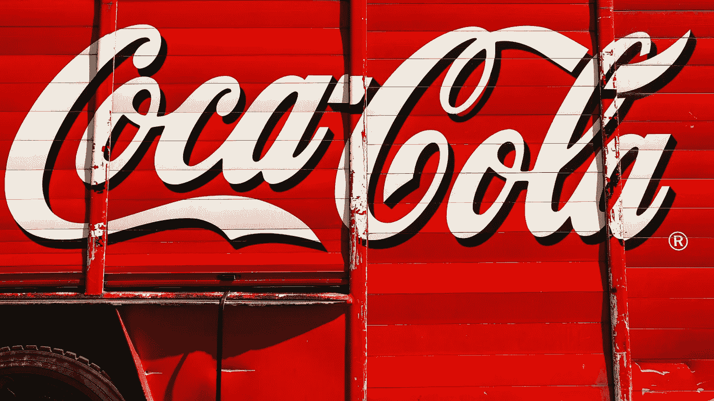

# 五月份你必须买的最好的两只股票

> 原文：<https://medium.com/coinmonks/best-2-stocks-which-you-must-to-buy-in-may-416881d25b4c?source=collection_archive---------16----------------------->

Source photo Unsplash.com

# 可口可乐公司

上个月初，可口可乐宣布暂停在俄罗斯的业务，加入了其他几十家公司的行列。

在不影响消费者需求的情况下管理不断上涨的大宗商品成本，是该公司今年最大的任务。