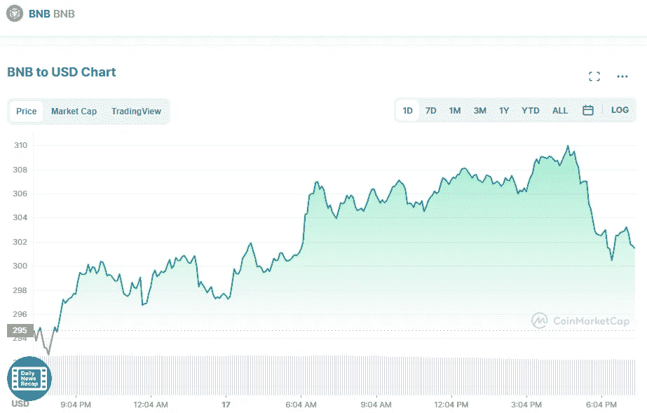

# 五月份最值得购买的三种加密货币

> 原文：<https://medium.com/coinmonks/best-3-cryptocurrency-to-buy-in-may-1cff620b9bf4?source=collection_archive---------33----------------------->

# 币安(BNB)

在过去的 24 小时内，币安货币的价值增加了 5.08%，达到 302 美元。在过去的七天里，BNB 的价格下降了 13.7%。市值将它列为目前第六大最有价值的加密货币。

Source photo [BNB price today, BNB to USD live, marketcap and chart | CoinMarketCap](https://coinmarketcap.com/currencies/bnb/)

前五天 31%的跌幅使得币安币的价格跌至 276 美元。和 BNB 一起…