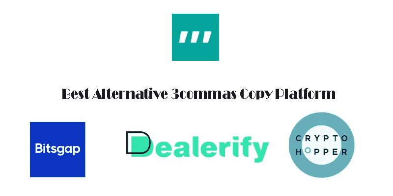

# 最佳 3commas 替代文案交易平台

> 原文：<https://medium.com/coinmonks/best-3commas-alternative-copy-trading-platform-eac29e3e36b8?source=collection_archive---------11----------------------->

3 备选的 3commas 复制平台

**什么是 3commas 平台？**

[*3commas*](https://3commas.io/) copy 交易平台是一个交易机器人，它通过实现利润最大化和给予交易者适当控制所需的功能来提高交易质量。

用 3commas 交易，可以在这个平台上同时进行多个平台的交易。你可以跟踪传统交易所没有的获利工具，你有一个回顾过去的机制，可以跟踪所有市场变化并限制损失，你可以获得关于订单状态的即时通知并记录每笔订单的笔记。

3commas 平台目前支持以下 12 个交易交易所:Bittrex、BitFinex、币安、Bitstamp、KuCoin、Poloniex、HitBTC、Cex、比特币基地 Pro、OKEX、Huobi、YOBIT。您可以将所有这些连接到 3 个 commas，并在一个页面上管理您的帐户。

在这篇文章中，我想向你介绍这种复制交易平台的最佳替代品。

1.  **隐漏斗**

Cryptohopper 复制交易平台

Cryptohopper 允许用户通过一个账户管理他所有的加密货币账户。该机器人允许用户进行个人和技术分析，并且还提供对机器人的各种模式和策略的访问。这个平台结合了一些最先进的交易方法，一个简单的用户界面，可以让中级加密交易者在几分钟内开始运行他们熟悉的策略。
Cryptohopper 为用户提供了一个基于云的平台，用于管理八个主要加密交易所的多项加密资产。一旦用户设置好，Cryptohopper 机器人将自动与客户的账户进行交易。CryptoHopper Marketplace 提供第三方加密信号来帮助您决定是否进入或退出头寸。除了自动交易之外，Cryptohopper 还提供社交交易，允许交易者一起合作赚钱。

**2。解除验证**

解除复制交易平台的验证

[*Dealerify*](https://dealerify.io/)*是市场上的新品，但它正迅速流行起来。这个机器人受欢迎的原因之一是，这个平台对初学者来说非常容易，因为你可以在一个页面上查看你的所有立场，并尽快为他们每个人做出任何你想要的决定。*

*Dealerify 为用户提供了非常多样化和重要的服务，例如，可以同时交易和管理 20 个用户账户，能够轻松管理交易风险，或者为专业交易商和供应商提供额外的分析工具。*

*Dealerify 在进入该平台之初，为其所有用户提供了 7 天的免费设施，以便他们可以免费熟悉平台条件及其功能和优势。*

*为了它的用户的安全和方便，这个平台没有访问你的交易所账户或者钱包的权限，你只把你的交易所 API 连接到平台上，你就可以安全的交易，确保你的资金在交易所是安全的。*

***3。Bitsgap***

**

*Bitsgap 复制交易平台*

*[*Bitsgap*](https://bitsgap.com/) 是 2021 年比特币交易领域最优秀的加密货币交易机器人之一。用户可以轻松管理他们的资产。只需点击几下鼠标，您就可以轻松创建自己独特的策略。这个交易软件帮助用户获得尽可能多的利润。*

*BatesGap 的一些特点是所有交易对用户账户中预算的依赖，使用法定货币和货币的代码进行套利交易，支持市场上大多数知名和流行的数字货币。*

*BitsGap 是一个用于交易加密货币的安全加密平台。另一方面，贝茨 Gap 自动交易算法显然是一个显著的优势，可以让这个平台的用户有一个稳定的和非常低的风险收入。该平台还为用户提供了多种方式，通过各种市场订单和退出策略来控制交易，从而将用户的交易风险降至最低。*

***4。Altrady***

**

*每天都有成千上万的交易者使用 Altrady 独特的自动化加密交易工具，通过自动化交易来实现回报最大化。该公司提供几种类型的机器人，包括网格和信号机器人，为有经验的交易者提供了一种简单的方法，让他们在没有任何知识或技能的情况下，在快节奏的市场中占据优势。*

***具有上下拖动功能的 Altrady 网格机器人***

*对于想要利用市场涨跌趋势的交易者来说，Altrady 网格机器人是一个完美的工具。有了它，你可以指定价格上限和下限，这样你的交易将永远是安全的，即使有一个巨大的波动！你还可以止盈止损，这使得交易比以往任何时候都容易。*

***具有 TradingView Webhook 或基于加密的扫描仪信号的备用信号机器人***

*信号机器人是以最小的努力参与行动的好方法。只需配置您的进入和退出设置，然后让这个机器人为您做所有的工作！*

*为了使用带有自定义信号的信号机器人，您必须配置带有 webhook 的信号机器人*

> **加入 Coinmonks* [*电报频道*](https://t.me/coincodecap) *和* [*Youtube 频道*](https://www.youtube.com/c/coinmonks/videos) *了解加密交易和投资**

# *另外，阅读*

*   *[3 商业评论](/coinmonks/3commas-review-an-excellent-crypto-trading-bot-2020-1313a58bec92) | [Pionex 评论](https://coincodecap.com/pionex-review-exchange-with-crypto-trading-bot) | [Coinrule 评论](/coinmonks/coinrule-review-2021-a-beginner-friendly-crypto-trading-bot-daf0504848ba)*
*   *[莱杰 vs n 格拉夫](/coinmonks/ledger-vs-ngrave-zero-7e40f0c1d694) | [莱杰纳诺 s vs x](/coinmonks/ledger-nano-s-vs-x-battery-hardware-price-storage-59a6663fe3b0) | [币安评论](/coinmonks/binance-review-ee10d3bf3b6e)*
*   *[Bybit Exchange 审查](/coinmonks/bybit-exchange-review-dbd570019b71) | [Bityard 审查](https://coincodecap.com/bityard-reivew) | [Jet-Bot 审查](https://coincodecap.com/jet-bot-review)*
*   *[3 commas vs crypto hopper](/coinmonks/3commas-vs-pionex-vs-cryptohopper-best-crypto-bot-6a98d2baa203)|[赚取加密利息](/coinmonks/earn-crypto-interest-b10b810fdda3)*
*   *最好的比特币[硬件钱包](/coinmonks/hardware-wallets-dfa1211730c6) | [BitBox02 回顾](/coinmonks/bitbox02-review-your-swiss-bitcoin-hardware-wallet-c36c88fff29)*
*   *[BlockFi vs Celsius](/coinmonks/blockfi-vs-celsius-vs-hodlnaut-8a1cc8c26630)|[Hodlnaut 点评](/coinmonks/hodlnaut-review-best-way-to-hodl-is-to-earn-interest-on-your-bitcoin-6658a8c19edf) | [KuCoin 点评](https://coincodecap.com/kucoin-review)*
*   *[Bitsgap 审查](/coinmonks/bitsgap-review-a-crypto-trading-bot-that-makes-easy-money-a5d88a336df2) | [Quadency 审查](/coinmonks/quadency-review-a-crypto-trading-automation-platform-3068eaa374e1) | [Bitbns 审查](/coinmonks/bitbns-review-38256a07e161)*
*   *[密码本交易平台](/coinmonks/top-10-crypto-copy-trading-platforms-for-beginners-d0c37c7d698c) | [Coinmama 审核](/coinmonks/coinmama-review-ace5641bde6e)*
*   *[印度加密交易所](/coinmonks/bitcoin-exchange-in-india-7f1fe79715c9) | [比特币储蓄账户](/coinmonks/bitcoin-savings-account-e65b13f92451)*