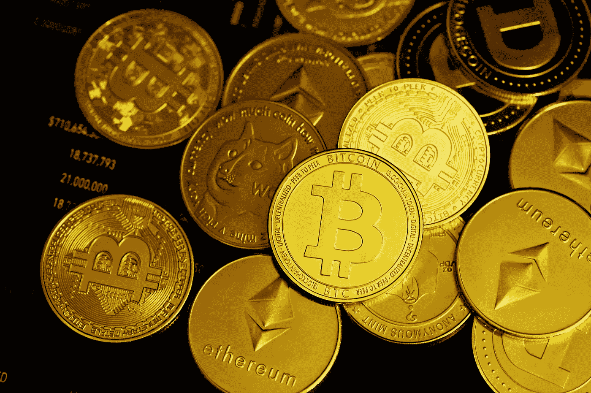

# 2022 年最值得购买的 4 种加密货币

> 原文：<https://medium.com/coinmonks/best-4-cryptocurrencies-to-buy-in-2022-e9b9d61687d5?source=collection_archive---------16----------------------->

Source photo Unsplash.com

# 比特币(BTC)

如果你是密码初学者，你应该购买比特币。如果你刚刚开始加密资产业务，比特币可能是目前最被低估的加密资产。

由于其较低的波动性，比特币仍然是最受欢迎的加密货币。然而，BTC 是最有价值的加密货币…