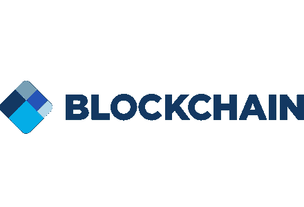

# 2022 年最佳 5 款加密货币钱包

> 原文：<https://medium.com/coinmonks/best-5-cryptocurrency-wallets-in-2022-62059d72ccec?source=collection_archive---------16----------------------->

## **最佳 5 款加密货币钱包**

**哪种钱包是“最好的”完全取决于具体情况，这个问题的答案因人而异，取决于知识水平、所需设施和资金数量。**

**例如，对于初学者来说，拥有一个易于使用并支持多种数字货币的钱包通常很方便，但对于专业人士来说，需要更多的比特币管理、用户界面或对其他数字货币的支持。这没多大关系。**

在讨论钱包是否合适时，特征(互联网接入、电脑或手机)也很有影响。比特币钱包有不同的类型，它们运行在不同的操作系统中，所以每个人都根据自己的条件和特点选择一种比特币钱包。例如，一个没有个人电脑的人使用手机钱包，或者一个没有智能手机的人使用手机以外的钱包。

## **1。信任钱包**

**手机信托钱包是最好的比特币钱包之一(尤其是新手用户)。这个完全免费的钱包，在 Android 和 iOS 上都有，属于世界上最大的数字货币交易所。**

**Trust Walt 支持除比特币之外的数千种其他硬币和代币，以超过 100 万的安装量和在 Google Play 上 4.5 的评分赢得了最受欢迎的数字货币钱包的称号。**

**这款钱包支持钱包的所有重要安全功能，如密码、PIN 码、备份、指纹锁。**

**优点:**

**-高安全性**

**-简易用户界面**

**-支持数千枚硬币和代币**

**缺点:**

**-仅适用于手机。**

## **2。总账硬件钱包**

**存储比特币最安全的选择之一是硬件钱包，法国公司 Ledger 目前是这种钱包的最大生产商。**

**Ledger 硬件钱包保持私钥完全安全离线，如果购买前盒子没有解锁，你可以放心，黑客入侵几乎是不可能的。**

**账本钱包支持几乎所有有效的数字货币，外加数千种代币。因此，一个钱包足以容纳大多数数字货币。**

**优点:**

**-极高的安全性**

**-支持多种数字货币(超过任何其他硬件钱包)**

**-非常强大的开发团队和支持**

**-**

**缺点:**

**-不适合日常使用。**

## **3。蓝色钱包**

**BlueWallet 是一款同时适用于 Android 和 iOS 操作系统的移动应用，仅支持比特币。虽然支持单一货币可能是一个缺点，但蓝牙具有管理比特币的功能，这是我们在多钱包中所没有的。这款钱包最重要的一个特点就是支持闪电网络。这个钱包是完全开源的，让用户控制私钥。**

**与大多数没有良好用户界面的专业钱包不同，蓝牙便于新手用户使用。因此，如果你正在寻找一个用户界面不那么困难的专业比特币钱包，Bluewallet 可能是你的选择。**

**优点:**

**-高安全性**

**-比特币管理的专业设施**

**-简易用户界面**

**——是开源的。**

**缺点:**

**-仅支持比特币。**

它只有手机版。

## **4- Exodus 钱包**

**Exodus 是可用于数字货币的最古老的钱包之一，自 2015 年以来一直为数字货币用户服务。这款钱包最初只适用于个人电脑，但现在可以安装在两个流行的移动操作系统上，Android 和 iOS。除了支持 100 多种数字货币和代币，美丽的 Exodus 用户界面是无与伦比的。**

**优点:**

**-高安全性**

**-简单美观的用户界面**

**-支持数百枚硬币和代币**

**-可以安装在手机和桌面上**

**缺点:**

**-不开源。**

## **5-区块链钱包**

**Blockchain.com 是最受欢迎和最古老的比特币钱包之一，支持除比特币之外的几种数字货币，包括 Atrium、Tetra、比特币现金和 Stellar。**

**虽然这个钱包很大方，并且在互联网服务器上存储了私钥，但是开发者已经证明，由于私钥和密码的加密，它没有访问资产的权限。**

**要说这款钱包的弱点，就必须提到对用户进行备份的微弱提醒。在这个钱包中，如果用户忘记了他们的密码，也没有备份他们的钱包，他们将永远无法访问他们的资产。**

**优点:**

**-高安全性**

**-只需一个浏览器即可轻松访问所有设备**

**-手机 app**

**缺点:**

**-私钥存储在互联网上。**

*   **备份不良提醒**

> 加入 Coinmonks [电报频道](https://t.me/coincodecap)和 [Youtube 频道](https://www.youtube.com/c/coinmonks/videos)了解加密交易和投资

## 另外，阅读

*   [有哪些交易信号？](https://coincodecap.com/trading-signal) | [Bitstamp vs 比特币基地](https://coincodecap.com/bitstamp-coinbase) | [买索拉纳](https://coincodecap.com/buy-solana)
*   [ProfitFarmers 回顾](https://coincodecap.com/profitfarmers-review) | [如何使用 Cornix Trading Bot](https://coincodecap.com/cornix-trading-bot)
*   [十大最佳加密货币博客](https://coincodecap.com/best-cryptocurrency-blogs) | [YouHodler 评论](https://coincodecap.com/youhodler-review)
*   [my constant Review](https://coincodecap.com/myconstant-review)|[8 款最佳摇摆交易机器人](https://coincodecap.com/best-swing-trading-bots)
*   [MXC 交易所评论](/coinmonks/mxc-exchange-review-3af0ec1cba8c) | [Pionex vs 币安](https://coincodecap.com/pionex-vs-binance) | [Pionex 套利机器人](https://coincodecap.com/pionex-arbitrage-bot)
*   [我的密码交易经验](/coinmonks/my-experience-with-crypto-copy-trading-d6feb2ce3ac5) | [《比特币基地评论》](/coinmonks/coinbase-review-6ef4e0f56064)
*   [氹欞侊贸易评论](https://coincodecap.com/anny-trade-review) | [Paybis 评论](https://coincodecap.com/paybis-review) | [Keevo 钱包评论](https://coincodecap.com/keevo-wallet-review)
*   [印度最佳 P2P 加密交易所](https://coincodecap.com/p2p-crypto-exchanges-in-india) | [柴犬钱包](https://coincodecap.com/baby-shiba-inu-wallets)
*   [8 大加密联盟项目](https://coincodecap.com/crypto-affiliate-programs) | [eToro vs 比特币基地](https://coincodecap.com/etoro-vs-coinbase)
*   [最佳以太坊钱包](https://coincodecap.com/best-ethereum-wallets) | [电报上的加密货币机器人](https://coincodecap.com/telegram-crypto-bots)
*   [交易杠杆代币的最佳交易所](https://coincodecap.com/leveraged-token-exchanges) | [购买 HTZ 代币](https://coincodecap.com/how-to-buy-htz-token)
*   [5 大最佳社交交易平台](https://coincodecap.com/best-social-trading-platforms) | [瓦济克斯 NFT 印度](https://coincodecap.com/wazirx-nft-india)
*   [10 本关于加密的最佳书籍](https://coincodecap.com/best-crypto-books) | [英国 5 个最佳加密机器人](https://coincodecap.com/uk-trading-bots)
*   [ko only 回顾](https://coincodecap.com/koinly-review) | [Binaryx 回顾](https://coincodecap.com/binaryx-review)|[Hodlnaut vs CakeDefi](https://coincodecap.com/hodlnaut-vs-cakedefi-vs-celsius)
*   [比斯勒评论](https://coincodecap.com/bitsler-review)|[WazirX vs coin switch vs coin dcx](https://coincodecap.com/wazirx-vs-coinswitch-vs-coindcx)
*   [赢取注册奖金——10 大最佳加密平台](https://coincodecap.com/earn-sign-up-bonus)
*   [最佳加密交易信号电报](/coinmonks/best-crypto-signals-telegram-5785cdbc4b2b) | [MoonXBT 评论](/coinmonks/moonxbt-review-6e4ab26d037)
*   [Coinswitch 俱吠罗评论](/coinmonks/coinswitch-kuber-review-1a8dc5c7a739) | [电网交易机器人](https://coincodecap.com/grid-trading) | [比特币基地收费](/coinmonks/coinbase-fees-831e77d4f2c5)