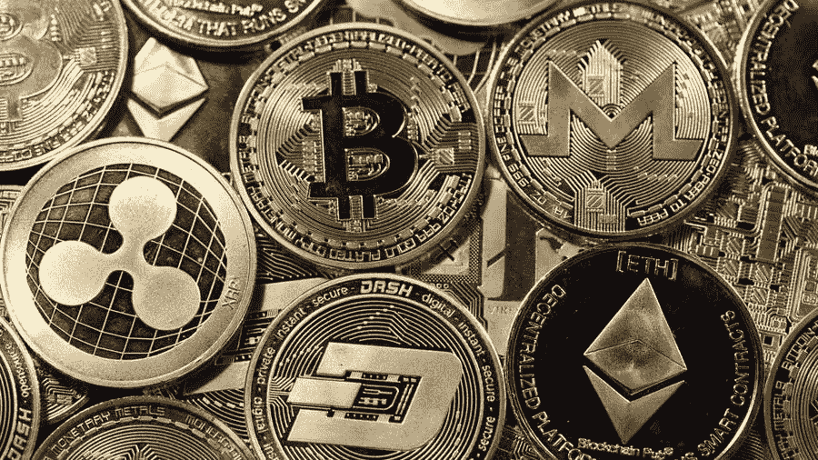

# 尼日利亚销售加密软件的最佳应用

> 原文：<https://medium.com/coinmonks/best-app-to-sell-crypto-in-nigeria-6ce0325d5312?source=collection_archive---------72----------------------->

在尼日利亚，选择最好的应用程序来销售加密货币的一个问题是不安全。担心把你的密码卖给一个平庸的交易平台或直接的骗子迫在眉睫，因为交易市场上有很多这样的人。因此，对于尼日利亚的加密交易商来说，确保他们出售给信誉良好且安全的交易所服务是至关重要的。我们将讨论一个可以信任的加密货币交换平台。

根据 Chainalysis 去年的全球加密采用指数，尼日利亚在全球总排名中名列第六。该指数力求掌握点对点(P2P)交易的加密货币总活跃度和交易量。

Statista 的一份报告旨在通过调查公民是否使用或拥有加密货币，了解加密货币在选定国家的普遍程度。尼日利亚以 32%位居第一。

尼日利亚加密货币使用的突破导致了对销售加密货币的安全平台的需求，这种交易平台在进入市场的过量诈骗中脱颖而出。

## **尼日利亚中央银行打击加密货币**

尼日利亚中央银行(CBN)于 2021 年 2 月 5 日授权所有商业银行和金融机构关闭所有交易加密货币的用户或运营加密交易所的组织的账户。这意味着尼日利亚用户不能使用信用卡或借记卡购买任何形式的加密货币，也不能在奈拉存款和取款。

尽管政府进行了打击，但尼日利亚人对交易加密货币的兴趣仍在持续增长。使用尼日利亚奈拉的比特币 P2P 交易大幅增长，尼日利亚是比特币 P2P 交易的第二大国家，仅次于美国。在一定程度上，加密交易的增加可以归因于尼日利亚中央银行实施的禁令。

## 尼日利亚销售比特币的最佳应用

如果你渴望一个安全的密码交换，你应该考虑光顾[达特非洲](http://dartafrica.io)；尼日利亚领先的加密交换平台。

**关于** [**镖非洲**](https://dartafrica.io/)

Dart Africa 是一个自动化的加密货币交易平台，在这里您可以轻松出售您的比特币和其他替代币。Dart Africa 旨在让您的交易体验变得简单无缝，而不必担心将加密货币出售给糟糕或平庸的平台所带来的挫折，如低汇率、长付款期、额外费用等。

如果你想在尼日利亚的这个平台上出售你的加密货币，你首先要在他们那里创建一个账户。在[网站](https://dartafrica.io/)或手机应用程序上注册，你就可以使用他们的立即出售选项。

## **为什么达特非洲最适合比特币交易**

以下是 Dart Africa 被评为该地区最佳数字平台的原因。它们列举如下:

*   **随时可用**–Dart Africa 随时可供您交易。您可以随时完成您的加密交易。
*   好的网页和应用程序设计-这个平台是为用户设计的。该平台的网络和移动版本都实现了出色的用户界面和体验设计，允许用户毫无争议地出售他们的密码。您可以在 Google Play 和 App store 上获得移动应用程序。
*   **使用多种支付方式**–根据您所在的位置，您可以用奈拉或塞迪斯支付您的加密货币。因为非洲灾难援助反应队也在加纳提供服务。
*   **快速交易**–用户认为 Dart Africa 的交易速度是最好的数字交易平台之一。支付设施是自动化的，所以你可以在验证你的加密交易后几分钟内收到你的付款。
*   **易于使用** -Dart Africa 尽可能简单。该平台提供直观的初学者友好界面和全天候客户支持，以防您在尝试销售加密货币时遇到任何问题。只需创建一个账户，您就可以在一分钟内在平台上注册您的数字钱包。
*   **汇率** - Dart Africa 提供外汇市场上最优惠的加密货币汇率。您可以随时使用 [Dart Africa 的硬币计算器](https://dartafrica.io/coincalculator)来检查您的加密货币的汇率。

## **如何在 Dart Africa 上销售加密货币**

*   使用您的凭据登录您的帐户，如果没有，请创建一个帐户。
*   单击工具栏图标(左上角的三条垂直直线)。您将在您的帐户面板上看到此信息。
*   点击出售硬币。
*   在硬币栏中选择要出售的加密货币。
*   输入您要出售的加密硬币的数量，相应的美元和奈拉金额将显示在列中。注意:你可以出售的 BTC 或任何加密货币的最低美元价格是 20 美元。
*   点击立即出售硬币。
*   将提供一个钱包地址和一个 QR 码。您可以通过手动输入地址或扫描二维码来发送您在上述步骤中选择的加密金额。付款被确认后，你将立即被记入贷方。

[在这里下载 Dart 手机 App](https://play.google.com/store/apps/details?id=com.dartafrica)！

> 加入 Coinmonks [电报频道](https://t.me/coincodecap)和 [Youtube 频道](https://www.youtube.com/c/coinmonks/videos)了解加密交易和投资

# 另外，阅读

*   [分散交易所](https://coincodecap.com/what-are-decentralized-exchanges) | [比特 FIP](https://coincodecap.com/bitbns-fip) | [宾邦评论](https://coincodecap.com/bingbon-review)
*   [用信用卡购买密码的 10 个最佳地点](https://coincodecap.com/buy-crypto-with-credit-card)
*   [加拿大最佳加密交易机器人](https://coincodecap.com/5-best-crypto-trading-bots-in-canada) | [Bybit vs 币安](https://coincodecap.com/bybit-binance-moonxbt)
*   [阿联酋 5 大最佳加密交易所](https://coincodecap.com/best-crypto-exchanges-in-uae) | [SimpleSwap 评论](https://coincodecap.com/simpleswap-review)
*   购买 Dogecoin 的 7 种最佳方式