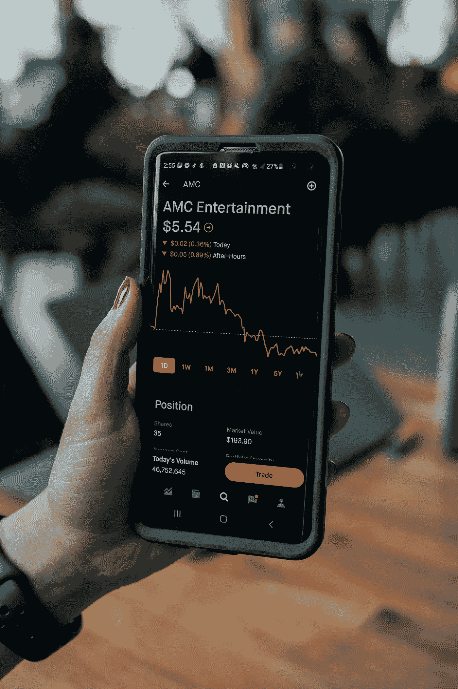

# 加密熊市中的最佳赌注

> 原文：<https://medium.com/coinmonks/best-bets-in-a-crypto-bear-market-ca138ffa6fa0?source=collection_archive---------48----------------------->

Photo by [Tech Daily](https://unsplash.com/es/@techdailyca?utm_source=medium&utm_medium=referral) on [Unsplash](https://unsplash.com?utm_source=medium&utm_medium=referral)

大多数加密货币比其历史高点低 85-95%。自 6-8 个月以来，熊市已经开始，替代硬币和蓝筹股加密货币的价格已经得到了最大程度的修正。一些最具创新性的加密货币价格非常便宜。

以下是我对长期使用代用币的一些建议。

1.  **以太坊** —区块链最好/最可靠的智能合同，将在 V2(较低的天然气费用)时恢复良好
2.  **Matic**——这是一种短期的替代方案，可以让你免去高昂的以太坊油费。
3.  **VeChain** —供应链解决方案的区块链。前途无量的 altcoin。
4.  索拉纳——当今市场上最快的区块链。
5.  **滴滴网络** —最佳未被发现的 DeFi Coin 一致的每日 1% ROI 和团队推荐奖励，采用创新的游戏理论。
6.  **币安硬币**——币安链条硬币是今天的 DeFi 基石。

当你投资加密货币时，请注意以下几点

1.  慢慢决定，你自己的研究。
2.  容易成为骗子的牺牲品，千万不要和任何人分享你的秘密短语。
3.  每月持续定期投资一些法币到加密货币中，以建立强大的头寸。

加入我的[电报](https://t.me/BoondDripSquad)频道，与 Boond Drip Squad 一起讨论点滴
“Boond”在印度是一滴水的意思

> *在印度，他们说，
> Boond，Boond Se Bane Sagar
> 即
> 每一滴水构成一片海洋……*

我们每个人都可以成为我们海洋中的一滴水！！！

> 加入 Coinmonks [电报频道](https://t.me/coincodecap)和 [Youtube 频道](https://www.youtube.com/c/coinmonks/videos)了解加密交易和投资

你也可以加入一个更大的团队，我是[**隐虫**滴电报](https://t.me/joinchat/PbTulqLoCmAzZmQx)组的一员。在获得那里的知识财富之前，必须投资于任何 Cryptozoa 成员之下。投资完成后，将我的 ID**0x 37553 dc03c 02174 C1 e890 D2 b 4805 a7a 2874 d0cf 8**和名字[**kg _ boond _ drip _ squad**](https://t.me/BoondDripSquad)贴在电报网关上以便访问，团队&我在那里为您提供任何需要的帮助—

您也可以加入开发钱包，它可以在 drip.community 网站上找到。

滴滴[白皮书](https://drip.community/docs/DRIP_LIGHTPAPER_v0.8_Lit_Version.pdf)是其圣经，拥有关于滴滴网络运行的所有信息。

感谢您的宝贵时间！！！去组建你的滴滴团队吧！！！

附页
1。如果你读到这里，请注意 1%的每日投资回报率必须根据你的财务目标来计算或人工申报！
2。你在这篇文章中读到的一切都不是财务建议，请你自己做研究。
3。祝你好运！！！