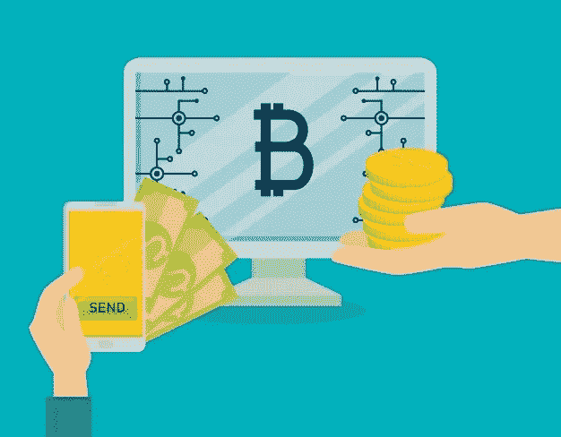

# 加纳最好的比特币购买平台

> 原文：<https://medium.com/coinmonks/best-bitcoin-buying-platform-in-ghana-78bdf259032c?source=collection_archive---------74----------------------->

加密货币的浪潮已经席卷了每个国家的金融市场，加纳人民一直在大力推动这一浪潮。加密货币在全球范围内是一种很好的投资渠道，如果你已经投资了比特币这样的加密资产，并且正在加纳寻找出售比特币的最佳平台，本指南提供了加纳最佳比特币购买平台的详细分类。

Dart Africa: Sell Bitcoin for Cedis

我们将重点介绍一些可信的交易平台，您可以向这些平台出售比特币，并在您当地的加纳账户中接收资金。信任任何平台与您的加密资产可能是有风险的，您必须对平台进行研究，以确保它们是合法的，并且它们会为您的加密资产提供最佳价值。在浏览了下面的列表后，一点点谷歌搜索就能让你完全信任一个平台。这里有一些最好的比特币购买平台，可以把你的比特币卖给它们；

## **非洲飞镖**

[Dart Africa](http://dartafrica.io/) 是领先的加密货币交易平台之一，在非洲购买各种类型的加密资产，包括比特币。Dart Africa 在向加密交换平台销售产品时，弥合了客户期望与提供的服务之间的差距。如果你在 Dart Africa 的平台上出售你的比特币，你会以尽可能高的汇率出售，你的比特币会立即得到支付。

如前所述，Dart Africa 为加密货币提供了加密外汇市场上最好的汇率之一。不管加密资产的不稳定性，Dart Africa 为其客户提供了有利的汇率。他们在其平台上集成了一个[硬币计算器](https://dartafrica.io/coincalculator)功能，可以告诉你的比特币和其他加密硬币在当地货币中的价值。

平台上有一个客户支持系统来处理客户的技术问题。该平台旨在方便不同技术水平的人使用。由于 Dart Africa 平台具有良好的用户界面和体验设计实践，因此使用该平台应该没有任何问题，但是，该系统仍然提供全天候的客户响应系统来帮助客户浏览平台。

您可以通过访问 Dart Africa 的[网站](http://dartafrica.io)或通过在 [Play Store](https://play.google.com/store/apps/details?id=com.dartafrica&hl=en_US&gl=US) 和 App Store 上下载的移动应用程序来访问 Dart Africa 的交换服务。该平台采用用户友好型设计，便于用户在上面进行交易。

# **如何在 Dart Africa 上出售你的比特币**

Sell Bitcoin on Dart Africa

–要在 Dart Africa 上进行交易，您必须在他们那里有一个账户。[使用您的正确凭证在他们那里创建一个账户](https://dartafrica.io/register),或者如果您已经有账户，只需[登录](https://dartafrica.io/login)。如果您只是创建一个帐户，一封验证邮件将发送到您提供的电子邮件，请确保验证您的帐户。

–首次登录您的帐户时，系统会要求您创建一个 PIN，请确保您选择了一个您能记住的 PIN。当你想从你的账户中提款时，这个密码将会被使用。

–将您的银行账户详细信息添加到 Dart Africa 账户的账号列表中。请注意，您可以向您的帐户添加多个帐户信息。

–您会在屏幕左侧看到一个导航菜单，点击出售硬币并输入加密硬币的详细信息。

–点击开始交易，他们的系统将自动创建一个带有条形码的钱包地址，将比特币发送到该地址，资金将在 2 次批量确认后发送到 Dart Africa 帐户。请注意，您可以向提供的钱包地址发送任何金额，他们的系统将根据收到的金额为您存款。

–在付款后，点击取款并添加您的帐户详细信息，作为支付到您的 Dart Africa 帐户，将资金从已保存的帐户列表发送到您的首选银行帐户。您可以查看您的交易历史，以检查资金是否已发送到您的银行账户。

**币安——拥有 600 多项资产的全球加密货币交易所**

对于狂热的加密货币用户来说，币安是全球最受认可的加密货币交易所之一。币安的日交易量是所有交易所中最高的，它为您提供了在加纳交易 500 多种加密资产的机会。自 2020 年以来，币安已在其平台上接受加纳 Cedi 存款，允许加纳用户直接进入加密货币市场。

你可以使用币安的 P2P 交易系统来出售你的比特币，在出售你的比特币之前，确保你熟悉 P2P 系统。

**比特币基地——用户友好的加密货币交易所**

比特币基地是一家顶级的全球加密交易所，在 100 多个国家提供服务，自 2021 年以来一直在加纳可用。

比特币基地为您提供 80 多个代币和 100 多个交易对，让您轻松兑换多种加密货币。你只需投资 2 美元或 15 加纳塞地，就可以开始在比特币基地交易加密货币。

> 加入 Coinmonks [电报频道](https://t.me/coincodecap)和 [Youtube 频道](https://www.youtube.com/c/coinmonks/videos)了解加密交易和投资

# 另外，阅读

*   [从 WazirX 切换到 CoinDCX 的 5 个理由](https://coincodecap.com/reasons-to-switch-from-wazirx-to-coindcx)
*   [Unocoin 评论](https://coincodecap.com/unocoin-review) | [最佳加密赌注硬币](https://coincodecap.com/best-crypto-staking-coins)
*   [如何使用 MetaMask Wallet 获得 KCC 地址？](https://coincodecap.com/kcc-address-metamask)
*   [如何获得自己的。XYZ 领域？](https://coincodecap.com/xyz-domain)
*   [最佳加密交换平台](https://coincodecap.com/best-crypto-swap-platforms) | [最佳加密交易所](https://coincodecap.com/crypto-exchange)
*   [购买比特币印度](/coinmonks/buy-bitcoin-in-india-feb50ddfef94) | [Pionex 评论](/coinmonks/pionex-review-exchange-with-crypto-trading-bot-1e459d0191ea) | [加密交易机器人](/coinmonks/crypto-trading-bot-c2ffce8acb2a)