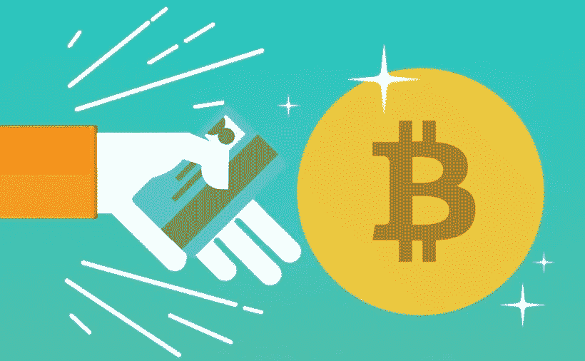

# 尼日利亚最好的比特币钱包

> 原文：<https://medium.com/coinmonks/best-bitcoin-wallet-in-nigeria-bcab7b5411f2?source=collection_archive---------30----------------------->

随着比特币和其他加密货币在该国的采用率不断上升，尼日利亚人是全球加密货币的最大用户之一。受欢迎的加密交易所 Kucoin 在《走进加密世界:解码加密消费者的世界》(Into The Crypto verse:Decoding The World Of Crypto Consumers)的一份报告中表示，尽管尼日利亚央行禁止银行业的加密货币相关交易，但约有 3340 万尼日利亚人交易或拥有加密资产。

根据谷歌趋势，尼日利亚是 2021 年全球比特币搜索次数最多的国家，这表明加密货币在该国的效用越来越大。

如果你想加入尼日利亚的加密货币运动，你必须了解加密货币钱包的使用，以及根据你的加密用户类型你可以使用的最佳加密钱包。

## **加密货币钱包:热、冷、&兑换钱包**

加密货币钱包是一种用于存储和检索您的数字资产的应用程序或设备。这个钱包有一个私人和公共密钥，这是用来管理您的加密交易的工具。

第一个加密钱包是由中本聪(比特币的化名创始人)在 2009 年首次发布比特币协议时推出的。比特币是最受欢迎和使用最多的加密货币，但其他基于其区块链技术的加密货币已经出现，其中任何一种都可以存储在加密货币钱包中。钱包可以容纳不同类型的加密货币。

**热门钱包:**

热门钱包是一种通过互联网不断连接到加密货币网络的加密货币钱包，因此热门钱包始终在线。热钱包用于执行加密货币交易，如发送和接收、交易、投资等，它们允许您查看您有多少加密资产可供使用。

## 要考虑的热门加密货币钱包列表；

*   比特币基地钱包
*   信任钱包
*   Luno 钱包
*   Quidax 钱包
*   Coinomi 钱包
*   比特币支付
*   北海巨妖
*   Remitano 钱包
*   Paxful 帕克思钱包

**冷钱包**

冷钱包最简单的定义是一个没有连接到互联网的钱包，因此受到危害的风险要低得多。这些钱包也可以被称为离线钱包或硬件钱包。

这些钱包将公钥和私钥都存储在不与互联网相连的东西(设备，有时是一张纸)上，并且通常带有类似工作的软件，以便用户可以查看他们的加密货币组合，而不会将他们的私钥置于风险之中。

离线存储加密货币最安全的方式之一是通过纸质钱包。纸质钱包是一种冷钱包，你可以在特定的网站上生成。该网站会生成公钥和私钥，您可以将它们打印在一张纸上。这张纸就像你的钱包一样，因为它是你唯一可以获取加密密钥(私人和公共密钥)的地方。

硬件钱包通常是一种安全存储用户私钥的 USB 驱动器设备。

**硬件钱包的种类**

*   莱杰纳米 S
*   特雷索模型一
*   S1 安全公司
*   钢铁比特币钱包，用于硬件钱包备份
*   Trezor 型-下一代
*   D'CENT 生物识别钱包
*   SecuX V20 最安全
*   SecuX W20 最安全

*“热门钱包连接到互联网，可能容易受到在线攻击——这可能导致资金被盗——但它更快，更容易交易或消费加密。冷钱包通常不与互联网连接，因此虽然它可能更安全，但不太方便。”*

**仅在加密交易中使用您的热门钱包**

在你的热门钱包中只保留一小部分加密货币投资组合是一个很好的加密安全礼仪；你应该只在需要的时候放入交易所需的加密货币。这种策略意味着将你的大部分加密资产存储在一个冷钱包中，然后将你需要的转移到热钱包中，以供立即或近期使用。

**哪款加密货币钱包最好？**

有不同的加密钱包，你可以选择许多选项。最好阅读尽可能多的评论，以找到一个适合您的需求，同时确保您的密钥得到保护。

## 为奈拉交易比特币的最佳平台；

Dart Africa 是非洲领先的加密货币交易平台。Dart Africa 拥有建立在信任基础上的交换平台、高汇率、快速支付系统、出色的客户支持系统、易于使用和访问的平台等等。

有了 Dart Africa，您的加密货币将以市场上最优惠的汇率兑换。网站上有一个自动的[比率计算器](https://dartafrica.io/coincalculator)，它给出你想要出售的任何数量的密码的 Naira 和 Cedis 等价物，所有这些都是为了帮助客户的销售体验。

你可以在飞镖非洲交易的加密硬币

*   比特币
*   以太坊
*   莱特币
*   Dogecoin
*   泰达币
*   BUSD
*   USDC 等。

> 加入 Coinmonks [电报频道](https://t.me/coincodecap)和 [Youtube 频道](https://www.youtube.com/c/coinmonks/videos)了解加密交易和投资

# 另外，阅读

*   [折叠 App 审核](https://coincodecap.com/fold-app-review) | [Kucoin 交易机器人](/coinmonks/kucoin-trading-bot-automate-your-trades-8cf0ca2138e0) | [Probit 审核](https://coincodecap.com/probit-review)
*   [如何匿名购买比特币](https://coincodecap.com/buy-bitcoin-anonymously) | [比特币现金钱包](https://coincodecap.com/bitcoin-cash-wallets)
*   [币安 vs FTX](https://coincodecap.com/binance-vs-ftx) | [最佳(SOL)索拉纳钱包](https://coincodecap.com/solana-wallets)
*   [比诺莫评论](https://coincodecap.com/binomo-review) | [斯多葛派 vs 3Commas vs TradeSanta](https://coincodecap.com/stoic-vs-3commas-vs-tradesanta)
*   [Capital.com 评论](https://coincodecap.com/capital-com-review) | [香港的加密借贷平台](https://coincodecap.com/crypto-lending-hong-kong)
*   [如何在 Uniswap 上交换加密？](https://coincodecap.com/swap-crypto-on-uniswap) | [A-Ads 评论](https://coincodecap.com/a-ads-review)