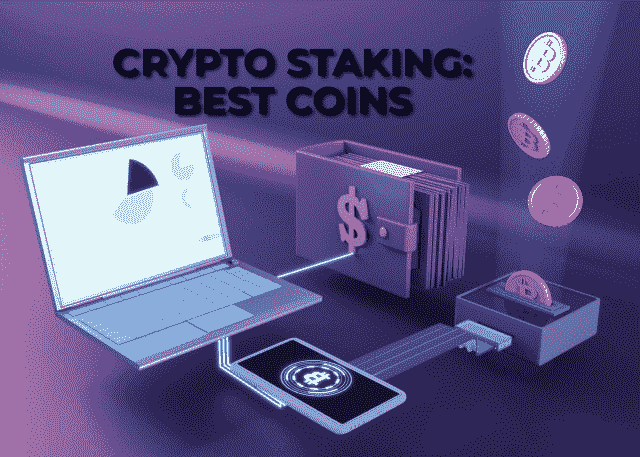

# 赚取被动收入的最佳加密赌注硬币

> 原文：<https://medium.com/coinmonks/best-coins-for-crypto-staking-to-earn-passive-income-cd041d91bbdf?source=collection_archive---------41----------------------->

赌注是被动从加密货币中赚钱的最有效的技术之一。投资者可以将硬币投资到资金池中，获得可观的回报，而不是简单地持有硬币。投资者可以将加密货币押在所有使用利益一致证明方法的加密货币上。尽管赌注是有益的，投资者必须做足功课才能从中获得最大收益。

这篇文章将探讨如何下注加密货币，下注前的注意事项，以及哪些加密货币支持下注。

# 什么是加密赌注？

赌注是一种锁定加密货币钱包中的资金的方式，以提高区块链网络的安全性和程序，以换取奖励。大多数时候，投资者可以立即将他们的密码存入信托钱包。另一方面，一些交易所向客户提供股权服务。

区块链网络以多种方法计算赌注激励。例如，一些网络在逐块的基础上进行计算，考虑账户参数，如验证器已活跃下注多长时间、下注的硬币数量、通货膨胀率以及网络上下注的硬币总数等。

另一方面，验证者可能会收到固定比例的网络奖励，作为对造成网络波动的补偿。验证者可以计算他们将在这个模型中得到的回报。

但是，只有在那些具有利益一致机制证明的密码的情况下，赌注才是可能的。利益验证机制比传统的工作验证机制更节能。

另读: [DeFi: 4 种获得被动收入的方法区块链 Shiksha](https://blockchainshiksha.com/4-ways-to-earn-passive-income-from-defi/)

# 进行标桩的方法

**(1)通过密码交易所:**各大集中密码交易所的用户可以下注硬币换取奖励。这些平台代表消费者投资加密货币。大多数交易所在提供大额支付的同时，对客户的赌注回报收取佣金。用户可以在币安和比特币基地等平台上押注加密货币，并获得回报。通过币安的高收益中心功能，AXS、SHIB、AVAX、NEAR、LUNA、ADA 和 MATIC 等加密货币的赌注可提供高达 104.62%的 APY。

**(2)下注资金池:**利用交易所下注的投资者加入由其他用户运营的“下注资金池”，将他们的现金锁定在资金池中，以获得奖励。投资者可以通过将他们的加密钱包连接到验证器的池来转移和锁定他们的资金一段时间。然而，投资者在转让代币之前必须验证这些资金池的有效性。

**(3)与验证者签约:**验证者是区块链网络的成员，他们检查交易以确保网络的安全。验证者验证交易并下注硬币。如果他们成功验证了交易，他们将得到加密硬币的补偿。通过成为验证者，投资者可以获得买入激励。与前面的两种技术相比，成为一个验证器来接收赌注奖励更加复杂。此外，作为验证者需要大量的初始支出。

## 打桩中的风险因素评估

**(1)硬币价值:**硬币的价值在长期财务决策中起着至关重要的作用。避免投资高通货膨胀率的硬币是明智的。这类硬币最初能获得高回报，但风险回报却少得多。

**(2)固定供应量:**需要检查硬币是否有固定供应量。在硬币供应有限且稳定的情况下，随着需求的增加，价格上涨的可能性更大。

**(3)实时应用:**更多用例中使用的硬币通常保持了市场需求，从而确保了价格的持续上涨。

**常用于抵押的 PoS 密码货币:**

根据 Statista 的记录，在 2022 年 3 月，就净买入价值而言，索拉纳是最受欢迎和买入的密码货币。sola(SOL)是一个总部位于区块链的平台，拥有旨在部署应用程序(Dapps)的智能合同。SOL(密码为 [Solana](https://blockchainshiksha.com/solana-strong-competitor-for-ethereum-and-bitcoin/) )是一种可堆叠的令牌，用于执行交易和支付网络费用。

用户可以作为委托赌注者或验证者参与网络，以获得赌注回报。验证者维护索拉纳网络并处理交易。受委托的赌注者将他们的代币委托给池运营商，以便为赚取回报而下注。

**(2)** [**卡尔达诺(ADA)**](https://cardano.org/) **:** 卡尔达诺是区块链第三代智能合同大厦。卡达诺的本地货币是 ADA，这是激励网络安全和交易便利化的一种有价值的令牌。参与者通过股份委托和管理股份池获得奖励。

在 Emurgo 的 Yoroi 钱包或 IOG 的代达罗斯钱包的帮助下，ADA 持有者可以用他们的代币做赌注。奖励在每个周期结束时给予股份代表。

**(3)Polkadot(DOT):**Polkadot(DOT)是用于将不同链连接到网络的互操作性区块链协议。用户作为利害关系证明(NPoS)共识算法的提名者或验证者获得赌注奖励。在 Polkadot 网络上，验证器负责事务验证，而命名器确保验证器的正常运行。提名者和验证者都可以使用 Ledger 或 Polkadot JS wallet 领取赌注奖励。

**(4)以太坊 2.0 (ETH):** 以太坊 2.0 是对以太坊协议的升级，是从 PoW 到 PoS 的过渡。它为持有人提供了采矿机会。vali9dator 锁定存款合同地址的最少 32 个 ETH。除了作为节点访问网络和验证区块链上的交易的最小 ETH 之外，还需要特定的软件。

**(5) Terra (LUNA):** Terra 是一个公共的区块链和开源协议。此协议使用户能够建立与国际法定货币挂钩的稳定货币，如韩元(KRT)、美元和欧元(EUT)。Terra 的价格是使用算法和 Terra 的 LUNA 令牌来确定的。

**最后的想法:**很多带 POS 的加密货币都可以用来跑马圈地。但在选择下注赚取被动收入时，保留某些因素是必不可少的。如果您有任何问题，请联系我们。团队区块链 Shiksha 随时准备提供帮助。

*原载于 2022 年 4 月 16 日 https://blockchainshiksha.com**的* [*。*](https://blockchainshiksha.com/crypto-staking-best-coins/)

> *加入 Coinmonks* [*电报频道*](https://t.me/coincodecap) *和* [*Youtube 频道*](https://www.youtube.com/c/coinmonks/videos) *了解加密交易和投资*

# 另外，阅读

*   [XT.COM 评论](https://coincodecap.com/profittradingapp-for-binance) | [币安评论](https://coincodecap.com/xt-com-review)
*   [SmithBot 评论](https://coincodecap.com/smithbot-review) | [4 款最佳免费开源交易机器人](https://coincodecap.com/free-open-source-trading-bots)
*   [比特币基地僵尸程序](/coinmonks/coinbase-bots-ac6359e897f3) | [AscendEX 审查](/coinmonks/ascendex-review-53e829cf75fa) | [OKEx 交易僵尸程序](/coinmonks/okex-trading-bots-234920f61e60)
*   [如何在印度购买比特币？](/coinmonks/buy-bitcoin-in-india-feb50ddfef94) | [WazirX 评论](/coinmonks/wazirx-review-5c811b074f5b)
*   [加密交易机器人](/coinmonks/crypto-trading-bot-c2ffce8acb2a) | [Probit 审查](https://coincodecap.com/probit-review)
*   [CryptoHopper 替代品](/coinmonks/cryptohopper-alternatives-d67287b16d27) | [HitBTC 审查](/coinmonks/hitbtc-review-c5143c5d53c2)
*   [CBET 评论](https://coincodecap.com/cbet-casino-review) | [库科恩 vs 比特币基地](https://coincodecap.com/kucoin-vs-coinbase)