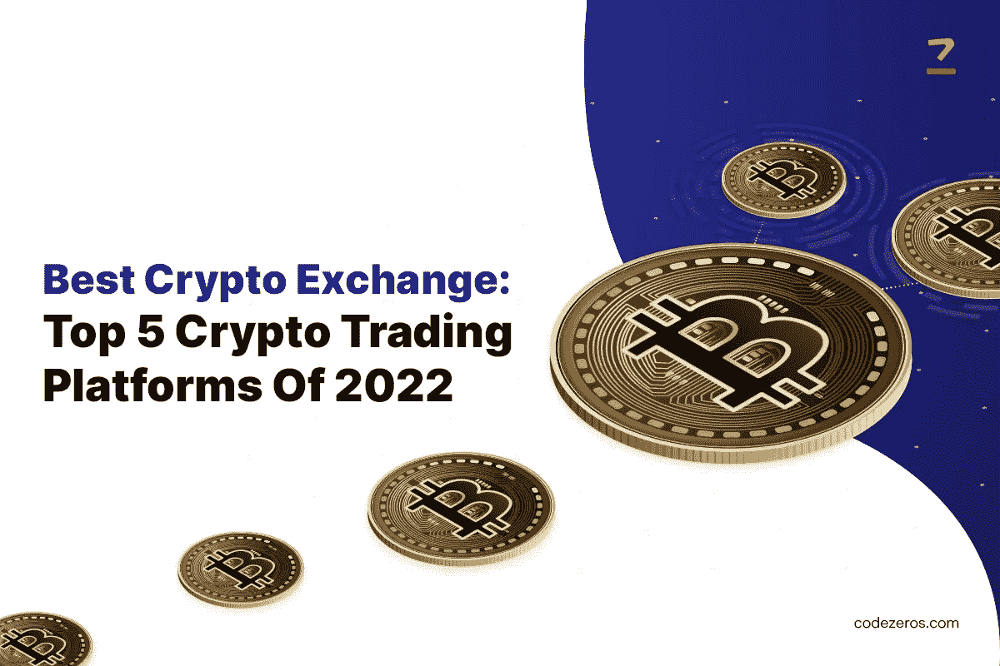

# 最佳密码交易所:2022 年 5 大密码交易平台

> 原文：<https://medium.com/coinmonks/best-crypto-exchange-top-5-crypto-trading-platforms-of-2022-9a7e25208730?source=collection_archive---------56----------------------->

促进加密货币交易的平台是数字市场，使你能够用一种加密货币交易另一种加密货币来获利。这在某种程度上类似于外汇交易，在外汇交易中，你需要针对市场或为市场买入。

如今，一些人正在投资加密货币，以对冲通胀风险。此外，还有一些投资者，他们的动机是出售或购买，以赚取利润。在本文中，我们列出了今年最受欢迎的加密货币交易平台。

**Crypto.com:**

这是一个全面的和最好的 [**加密货币交易**](https://www.codezeros.com/services/exchange-development) 平台。有 200 多种密码可供你选择。您可以利用加密钱包或信用卡来获取 NFTs。

该平台中的数字材料易于使用。它支持前景交换，现场交换，以及复杂的安排排序。这款应用功能多样，安卓和 iOS 客户端都可以使用。客户可以在几分钟内兑换加密货币，而不是几周。

Crypto.com 是一个有用和安全的一站式商店，可以获取、提供、保存、发送和跟踪密码。此外，它还提供电子邮件、实时聊天和帮助。为了保护您的资源，现金保险和 2FA(双因素认证)也是可用的。下注后，用户可以赢得最高 12%的年回报率。

> 交易新手？在[最佳加密交易](/coinmonks/crypto-exchange-dd2f9d6f3769)上尝试[加密交易机器人](/coinmonks/crypto-trading-bot-c2ffce8acb2a)或[复制交易](/coinmonks/top-10-crypto-copy-trading-platforms-for-beginners-d0c37c7d698c)

**BlockFi:**

BlockFi 是最有吸引力的加密货币交易平台和加密交易所之一。该平台为你的数字硬币提供 8%的年利率。该平台在世界各地均可使用，交易不收取佣金。

除了提供最高的利率，它还提供简单的界面、额外津贴和奖金，以利用它们的功能和免费的比特币，即 2022 年 最佳加密货币 [**。这个平台最好的一点就是提供贷款。**](https://www.codezeros.com/)

简而言之，你可以获得贷款，而不是出售你的数字资产。你可以把 50%的硬币作为抵押。企业实体和个人都可以访问这一特定功能。

**eToro:**

说到比特币交易，eToro 被认为是 [**加密货币开发兑换服务**](https://www.codezeros.com/services/wallet-development) 的最佳平台之一。它不仅易于操作，而且高度安全。它提供了一个加密货币钱包，你可以用来保存你的硬币，eToro 钱包可以毫无延迟地保存多个加密货币。

这个平台提供了大量的教育支持和资源。除了有一个简单的界面，它是初学者友好的，你也可以复制那些成功得到他们所得到的结果的交易者。

eToro 的独特功能之一是复制交易功能。在这里，你可以对 eToro 开发的任何可用投资组合进行投资，然后你可以坐下来，让他们正确地处理投资，让事情对你来说更容易。

**Coinmama:**

如果你正在寻找一个 [**加密货币交易所**](https://www.codezeros.com/) 赚取利息的平台，可以朝 Coinmama 看看。它的目的是揭开密码市场的神秘面纱。这个平台为以太坊、比特币、涟漪、卡达诺、莱特币和比特币提供了便利。通过使用法定货币，你可以兑换密码。

此外，如果你需要关于比特币或任何其他替代币的最新消息，这个平台可以为你提供一切。与其他任何加密交易平台或 [**交易所开发公司**](https://www.codezeros.com/services/exchange-development) 不同，在 Coinmama 上购买比特币后，不出几分钟，就能收到。并且它消除了等待数小时或数天来接收硬币的需要。你不必担心通过平台暴露你的钱包。

平台本身既不能接入用户的资金，也不能存储支付信息。用户需要通过他们选择的第三方钱包亲自控制他们所有的资产和信息。

**币安:**

币安是加密货币交易和加密 [**交易所开发服务**](https://www.codezeros.com/contact) **最安全、最快的平台之一。**iOS 和 Android 用户都可以使用。为了促进网上交易，它提供了大量的资源和工具。

此外，这个用户友好的平台提供年度奖励和奖金，不存在注册或交易费用。双因素验证是可用的，它完全保护用户的帐户。

它容纳不同的替代硬币。币安的 P2P 特性让在这个平台上交易变得更加容易。这是专家和初学者的理想平台。

**结论:**

上述加密交易平台完全安全、方便，且易于交易。而且，他们中很少有人还为用户提供+存储和保管选项，以保护他们的加密货币资产免受盗窃和黑客攻击。如果你还在考虑投资 crypto，你已经超越了其他几个人。所以，你现在需要做的事情。