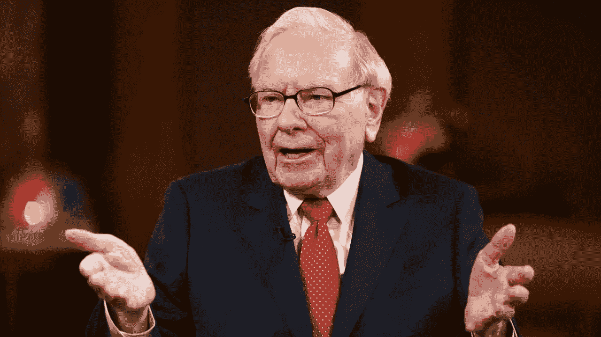
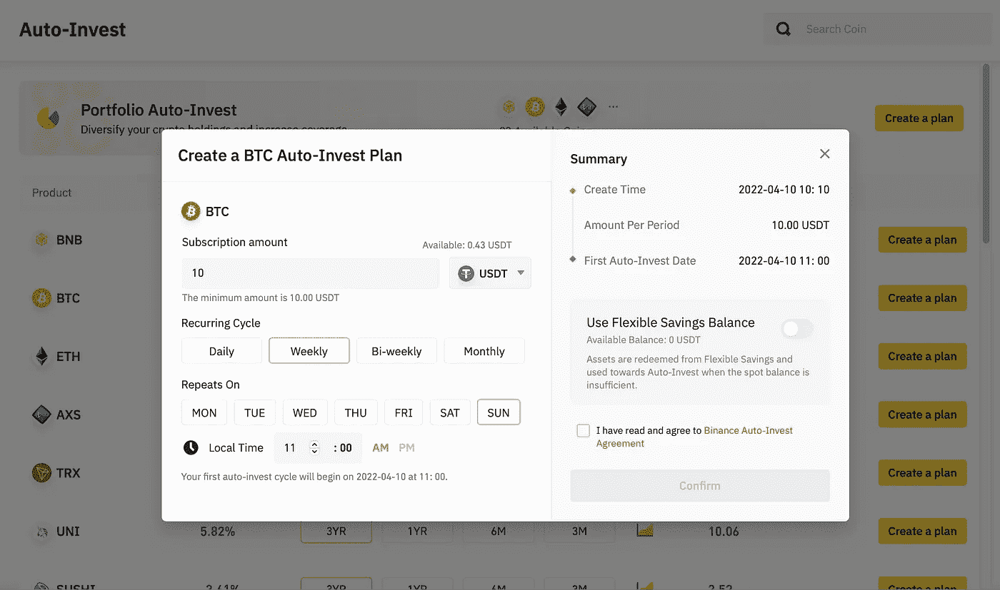
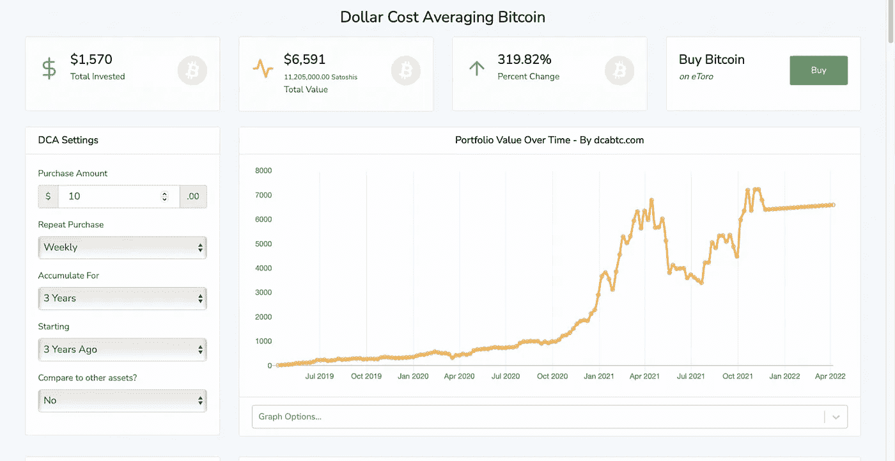
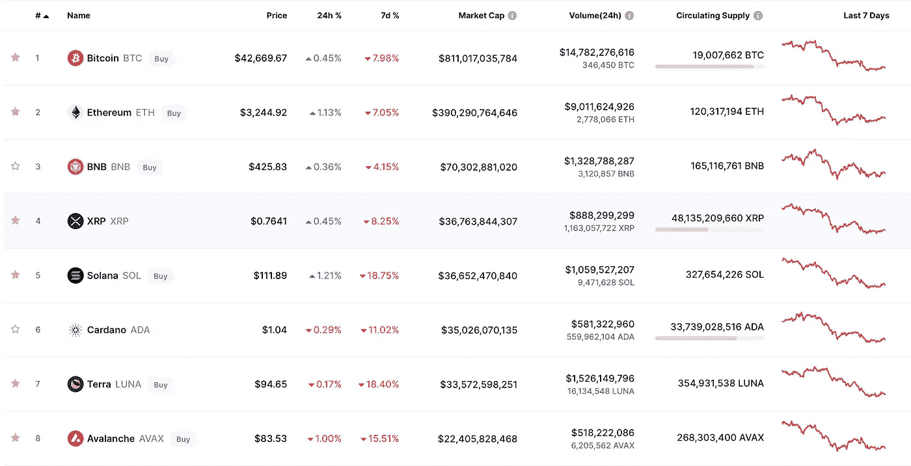

# 2022 年懒人最佳加密策略

> 原文：<https://medium.com/coinmonks/best-crypto-strategy-for-lazy-people-in-2022-f85bf4f949a6?source=collection_archive---------20----------------------->

我们都同意投资是一项非常耗时的活动。你寻找项目，阅读他们的白皮书，检查团队成员、社交平台和 Reddit 群组。

在你找到几个有前途的项目后，你为你想遵循的投资策略写一个游戏计划，并开始在 TradingView 上查看价格，看看你想什么时候进场，什么时候出场。

此外，如果你对你的计划没有 100%的把握，我可以保证这将是一个充满压力的旅程。这就是为什么我今天要向你展示一种方法，适用于那些“懒惰”的人，或者那些没有足够的时间或其他资源来建立一个合适的投资策略的人。

# 复制过去的好沃伦

我想每个人都知道沃伦·巴菲特，但如果你不知道，让我来帮你解释一下。

Warren Buffett

2008 年，他是世界上最富有的人，从那以后，他一直保持着前五名的位置。**2022 年，** **他的总身家在** **左右，1270 亿美元。**

你可能会认为他遵循一套非常复杂的投资策略，但事实并非如此。例如，他从 1988 年起就持有可口可乐的股份，他现在仍然持有。那就是 34 年。他只是购买声誉良好的公司，并长期持有。

沃伦 11 岁时在股票市场上买了第一只股票。你可能会问为什么不是每个人都遵循这个策略，但是，嗯…这需要很多时间。

 [## 最佳加密税务软件——评论和比较

### 不管你是刚接触加密还是已经在这个领域呆了一段时间，你都需要交税。

medium.com](/coinmonks/best-crypto-tax-tool-for-my-money-72d4b430816b) 

# 美元成本平均战略

美元成本平均法(DCA)是一种投资方法，将投资总额分成目标资产的定期购买，以减少波动对整体购买的影响。收购是定期进行的，不考虑资产的价格。

*你可以在*[*Investopedia*](https://www.investopedia.com/terms/d/dollarcostaveraging.asp)*了解更多。*

Binance Auto-Invest Feature

在像币安这样的交易所，你可以自动化这个过程，系统会每天、每周或每月购买你选择的资产。你可以在币安汽车投资公司找到它。此外，您可以在这里注册平台[，并获得 10%的交易费用。](https://accounts.binance.com/en/register?ref=NX0DCNVB)

# 用 DCA 回归历史

您可以在许多页面上查看过去几年 DCA 不同资产的回报。

Return on DCA for the last 3 years with Bitcoin

例如，对于比特币，如果你在过去 3 年中每周投资 10 美元，那么你总共投资了 1570 美元，现在价值 6591 美元。那是 320%的利润。

当然，有时市场会下跌，但在这种时候，你仍然会买入资产，这会降低你的平均进场价格。

# 投资什么？蓝筹股！

沃伦的投资组合中有一半是苹果。你不必在 20 个不同的项目上投资 5%就能拥有一个好的投资组合。找到稳定的，好的项目，坚持下去就好了。

CoinMarketCap Top Projects by Market Cap

最容易的选择是比特币和以太坊，因为它们已经伴随我们很多年了。我建议你按市值查看 CoinMarketCap 或 CoinGecko top20，你会发现更多这样的项目。

# 额外收获:去找那些无聊的吧！

除了 DCA 策略，你还有其他选择。例如，你可以尝试用稳定的收入赚取被动收入。您可以在我的上一篇文章中了解更多信息:

 [## 2022 年使用 Crypto 赚取被动收入的安全方式

### 许多人一听到“加密”这个词，就会联想到波动性、快速的收益或损失。这不应该是…

medium.com](/coinmonks/safe-way-to-earn-passive-income-with-crypto-in-2022-ea9e9a465f9b) 

## 结论

你不必成为时间百万富翁，也能在加密货币上赚些钱。此外，没有必要拿你所有的钱去冒险。如果你只是每个周末花几块钱买比特币，你还可以说你投资了比特币，你还可以睡个好觉。

> 加入 Coinmonks [电报频道](https://t.me/coincodecap)和 [Youtube 频道](https://www.youtube.com/c/coinmonks/videos)了解加密交易和投资

# 另外，阅读

*   [分散交易所](https://coincodecap.com/what-are-decentralized-exchanges) | [比特 FIP](https://coincodecap.com/bitbns-fip) | [Pionex 评论](https://coincodecap.com/pionex-review-exchange-with-crypto-trading-bot)
*   [用信用卡购买密码的 10 个最佳地点](https://coincodecap.com/buy-crypto-with-credit-card)
*   [最佳卡达诺钱包](https://coincodecap.com/best-cardano-wallets) | [Bingbon 副本交易](https://coincodecap.com/bingbon-copy-trading)
*   [印度最佳 P2P 加密交易所](https://coincodecap.com/p2p-crypto-exchanges-in-india) | [柴犬钱包](https://coincodecap.com/baby-shiba-inu-wallets)
*   [八大加密附属计划](https://coincodecap.com/crypto-affiliate-programs) | [eToro vs 比特币基地](https://coincodecap.com/etoro-vs-coinbase)