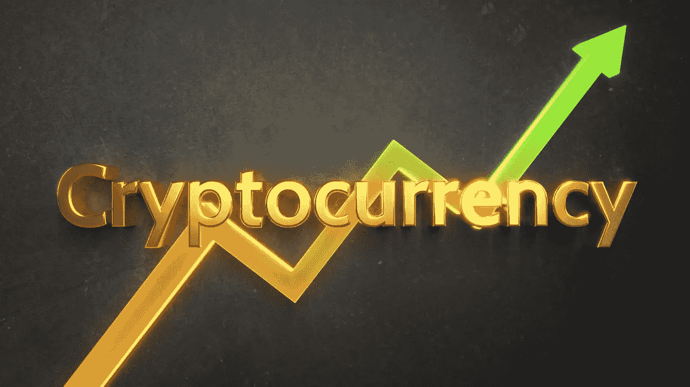

# 最佳投资加密货币

> 原文：<https://medium.com/coinmonks/best-cryptocurrencies-for-investment-f6c6243bdca2?source=collection_archive---------29----------------------->

Cryptocurrency market has volatile dynamics due to its nature

加密货币市场上有数千种不同的加密货币，从比特币和以太坊到 Dogecoin 和 Tether。如果你是加密货币市场的新手，想要投资和赚取更多，这种差异可能会在一开始让你不知所措。你做决定最重要的一个指标就是看目前流通的所有加密货币的总价值。谁知道呢，也许‘市场的看不见的手’会和你握手，你根据这些硬币的市场价值创造的硬币篮子就会成功，宾果！你发财了！当然除非投机者！

在本文中，将列出加密货币市场中市值最高的硬币。当然，本文并不为你提供投资建议。

一些投资者说，如果你不能承受 20%或更多的跌幅，就不应该投资股市。目前还没有切实的证据表明，要成功参与加密货币，你需要冒多大的风险。尽管如此，他们说，更高的风险带来更大回报的机会。

## 1.比特币

比特币(BTC)由中本聪于 2009 年创建，是个人和企业首选的原始加密货币。因为 BTC 是一个区块链，必须通过解决一个密码难题来验证，这个过程被称为工作证明，比特币是安全的，不会被骗子窃取。虽然在 2016 年 5 月，一辆 BTC 的售价约为 500 美元，但截至 2022 年 5 月 12 日，这一价格已超过 27000 美元。BTC 价格高的原因之一是因为它的硬币供应有限。另一方面，BTC 股市的大幅下跌让投资者感到紧张。BTC，从 3 月初的 43，000 美元涨到 47，000 美元，到 5 月份显示出持续下降的趋势，正如我上面提到的。

## 2.以太坊

根据通货膨胀代币经济模型，以太坊具有无限的代币供应，作为加密货币和区块链平台，以太坊是加密货币市场中程序开发者的最爱之一。

以太坊也是最赚钱的加密货币之一。从 2016 年 4 月到 2022 年 5 月中旬，其价格从 11 美元左右上涨到 2000 美元，涨幅约为 18000%。除了赚了很多钱，以太坊还凭借其创新理念引领了加密货币市场。例如，他开创了分散金融(DeFi)的概念，这是一种突破传统中间人和中介(如银行、经纪人和集中交易所)的破坏性新金融系统。

另一方面，由于即将到来的“合并”事件，ETH 是目前最好的加密货币之一。Merge 曾被称为以太坊 2.0，预计将于 2022 年下半年推出。然而，看起来将信标链并入现有的 Mainnet 链将有助于再次加速以太坊生态系统并复兴以太。以太坊现在成为加密货币中最值得购买的东西之一是其强大的 Dapps 生态系统。自 2015 年作为第一款 Dapps 区块链推出以来，它一直占据着市场主导地位。

考虑到流行的加密货币目前的交易价格低于每枚 3000 美元，考虑到以太坊可能在 2022 年翻一番，这可能是一个不错的投资选择。

## 3.极限

Tether (USDT)是第一批也是最受欢迎的被称为加密货币的稳定货币之一，旨在将市场价值固定在一种货币或其他外部参考点上，以降低波动性。大多数数字货币，甚至像比特币这样的大型货币，都会经历频繁的剧烈波动。Tether 和其他 stablecoins 试图消除价格波动，以吸引可能会谨慎行事的用户。USDT 后来被升级到以太坊、EOS、Tron、Algorand 和 OMG 区块链上运行。

USDT 宣称的目的是将加密货币的无限性与美元的稳定价值结合起来，加密货币可以在没有可信的第三方中介的情况下在用户之间发送。最近，稳定的货币越来越多地被用来对冲通货膨胀。截至 2022 年 5 月 13 日，Tether 是市值第三大的加密货币，市值为 823 亿美元，并且(你猜对了！)每枚代币近 1 美元。

## 4.硬币

ApeCoin 是基于 web3 的 APE 生态系统中使用的 ERC-20 治理和效用令牌。ApeCoin 持有者通过控制 ApeCoin DAO 的分散治理框架进行自我管理。

ApeCoin 允许代币持有者参与 ApeCoin DAO。它还为其参与者提供了一种共同的、开放的货币，可以在没有中央中介的情况下使用。在这方面，亚太经合组织所有资金的 62%分配给生态系统基金，该基金将支持亚太经合组织道成员投票通过的社区驱动的倡议。

与许多加密货币平台不同，ApeCoin 还提供了对生态系统某些部分的访问，如独家游戏和服务。在这种背景下，ApeCoin 也重视第三方开发者。第三方开发者将 ApeCoin 作为一种工具，通过将其包含在服务、游戏和其他项目中来加入生态系统。

硬币代币采用了经济背景下的通货膨胀模型。它的总供应量是 10 亿枚硬币，而且是一次性铸造的。正如我上面提到的，ApeCoin 是在以太坊区块链推出的 ERC 20 代币。因此，以太坊的工作证明(POW)受到共识机制的保护。

## 5.币安

币安于 2017 年 7 月推出，是全球日交易量最大的加密货币交易所。币安的目标是将加密货币交易所带到全球金融活动的前沿。币安为其用户推出了一个全功能生态系统。在这方面，币安网络包括币安链、币安智能链、币安学院、信托钱包和使用区块链技术的研究项目。BNB 是许多币安子项目成功运作的一个组成部分。

币安与其他加密货币中心的区别在于其分散的区块链网络生态系统。因此，该公司吸引了极大的关注，成为许多国家领先的密码交易所。

币安采取了 BEP-95 等措施。因此，它提高了通货紧缩的象征，使 BNB 更加通货紧缩。虽然 BNB 开始是区块链以太坊上的一个传统的 ERC 20 代币，但后来它迁移到了自己的区块链(BFT)。

ERC-20 令牌基于利益相关者共识，这使得它们具有高度的可扩展性，并允许创建智能合约。与 PoS 不同，币安区块链不支持智能合同功能。相比之下，比特币区块链受到公认的工作证明(proof-of-work)的保护，这种方法要有限得多，并且消耗大量的电力和计算能力。‎

## 6.索拉纳

Solana 是一个开源项目，它使用区块链技术来提供分散金融(DeFi)解决方案。

Solana 协议旨在促进分散式应用程序(DApp)的创建。由于其创新的混合共识模型，索拉纳继续吸引小时间交易者和机构交易者。另一方面，Solana 在加密货币领域非常重要，因为区块链提供的交易时间非常短。Solana 的混合协议大大缩短了交易和智能合同执行的验证时间。凭借闪电般的交易时间，索拉纳还成功吸引了企业的注意。

Solana 的协议旨在降低交易成本，同时确保可伸缩性和快速处理。Solana 脱颖而出，成为一个可以在速度和性能方面与以太坊相媲美甚至挑战以太坊的竞争对手。

因此，从长远来看，由于 FTX 等交易所的大力支持，索拉纳可能会增值。

## 结论

加密货币市场对即时变化开放。更一般地说，经济中完全竞争的情况只不过是一种幻想。经济的总体状况，因此市场总是易受波动的影响。例外是没有波动的时候。就其本质而言，就像资本主义市场上交易的每一种珍贵商品一样，加密货币也会受到这些波动的影响。在这种情况下，有必要看看更长期的数据，而不是每天、每月或每季度的数据。

**参考文献**:

1.  【https://bit.ly/39rVt6I 号
2.  【https://bit.ly/39rVw2o 
3.  [https://bit.ly/3wvrl2j](https://bit.ly/3wvrl2j)
4.  [https://bit.ly/3yBERnO](https://bit.ly/3yBERnO)

> 加入 Coinmonks [电报频道](https://t.me/coincodecap)和 [Youtube 频道](https://www.youtube.com/c/coinmonks/videos)了解加密交易和投资

# 另外，阅读

*   [Bookmap 评论](https://coincodecap.com/bookmap-review-2021-best-trading-software) | [美国 5 大最佳加密交易所](https://coincodecap.com/crypto-exchange-usa)
*   最佳加密[硬件钱包](/coinmonks/hardware-wallets-dfa1211730c6) | [Bitbns 评论](/coinmonks/bitbns-review-38256a07e161)
*   [新加坡十大最佳加密交易所](https://coincodecap.com/crypto-exchange-in-singapore) | [购买 AXS](https://coincodecap.com/buy-axs-token)
*   [红狗赌场评论](https://coincodecap.com/red-dog-casino-review) | [Swyftx 评论](https://coincodecap.com/swyftx-review) | [CoinGate 评论](https://coincodecap.com/coingate-review)
*   [投资印度的最佳密码](https://coincodecap.com/best-crypto-to-invest-in-india-in-2021)|[WazirX P2P](https://coincodecap.com/wazirx-p2p)|[Hi Dollar Review](https://coincodecap.com/hi-dollar-review)
*   [加拿大最佳加密交易机器人](https://coincodecap.com/5-best-crypto-trading-bots-in-canada) | [库币评论](https://coincodecap.com/kucoin-review)