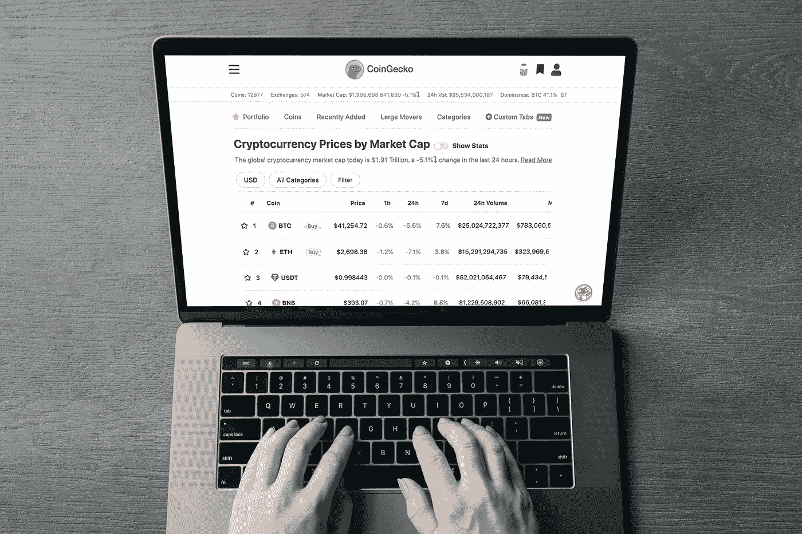

# 6 月 24 日购买的最佳加密货币

> 原文：<https://medium.com/coinmonks/best-cryptocurrencies-to-buy-on-24th-of-june-af47566ed8e1?source=collection_archive---------32----------------------->

Source photo Unsplash.com

# 涟漪(XRP)

在过去的 24 小时里，XRP 的价值上涨了 17%。它现在的交易价格为 0.383744 美元，上周上涨了 22%，但上个月下跌了 6%。

这也是 XRP 的迹象指向突破的时候。其中很大一部分原因是由于 Ripple 对 SEC 的诉讼即将做出裁决。Ripple 预计将…