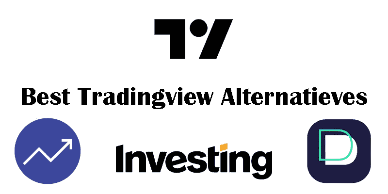
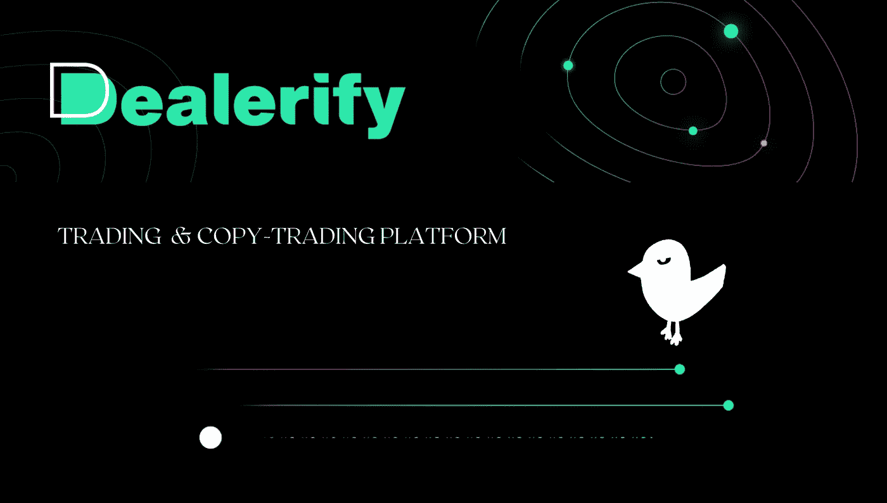
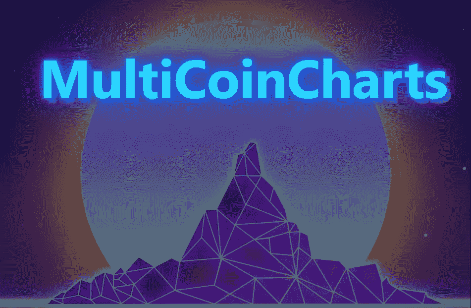

# 最佳自由交易查看备选方案

> 原文：<https://medium.com/coinmonks/best-free-tradingview-alternatives-be2b5a9ab765?source=collection_archive---------1----------------------->

Tradingview 拥有许多独特的功能，是所有交易者的最佳网站。该网站的功能包括图表部分、成员分析部分、过滤部分等。在这个网站上，你可以查看和使用其他人的分析。此外，在新闻部分，所有的基本和新的新闻将被更新。在这篇文章中，我将从大量的网站中为你介绍 4 个有用的网站，它们与 Tradingview 功能相似，但都是免费的。

1-GoCharting.com

Gocharting.com

14K +对和 90+交易所中的加密货币+ 2000 的高级和实时技术和技术图表及分析平台。在云上跟踪和存储你的技术图表，建立投资组合和壮观的列表，在社交媒体上分享你的工作。

[***GoCharting***](http://Gocharting.com)是一个最先进的金融分析平台，提供世界级的交易和图表，专注于加密货币市场。它支持 14K +对和 90+交易所中的 2000 多种加密货币。绘图、警报、自动模式识别、实时新闻更新和博客收藏—全部在一个包中。使用壮观的列表在云中跟踪和存储您的技术图表，您的加密货币投资组合构建和跟踪，并在社交媒体上分享您的工作。

> 交易新手？尝试[加密交易机器人](/coinmonks/crypto-trading-bot-c2ffce8acb2a)或[复制交易](/coinmonks/top-10-crypto-copy-trading-platforms-for-beginners-d0c37c7d698c)

2.Dealerify.io

Dealerify.io

[***Dealerify***](https://dealerify.io/)被认为是 tradingview 的最佳替代方案之一，因为它拥有 30 多个指标、多样化的蜡烛线模式以及完整的图表时间框架，如秒时间框架、分钟时间框架、小时时间框架、日时间框架和周时间框架。事实上，Dealerify 消除了加密货币交易领域对任何分析工具的需求。这个平台可以被称为智能交易平台，它允许你连接你的交易所，你可以直接在上面交易。这个平台上有如此多不同且重要的服务，使得这个工具对交易者来说有用且高效。这些重要的服务之一是，Dealerify 通过添加基于秒的时间框架，在图表上为您提供准确的数据。这一功能使你能够跟踪其他眼睛可能忽略的每一个动作。你可以灵活地选择你想要的时间框架，这样你就可以更准确地进场和出场，做出最好的决定。
您现在可以使用秒时段图表，如 S5/ S10/ S15/ S20/ S30，基于分钟的图表，如 M1/ M3/ M5/ M15/ M30，基于小时的 H1/ H2/ H4/ H6/ H8/H12，以及日线图和周线图

3.Investing.com

investing.com

投资网站可以作为任何交易者的参考。这个网站涵盖了一个交易者的所有信息需求，并帮助你获得最新的内容和文章。在这个网站上，有货币对和股票的即时新闻。这个网站的用户部分也为交易者创造了一个讨论和交流的空间，是交易者的一种社交网络。

[***【Investing.com】***](http://investing.com)平台成立于 2007 年。与传统经纪人不同，投资是一个金融门户，在全球七个地方拥有 250 多名员工。Investing.com 是当今世界三大最成功的金融门户之一。该网站每月可为超过 2100 万用户提供服务，并在全球范围内提供超过 1.8 亿次会话。由于该平台的全球性活动和应用，其服务以 44 种不同的语言提供。例如，服务提供德语、英语、意大利语、法语、波兰语和…

除了广泛的产品之外，所提供的工具通常在选择合适的提供商时也起着重要的作用。然而，客户希望利用有用的专业工具和网站的其他功能。在 Investing.com，交易者有很多不同的工具可以使用。其中有技术工具，投资工具等等。

4-Multicoincharts.com

multicoincharts.com

*是 tradingview 的另一个很好的替代品。在这个网站上，您可以通过实时(live)图表&价格数据轻松监控所有您喜爱的加密货币。比特币(BTC)、以太坊(ETH)、DogeCoin (DOGE)等等。率先看到市场动向，在与 MCC 的竞争中领先一步。*

*Multicoincharts 支持你需要的所有好的交易所，如币安、比特币基地、库科恩、FTX 等等。不再有多个标签来跟踪多个交易所的加密货币价格的麻烦。*

> *加入 Coinmonks [电报频道](https://t.me/coincodecap)和 [Youtube 频道](https://www.youtube.com/c/coinmonks/videos)了解加密交易和投资*

# *另外，阅读*

*   *[BigONE 交易所评论](/coinmonks/bigone-exchange-review-64705d85a1d4) | [CEX。IO 审查](https://coincodecap.com/cex-io-review) | [交换区审查](/coinmonks/swapzone-review-crypto-exchange-data-aggregator-e0ad78e55ed7)*
*   *[最佳比特币保证金交易](/coinmonks/bitcoin-margin-trading-exchange-bcbfcbf7b8e3) | [比特币保证金交易](https://coincodecap.com/bityard-margin-trading)*
*   *[加密保证金交易交易所](/coinmonks/crypto-margin-trading-exchanges-428b1f7ad108) | [赚取比特币](/coinmonks/earn-bitcoin-6e8bd3c592d9)*
*   *[WazirX vs CoinDCX vs bit bns](/coinmonks/wazirx-vs-coindcx-vs-bitbns-149f4f19a2f1)|[block fi vs coin loan vs Nexo](/coinmonks/blockfi-vs-coinloan-vs-nexo-cb624635230d)*
*   *[BlockFi 信用卡](https://coincodecap.com/blockfi-credit-card) | [如何在币安购买比特币](https://coincodecap.com/buy-bitcoin-binance)*