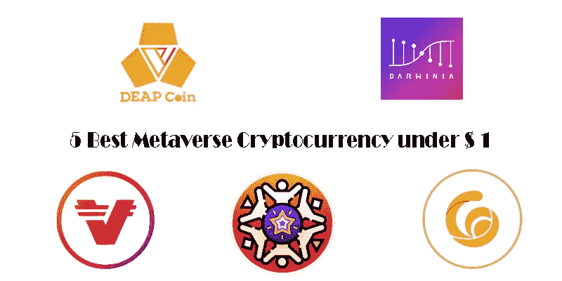
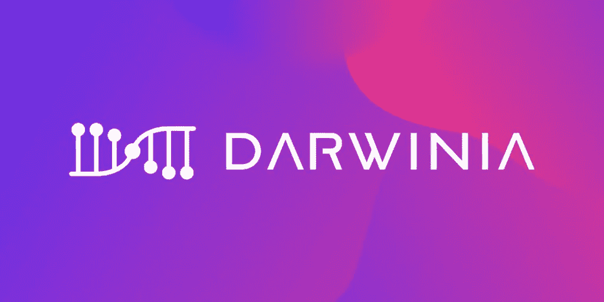
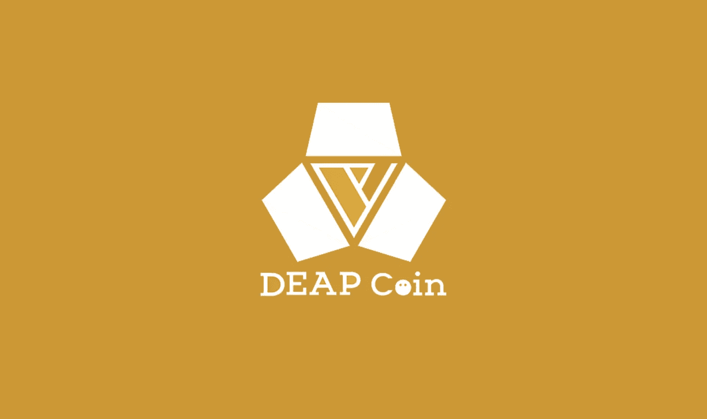
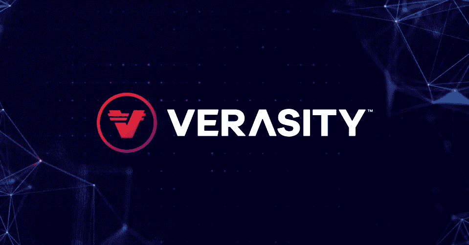
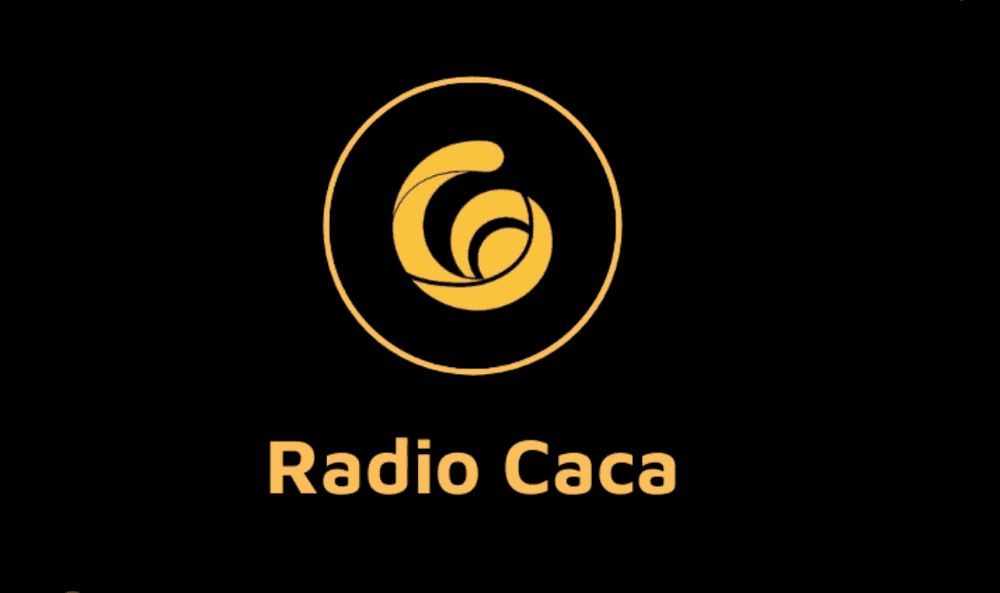
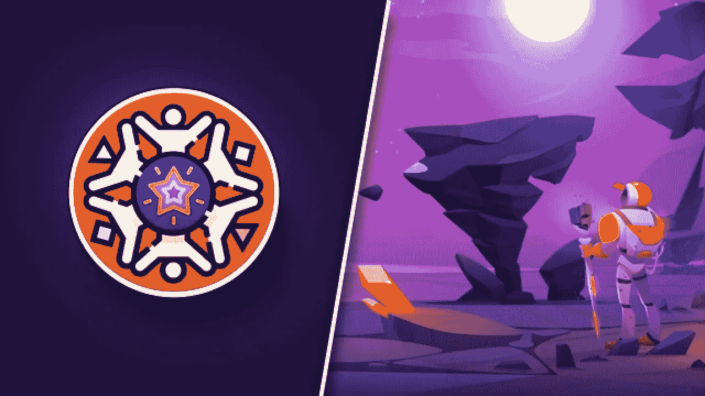

# 1 美元以下的最佳元宇宙加密货币

> 原文：<https://medium.com/coinmonks/best-metaverse-cryptocurrency-under-1-af0870085e54?source=collection_archive---------8----------------------->

5 美元以下的元宇宙加密货币

元宇宙加密货币继续主导市场，交易商也加入了这一趋势，寻找次佳的加密货币进行购买。在这篇文章中，我将向您介绍 5 个优秀的手工挑选的元宇宙密码，具有巨大的长期潜力，价格低于 1 美元。

1.  [达尔文网络(环)——0.01851 美元](https://www.datisnetwork.com/what-is-darwinia-network.html)

达尔文网络是 Polkadot 内置的 Web3.0 跨链元桥。Darwinia Network 支持与 Polkadot 生态系统集成，用于嵌入传统区块链的数字资产，如 Atrium 和币安智能链。

戒指总供应量等于 20 亿，工作供应量为 5.08 亿。

可以在火币环球、Gate.io、Uni Swap、MECV 等购买戒指。如果你在美国，我们推荐 Uni Swap。

2.迪普科恩(DEP)——0.1211 美元

DeapCoin 是一个位于区块链的游戏和 NFT 平台。DEP 是网络的本土 ERC-20 令牌建在中庭区块链。DeapCoin 有一项名为 Play Mining 的服务，它托管各种基于区块链的“玩赚”游戏。

DEP 的总供应量相当于 300 亿，其工作供应量为 32.6 亿。

你可以在 OKEx、Uni Swap、Pancake Swap 等网站购买 DEP。煎饼掉期对于寻求低交易和交易成本的美国居民和用户来说是一个很好的选择。

3.真实度(VRA)-0.01961 美元

Verasity 是一个建立在以太坊区块链上的视频分享平台。它的使命是为不同平台的视频发行商大幅增加参与度和广告收入。

VRA 的总供应量相当于 194 亿，其流通供应量为 44.7 亿。

你可以在一些主要的交易所购买 VRA，包括 Kucoin、Gate.io、Uni Swap 等等。如果你在美国，我们推荐 Kucoin 或 Uni Swap。

4.卡卡电台(RACA)——0.001623 美元

卡卡电台是玛雅·马斯克的独家 NFT 总监，也是马耶神秘盒子 NFT 的支持团队。RACA 还描绘了 USM 元宇宙，一个三维的行星世界，用户可以拥有土地，在他们的房地产上购物，玩或建造各种游戏。

RACA 的总供应量相当于 44.3 亿，其工作供应量为 12 亿。

你可以在各种交易所购买 RACA，包括 Poloniex、Gate.io、Pancake Swap、MEXC 等等。如果你在美国，煎饼互换是最好的选择，因为它成本低，没有地理限制。

5.StarLink(STARL)——0.00001556 美元

Starlink 寻求建立第一个真正分散的元交换机。Starlink 称自己是第一个分散的虚拟社区项目。STARL 是 STARL 生态系统的管理标志。Starlink 允许用户买卖和交易虚拟物品，如卫星、宇宙飞船和土地。

STARL 的总供给量等于 10 万亿，其流通供给量为 9.9 万亿。

你可以在 OKEx、Gate.io、Uni Swap、Sushi Swap 等多家交易所购买 STARL 代币。如果你在美国，我们建议使用 Uni Swap 进行 STARL 交易。

> 加入 Coinmonks [电报频道](https://t.me/coincodecap)和 [Youtube 频道](https://www.youtube.com/c/coinmonks/videos)了解加密交易和投资

# 另外，阅读

*   最好的[加密税务软件](/coinmonks/best-crypto-tax-tool-for-my-money-72d4b430816b) | [硬币追踪评论](/coinmonks/cointracking-review-a-reliable-cryptocurrency-tax-software-5114e3eb5737)
*   [Stackedinvest 评论](https://coincodecap.com/stackedinvest-review) | [北海巨妖评论](/coinmonks/kraken-review-6165fc1056ac) | [bitFlyer 评论](https://coincodecap.com/bitflyer-review)
*   最佳[加密借贷平台](/coinmonks/top-5-crypto-lending-platforms-in-2020-that-you-need-to-know-a1b675cec3fa) | [杠杆代币](/coinmonks/leveraged-token-3f5257808b22)
*   最佳[加密制图工具](/coinmonks/what-are-the-best-charting-platforms-for-cryptocurrency-trading-85aade584d80) | [最佳加密交易所](/coinmonks/crypto-exchange-dd2f9d6f3769)
*   [比斯勒评论](https://coincodecap.com/bitsler-review)|[WazirX vs coin switch vs coin dcx](https://coincodecap.com/wazirx-vs-coinswitch-vs-coindcx)
*   [7 大副本交易平台](https://coincodecap.com/copy-trading-platforms) | [BuyCoins 点评](https://coincodecap.com/buycoins-review)
*   [my constant Review](https://coincodecap.com/myconstant-review)|[8 款最佳摇摆交易机器人](https://coincodecap.com/best-swing-trading-bots)
*   [Godex.io 审核](/coinmonks/godex-io-review-7366086519fb) | [邀请审核](/coinmonks/invity-review-70f3030c0502) | [BitForex 审核](https://coincodecap.com/bitforex-review)