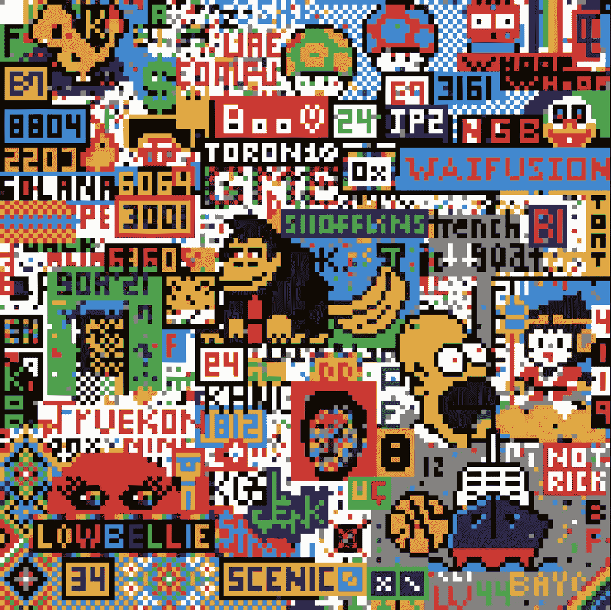

# 2022 年最佳 NFT 收藏，值得投资和关注！

> 原文：<https://medium.com/coinmonks/best-nft-collections-of-2022-to-invest-and-look-out-for-700a5bf4810?source=collection_archive---------87----------------------->

这些是最受欢迎的 NFT 系列，也是 2022 年最具潜力的系列

**大玩家**，老牌 NFT——集合:
——隐朋克:[https://opensea.io/collection/cryptopunks](https://opensea.io/collection/cryptopunks)
——无聊猿游艇俱乐部:[https://opensea.io/collection/boredapeyachtclub](https://opensea.io/collection/boredapeyachtclub)
——类人机器人:[https://opensea.io/collection/thehumanoids](https://opensea.io/collection/thehumanoids)
——兴奋剂战争:[https://opensea.io/collection/dope-v4](https://opensea.io/collection/dope-v4)
——阿谢:[https://axieinfinity.com/](https://axieinfinity.com/)
——分散地:[https://market.decentraland.org/](https://market.decentraland.org/)

**Upcommers**，潜力巨大但依然实惠的 NFT——收藏:
——https://opensea.io/collection/humansofnft 的人类:
——travel gnome:
——Dope Shibas:[https://opensea.io/collection/dope-shibas](https://opensea.io/collection/dope-shibas)

如何购买 NFT 代币？
TL；博士:去这里:[https://swapzone.io/?refId=ulinXGM85P](https://swapzone.io/?refId=ulinXGM85P)

让我们从头开始，从第一步开始:你需要为自己购买一些加密货币，以便您可以购买 NFT！

第一步。第一步是购买乙醚。是的，以太是你需要购买 NFT 加密令牌的硬币。

第二步:购买乙醚后，您必须将其转移到您选择的交易所的安全钱包中。

第三步:现在去 OpenSea 或任何其他 NFT 市场看看。虽然你可以从区块链上的其他人那里买到特定的 NFT，但大多数时候你还是想找一个信誉良好的市场。

第 4 步:接下来，你必须将你的 MetaMask 钱包连接到 marketplace(如果你没有钱包，请创建一个钱包)，并将你从 exchange 帐户购买的乙醚转移到 marketplace 钱包，以便购买 NFTs。

第五步:确定哪个 NFT 最适合你。没必要着急。设定一个具体的价格范围，选择你想购买的 NFT 的类型，并在 OpenSea 界面中填写一些其他数据，以帮助你缩小选择范围。

第六步:购买 NFT。当您到达您选择的 NFT 的登录页面时，您可能会发现一些不同的选项。一些 NFT 可以立即购买，而另一些可能需要您首先进入拍卖；出于本文的目的，让我们假设您将购买可以立即购买的 NFT。在 OpenSea 网站的右上方可以看到一个钱包符号；按下它，一个加密钱包的列表就会出现。

第七步。如果您还没有将 MetaMask 钱包连接到 OpenSea，现在就进行连接。要完全获得您的 NFT，您必须将此钱包连接到市场。这是一个简单快速的过程；你所要做的就是按照平台上的步骤去做。

第八步:和你的新 NFT 玩得开心！支付所有费用后，交易已在区块链上确认，您现在是一个不可替代令牌的快乐所有者！它将显示在你的 MetaMask 钱包中，你将能够交易它或者只是享受你现在可以购买 NFT 的事实。

> 加入 Coinmonks [电报频道](https://t.me/coincodecap)和 [Youtube 频道](https://www.youtube.com/c/coinmonks/videos)了解加密交易和投资

# 另外，阅读

*   [3 商业评论](/coinmonks/3commas-review-an-excellent-crypto-trading-bot-2020-1313a58bec92) | [Pionex 评论](https://coincodecap.com/pionex-review-exchange-with-crypto-trading-bot) | [Coinrule 评论](/coinmonks/coinrule-review-2021-a-beginner-friendly-crypto-trading-bot-daf0504848ba)
*   [莱杰 vs n rave](/coinmonks/ledger-vs-ngrave-zero-7e40f0c1d694)|[莱杰 nano s vs x](/coinmonks/ledger-nano-s-vs-x-battery-hardware-price-storage-59a6663fe3b0) | [币安评论](/coinmonks/binance-review-ee10d3bf3b6e)
*   [Bybit Exchange 审查](/coinmonks/bybit-exchange-review-dbd570019b71) | [Bityard 审查](https://coincodecap.com/bityard-reivew) | [Jet-Bot 审查](https://coincodecap.com/jet-bot-review)
*   [3 commas vs crypto hopper](/coinmonks/3commas-vs-pionex-vs-cryptohopper-best-crypto-bot-6a98d2baa203)|[赚取加密利息](/coinmonks/earn-crypto-interest-b10b810fdda3)
*   最好的比特币[硬件钱包](/coinmonks/hardware-wallets-dfa1211730c6) | [BitBox02 回顾](/coinmonks/bitbox02-review-your-swiss-bitcoin-hardware-wallet-c36c88fff29)