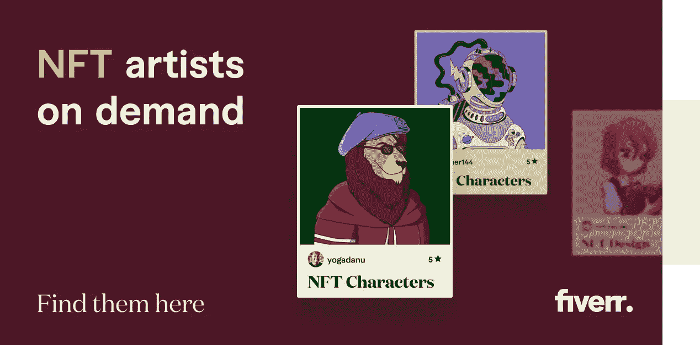

# Fiverr 最佳 NFT 设计师/艺术家

> 原文：<https://medium.com/coinmonks/best-nft-designers-artists-on-fiverr-471ffda1b7ed?source=collection_archive---------80----------------------->

Fiverr 是招聘自由职业者的最佳网站之一，因为它很受自由职业者的欢迎。**有成千上万的平面设计师使用这个平台，有数百种 NFT 特有的工作可供选择，一定会有一个适合你的自由职业者。**

根据我的研究，Fiverr 在寻找最优秀的 NFT 设计师****方面领先。我在 Fiverr 上找到的一些唱片是最好的，质量最高的。它拥有最多的 NFT 设计师和艺术家，这意味着你可以选择，这比周围的其他一些网站都要多。记住:这是一个新兴行业，所以任何选择都是加分项。****

****此外，Fiverr 上的许多 NFT 专业人士提供的服务价格低至 5 美元，所以你可以很容易地找到符合你预算的设计师。**你也可以根据你的预算、选择的艺术风格或卖家评分来过滤你的搜索。当你为你的 NFT 项目选择艺术家时，这可以节省你大量的时间。******

****然而，到目前为止，我最喜欢的功能是 Fiverr 对你的合法权利有多清楚。**有了 Fiverr，一旦你为作品付费，你就可以获得委托设计的全部所有权。Fiverr 上的每个设计师都在相同的法律合同下工作，所以你不需要花几个小时钻研无休止的法律术语来确保你的设计师提供你需要的东西。******

****值得注意的是**不是每个 Fiverr 卖家都提供他们作品的商业用途，**你不能根据他们是否提供这种用途来筛选设计师。所以，如果拥有商业使用权对你来说很重要，准备好多花一点时间为你的项目找一个设计师。****

****想了解更多关于 NFT 艺术和其他来自 Fiverr 的数字服务，你可以在这里查看我的博客**。我希望这篇文章对你有帮助，如果有，请在下面留言告诉我。谢谢大家！******