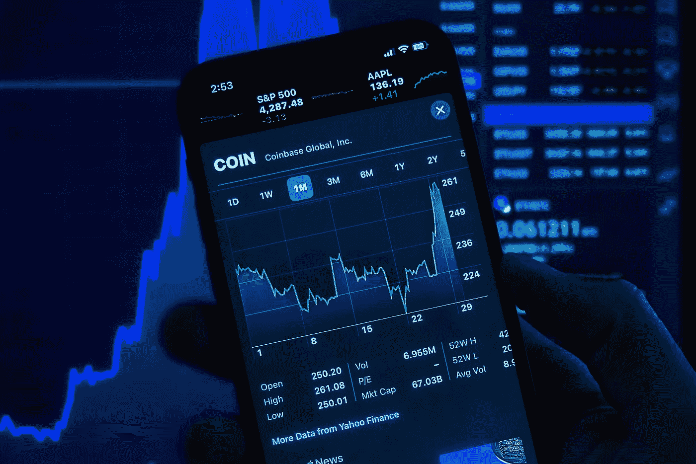

# 购买密码的最佳地点

> 原文：<https://medium.com/coinmonks/best-places-to-buy-crypto-b00aaa216457?source=collection_archive---------57----------------------->

加密货币世界看起来真的很令人兴奋！

导航起来也有点困难。你在哪里买密码，你如何买密码，它存放在哪里？

这些都是很好的问题，我们将为您解答。

购买密码最简单的方法是通过交易所。交易所使得买卖、发送和接收密码变得极其容易。

如果你正在寻找密码入门，这里是购买密码的最佳交易所。

# **比特币基地**

如果你想开始学习加密，比特币基地是最好的注册交易所。有超过 100 种加密货币，你可以很容易地投资任何一种非常受欢迎的硬币。

有很多理由说明它是第一名。

它在美国每个州都有售。不是每个州都有很多交易所可用(看你，纽约。)在世界上许多国家也有售。通过发送密码，你可以轻松地在世界各地转移资金。

有了比特币基地，你只需要投资 2 美元就可以开始了。您可以使用各种不同的支付方式，但是每种方式都有自己的交易费。支付方式包括 PayPal、借记卡、银行账户或电汇。

比特币基地也给你很多免费的密码。通过学习和赚取，你可以观看关于某种加密货币的视频，并回答有关它的问题以免费赚取密码。有时这可能是价值 3 美元的密码，有时这可能是价值 10 美元的密码。这是获得各种不同密码的好方法。

比特币基地最棒的一点是，如果你 [**通过这个链接**](https://coinbase.com/join/heil_58) 注册，你将免费获得 10 美元的比特币！

# **双子座**

美国 50 个州都有的另一个交易所是 Gemini。对于刚刚开始使用加密货币的人来说，这是一个非常好的交流方式。

目前，Gemini 有超过 50 种加密货币上市交易。你会发现任何流行的硬币，如比特币或以太坊。你在 Gemini 上持有的任何硬币都可以抵御黑客攻击。

双子座也让你通过在他们的平台上下注来赚取你的密码。有些回报率不太高，只有 1%或 2%(不过，它们比银行高。)如果你使用该平台自己的加密货币 Gemini Dollar 下注，你将获得高达 8.05%的回报。

当你 [**使用这个链接**](https://gemini.com/share/46em5ykcl) 注册并开始投资时，双子座也会免费给你 10 美元。

# **罗宾汉**

Robinhood 多用于交易股票，但也可以用于交易加密货币。如果你刚刚开始使用加密，你只是想投资，罗宾汉可能是你的地方。

罗宾汉最大的好处之一就是免费的密码交易。上面列出的两个交易所都不提供任何形式的自由交易。也没有最低消费，你必须开始在加密。你甚至可以只买一个金币！

罗宾汉的缺点是几乎没有任何种类的密码。在这里，只有 7 种不同的密码可供选择。不过，他们确实有两个最流行的密码，比特币和以太坊。

# 那现在怎么办？

现在，是时候注册一个交易所，开始使用 crypto 了！

如果你想跳进比特币基地，你可以使用 [**这个链接在你注册**](https://coinbase.com/join/heil_58) 时获得 10 美元。比特币基地是伟大的，因为它可以在所有 50 个州，它有一个低启动费，因为你可以免费赚取吨加密。

当你 [**注册并投资**](https://gemini.com/share/46em5ykcl) 时，双子座也提供同样价值 10 美元的比特币。双子座非常适合赌上你的密码，被动地赚取更多。

Robinhood 是免费入门的好地方。如果你已经在使用该平台进行股票交易，这也很方便。

现在你已经开始使用 crypto 了，让我们把这些袋子变大。查看 [**获得免费加密的最佳方式**](https://www.cryptolovesh2o.com/blog-posts/how-to-earn-free-cryptocurrency) 。

> 加入 Coinmonks [电报频道](https://t.me/coincodecap)和 [Youtube 频道](https://www.youtube.com/c/coinmonks/videos)了解加密交易和投资

# 另外，阅读

*   [折叠 App 审核](https://coincodecap.com/fold-app-review) | [Kucoin 交易机器人](/coinmonks/kucoin-trading-bot-automate-your-trades-8cf0ca2138e0) | [Probit 审核](https://coincodecap.com/probit-review)
*   [如何匿名购买比特币](https://coincodecap.com/buy-bitcoin-anonymously) | [比特币现金钱包](https://coincodecap.com/bitcoin-cash-wallets)
*   [币安 vs FTX](https://coincodecap.com/binance-vs-ftx) | [最佳(SOL)索拉纳钱包](https://coincodecap.com/solana-wallets)
*   [比诺莫点评](https://coincodecap.com/binomo-review) | [斯多葛派 vs 3 commmas vs trapanta](https://coincodecap.com/stoic-vs-3commas-vs-tradesanta)
*   [Capital.com 点评](https://coincodecap.com/capital-com-review) | [香港数字加密贷款平台](https://coincodecap.com/crypto-lending-hong-kong)
*   [如何在 Uniswap 上交换加密货币？](https://coincodecap.com/swap-crypto-on-uniswap) | [A-Ads 点评](https://coincodecap.com/a-ads-review)