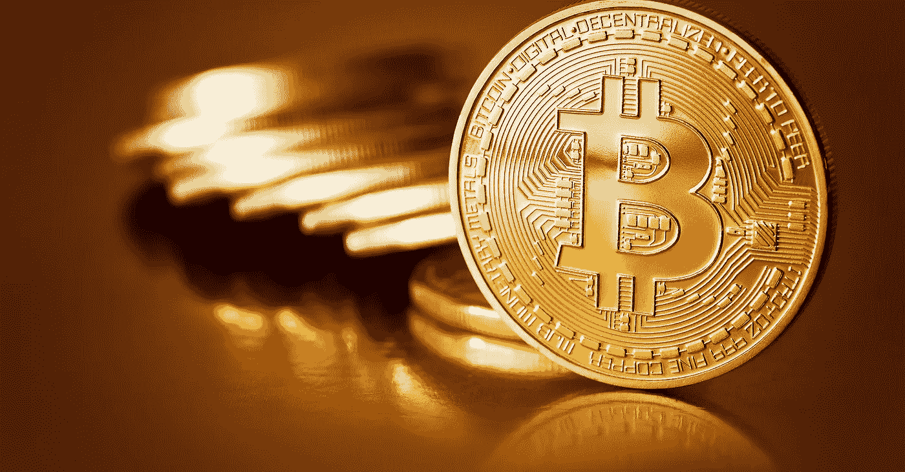
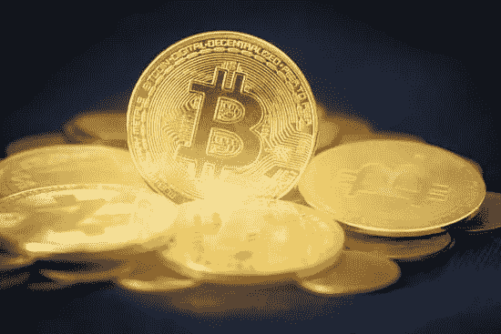

# 加纳销售比特币的最佳平台

> 原文：<https://medium.com/coinmonks/best-platform-to-sell-bitcoin-in-ghana-cf7291bea8f6?source=collection_archive---------67----------------------->

加纳是发展最快的非洲国家之一，对加密货币并不陌生，尤其是比特币的使用。这个西非国家是世界上少数几个密码交易猖獗的国家之一。

加纳人已经参与了比特币的交易，以赚取财富。在世界的这一地区，当地货币(Cedis)已被用作支付方式。

Sell Bitcoin in Ghana

如果你在加纳，正在寻找出售比特币的最佳交易平台，那你来对地方了。在本文中，我们将重点介绍加纳销售比特币的一些主要平台。

你可能会认为你可以使用任何你喜欢的平台，但是当涉及到加密货币时，必须采取额外的谨慎措施，以确保你获得最大的投资回报。这里有一些平台，你可以把你的比特币卖给它们；

# 在加纳卖比特币

[Dart Africa](http://dartafrica.io/) 是领先的加密货币交易平台，在非洲销售包括比特币在内的各类加密货币。Dart Africa 已经能够拉近客户对加密交换平台的期望与最终交付的服务之间的差距。如果你在 Dart Africa 的网站上出售你的比特币，支付是即时的。加纳人和尼日利亚人都可以参加 Dart Africa。

Dart Africa 提供外汇市场上最好的汇率之一。尽管 crypto 的价值不断变化，Dart Africa 提供的汇率始终对客户有利。您可以随时使用 [Dart Africa 的硬币计算器](https://dartafrica.io/coincalculator)来检查您的加密硬币的当前汇率。

您可以通过访问他们的[网站](http://dartafrica.io)或通过在 [Play Store](https://play.google.com/store/apps/details?id=com.dartafrica&hl=en_US&gl=US) 和 App Store 下载的移动应用程序来访问 Dart Africa 的交换服务。该平台采用用户友好型设计，便于用户在上面进行交易。

**如何在 Dart Africa 上出售你的比特币**

Sell Bitcoin on Dart Africa

1.  在你可以在 Dart Africa 的平台上销售任何加密货币之前，你必须拥有他们的账户。[使用您的正确凭证(电子邮件和电话号码)注册](https://dartafrica.io/register)或[使用您的电子邮件地址和密码登录](https://dartafrica.io/login)(如果您已经有帐户的话)。
2.  填写您的银行账户信息。
3.  登录后，在您的帐户面板上点击“出售”。
4.  如果您要出售比特币，请选择比特币作为您的首选加密货币；如果您要出售其他硬币，请选择显示的其他替代硬币。选择你要出售的密码数量，然后会提供当前的美元、奈拉和塞迪斯价格。点击立即出售硬币
5.  通过将比特币发送到通过手动输入钱包地址或扫描条形码提供的钱包地址来完成交易。
6.  一旦系统确认您的交易，资金将在几分钟内发送到您的账户

帕特丽夏:

这里是另一个比特币交易所，你可以在加纳买卖比特币。交易所总部设在尼日利亚，在加纳、联合王国和美利坚合众国设有分支机构。Patricia 由 Hanu Agbodje 于 2018 年成立。帕特丽夏不仅出售密码，他们还交易礼券，帕特丽夏卡，完美的钱，贝宝基金等。

该交易所还提供一个钱包，你可以在那里保存你的比特币。

你还可以使用比特币支付账单、购买通话时间和购买数据。帕特里夏交易平台，这似乎是它相对于其他交易平台的优势。

**Paxful:**

这是把你的比特币卖给加纳 cedi (GHS)的最佳平台之一。Paxful 是全球领先的点对点(P2P)比特币市场之一。使用 Paxful 的优势之一是无需处理通过传统金融机构汇款带来的额外费用。除了传统的银行转账，Paxful 还提供多种支付方式。

**在任何平台交易前需要考虑的事情:**

*   汇率。确保你要去的平台为你的比特币提供了市场上最好的汇率。
*   费用。找出发送你的比特币或在你当地的银行接收你的钱是否有任何附加费用。
*   极限。查看比特币和 Cedis 的汇率和取款限制。
*   安全。交流平台的口碑如何？平台安全吗，他们对你的数据和资金的安全性有多重视？
*   客服。这一点经常被忽视或忽略，但如果出现问题，考虑他们的客户支持系统是很重要的。此外，请记住他们可用的时间。
*   可信度。通过阅读用户评论和反馈，看大众对交换平台的观感。留意负面评论，观察公司如何应对也是一个好主意。

> *加入 Coinmonks* [*电报频道*](https://t.me/coincodecap) *和* [*Youtube 频道*](https://www.youtube.com/c/coinmonks/videos) *了解加密交易和投资*

# 另外，阅读

*   [Bookmap 点评](https://coincodecap.com/bookmap-review-2021-best-trading-software) | [美国 5 大最佳加密交易所](https://coincodecap.com/crypto-exchange-usa)
*   最佳加密[硬件钱包](/coinmonks/hardware-wallets-dfa1211730c6) | [Bitbns 评论](/coinmonks/bitbns-review-38256a07e161)
*   [新加坡十大最佳加密交易所](https://coincodecap.com/crypto-exchange-in-singapore) | [购买 AXS](https://coincodecap.com/buy-axs-token)
*   [红狗赌场评论](https://coincodecap.com/red-dog-casino-review) | [Swyftx 评论](https://coincodecap.com/swyftx-review) | [CoinGate 评论](https://coincodecap.com/coingate-review)
*   [投资印度的最佳密码](https://coincodecap.com/best-crypto-to-invest-in-india-in-2021)|[WazirX P2P](https://coincodecap.com/wazirx-p2p)|[Hi Dollar Review](https://coincodecap.com/hi-dollar-review)