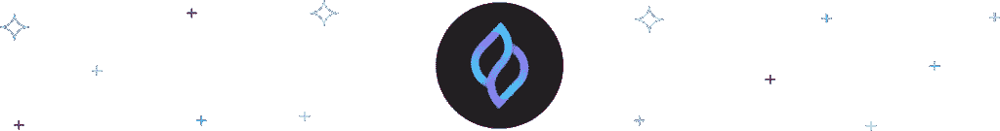

# 多边形网络的最佳方案

> 原文：<https://medium.com/coinmonks/best-projects-of-the-polygon-network-700bbb65d90c?source=collection_archive---------10----------------------->

从 Dao 到合成资产，Polygon 网络充满了试图改变我们与去中心化网络交互方式的项目。让我们来看看 Polygon 是什么，以及目前 Polygon 上最流行的一些项目。

# 什么是多边形？

Polygon 是一个分散的协议生态系统，使以太坊能够扩展到每秒数千个交易。Polygon 还为开发者提供了广泛的工具和服务，方便他们在以太坊上构建和部署去中心化的应用。Polygon 的原生令牌 MATIC 用于支付网络上的交易费用。Polygon 于 2021 年 3 月推出，汇集了之前的 Matic Network 和以太坊 sidechain。该项目已被重新命名为多边形。

多边形上有一些以太坊-缩放解。其中一些包括:

*   **Polygon PoS:** Polygon PoS 是第 2 层扩展解决方案，使用侧链进行交易处理，以实现卓越的交易速度和成本降低。同样，PoS 通过分散的利害关系证明(POS)验证器网络和强大的等离子桥接框架来保护资产。Polygon 的可扩展风险证明设计补充了以太坊的分散安全性，允许您构建吸引广大受众的应用程序，同时保持分散化的效力。
*   **Polygon Hermez:**Hermez ZK-roll up 是构建在以太坊之上的第 2 层架构，它通过将几个事务合并成一个事务来克服可伸缩性问题。为了显示和公开记录在以太坊区块链上执行的滚动交易的真实性和准确性，使用了“零知识证明”(ZK)技术。
*   **多边形边缘:**多边形边缘允许你用各种你可以定制的特性创建你的区块链网络。它基于模块化设计概念，使以太坊与您的网络兼容。
*   **Polygon night:**Polygon night 是一个乐观的汇总，旨在使私人转让 ERC20、ERC721 和 ERC1155 代币更加实惠。它使用乐观汇总来降低交易成本，使用零知识证明来保证匿名性。

有些仍在开发中，如:

*   **多边形 Avail:** Avail 允许模块化链设计，数据排序和可用性由 Avail 在各种执行环境中处理。
*   **Polygon Miden:**Polygon Miden 是以太坊第二层缩放解决方案。Miden 使用零知识技术(zk-STARKs)将数千个第 2 层交易“汇总”成单个以太坊交易，从而提高吞吐量并降低交易费用。
*   **Polygon Zero:** Polygon Zero 是以太坊第二层缩放解决方案。Plonky2 是开创性的证明系统，它比任何其他现有技术都更快地创建 ZK 证明，是 Polygon Zero 区别于其他 ZK 缩放解决方案的地方。

# 贝拉协议

[Bella Protocol](https://bella.fi/) 是一个提供一些 DeFi 解决方案的平台，旨在使加密银行变得更加容易和简单。该协议由 Felix Xu 和 Xu 于 2020 年共同创立，承诺通过消除某些平台可能存在的高费用和延迟交易问题来改善用户体验，同时通过 DeFi 智能门户简化流程。

[BEL 令牌](https://swapzone.io/currencies/bella-protocol)是 Bella 协议生态系统的一个重要特征，因为它在平台治理中既作为奖励令牌又作为投票令牌。BEL 可用于接收赌注奖励、农场网络费用奖励以及获得 Bella 协议项目的独特折扣。

2021 年 7 月，Bella Protocol 宣布与 Dinoswap(一个跨链基础设施平台，帮助一级区块链、AMMs 和合作伙伴计划开发流动性)合作，这意味着 BEL token 迁移到 Polygon 生态系统。Bella 可以通过切换到 MATIC(为多边形网络供电的以太坊令牌)来克服以太坊主链上 DeFi 协议的高费用、低速度和差 UX，从而获得无与伦比的完整 DeFi 体验。

# 威望

[法力令牌](https://swapzone.io/currencies/decentraland)是[分散](https://decentraland.org/)平台的原生货币。它用于在分散的虚拟世界中购买土地、商品和服务。它也用于支付区块链的交易费用。分散土地是一个虚拟世界，用户可以购买、出售或租赁土地。土地存放在以太坊区块链上，每块土地由一个不可替换的令牌(NFT)代表。由 Ariel Meilich 和 Esteban Ordano 共同创建的分散之地是一个为寻求新的艺术媒体、商业机会或娱乐来源的内容创作者、企业和个人搭建的平台。

2021 年 4 月，分散地宣布了一个令牌桥，允许分散地的 dApps 在多边形网络上进行免费交易。这种集成使分散式土地能够扩展其服务，并为平台的开发者和用户提供完成基本日常任务所需的速度、经济性和可用性。

用户可以完全通过 Polygon 平台认领、购买、出售和交易可穿戴设备。通过与 crypto on/off ramp Transak 的集成，该平台还允许用户直接使用 Polygon 上的借记卡和信用卡购买法力令牌。

# 矿脉

[礁令牌](https://swapzone.io/currencies/reef)是[礁链](https://reef.io/)的本地货币，用于流动性、交易费用和治理。REEF(代表可靠、可扩展、高效和快速)链是一个 DeFi、NFTs 和游戏友好的第 1 层和 EVM 兼容的区块链。它速度快，可扩展，交易成本最低，不会低效开采。它是用底层框架构建的，并具有链上治理。它采用了一种共识算法，称为提名的利害关系证明。

Reef 链可以运行任何已经在以太坊或 EVM 兼容网络上实现的 DeFi 协议，只需对代码进行少量修改。珊瑚礁生态系统可以由任何有 Web3 钱包的人访问，他们对访问珊瑚礁上的 dApps 感兴趣，因为珊瑚礁链横跨以太坊和波尔卡多特之间的十字路口，以及通往其他区块链的桥梁。

# 总注册吨位

[图](https://thegraph.com/en/)是一个索引协议，可以用来查询以太坊、IPFS 等网络。任何人都可以创建和发布开放的 API，称为子图，使数据更容易访问。参与者使用[图形令牌(GRT)](https://swapzone.io/currencies/the-graph) 来保证图形网络的经济安全性以及被查询数据的完整性。GRT 是一个工作令牌，索引器、管理器和委托器使用它为网络提供索引和管理服务。

随着 Polygon 上 Subgraph Studio 的计费合同的推出，Graph 扩展了它在 Polygon 上的用例(开发人员可以使用 Subgraph Studio 来构建、测试和部署子图，以及管理他们的 API 键)。

# AAVE

Aave 是一个 DeFi 贷款协议。这是一个非托管、开源的货币市场平台，允许你赚取存款利息并借入各种数字资产。 [AAVE](https://swapzone.io/currencies/aave) 作为一个治理令牌，为所有者提供了对协议未来发展的发言权。它还以优惠的平台费用奖励持有人。

2021 年，Aave 宣布与 Polygon 整合。Polygon 推出 Aave 市场对于启动 DeFi 生态系统并为其客户提供稳定的流动性来源非常重要。该实现旨在为任何人都可以使用的 DeFi 应用程序创建替代方案，允许用户利用“几乎免费”的交易。

# UMB

[Umbrella network](https://www.umb.network/) 是世界上第一个真正去中心化的 oracle，提供低成本、大规模可扩展且安全的智能合同解决方案。它们让区块链开发人员能够访问他们以前无法访问的数据，而且成本比业内任何其他 oracle 都低。伞状网络的分散权力基于 [UMB 公用事业令牌](https://swapzone.io/currencies/umbrella-network)，用于赌注、社区投票以及奖励和激励。

自从 Polygon 上推出伞形网络以来，Polygon 生态系统上的许多 dApps 已经能够将伞形网络的数据馈送直接集成到他们的智能合同中。

# 斯方德

[Seedify](https://launchpad.seedify.fund/) 是区块链游戏的孵化器和发射台。通过下注 [$SFUND](https://swapzone.io/currencies/seedifyfund) ，你可以在社区中的其他人之前购买游戏代币，让你在“玩到赚”的时代获得优势。

其生态系统还包括 Seedify NFT 空间，这是业内首个以游戏和元宇宙资产为中心的 NFT 市场，以及一个用于游戏和元宇宙资产的 NFT 发射台。

他们可以提供顶级的区块链解决方案、资金选项、开发支持，以及制作具有出色用户体验的游戏的能力，同时由于他们与 Polygon 的集成，优化了项目投资者的 ROI。

# SHFT

Shyft 网络是一种公共协议，用于检查区块链数据中的身份和电源合规性。Shyft Network 提供了有价值的用户信息，机构可以使用这些信息来保护加密货币，同时通过允许在集中式和分散式生态系统之间传输可验证的数据来维护隐私。Shyft 协议由一个本地令牌 [SHFT](https://swapzone.io/currencies/shyft-network) 提供支持。代币充当支付方法、链接价值的机制和获取价值的工具。货币用于数据传输和识别，也作为生态系统协调的治理工具。

Shyft Network 和 Polygon 联手为分散金融(DeFi)提供一个选择加入的合规基础设施。开发人员可以将 Shyft Network core contracts 集成到他们的 dapp 中，以实现了解客户(KYC)和身份原语、合规资产池、跨 dapp 的路由声誉和验证，并符合即将到来的分散式金融和保管及非保管 FATF 全球指导要求，以及即将到来的分散式金融和保管及非保管 FATF 全球指导要求。

# 卡斯塔

在 KASTA 生态系统中，Kasta 是一种加密货币令牌，具有广泛的应用和好处。KASTA 可以像另一种加密货币一样进行买卖。Kasta 将在 KASTA 的发展和实现其引导全球广泛采用加密货币的目标方面发挥关键作用。

去年年底，Kasta 宣布他们已经选择 Polygon 作为他们建立分散开放和无边界支付新时代的网络。这一选择是基于 Polygon network 的扩展解决方案、更低的费用、更快的交易吞吐量以及去中心化的方法。

# 顶级多边形项目-结论

多边形网络由于其令人印象深刻的可扩展性而变得日益重要。毫不奇怪，Bella Protocol、Kasta、Aave、分散式网络、Shyft 网络等几个项目都在利用多边形网络的多功能性。

有趣的是，许多这些有前途的项目都有代币，可以在 [Swapzone](https://swapzone.io/) 上兑换。

Swapzone 是一个即时交易所，它提供了更高的流动性、零被黑事件发生率以及尽可能低的交易费用。

**进一步阅读:** [**赚取密码玩游戏:Axie Infinity、DogeDash、Kleerun、Sandbox、splitter lands**](https://swapzone.io/blog/play-to-earn-crypto-games)

> *加入 Coinmonks* [*电报频道*](https://t.me/coincodecap) *和* [*Youtube 频道*](https://www.youtube.com/c/coinmonks/videos) *了解加密交易和投资*

# 另外，阅读

*   [3 商业评论](/coinmonks/3commas-review-an-excellent-crypto-trading-bot-2020-1313a58bec92) | [Pionex 评论](https://coincodecap.com/pionex-review-exchange-with-crypto-trading-bot) | [Coinrule 评论](/coinmonks/coinrule-review-2021-a-beginner-friendly-crypto-trading-bot-daf0504848ba)
*   [莱杰 vs Ngrave](/coinmonks/ledger-vs-ngrave-zero-7e40f0c1d694) | [莱杰 nano s vs x](/coinmonks/ledger-nano-s-vs-x-battery-hardware-price-storage-59a6663fe3b0) | [币安评论](/coinmonks/binance-review-ee10d3bf3b6e)
*   [Bybit Exchange 评论](/coinmonks/bybit-exchange-review-dbd570019b71) | [Bityard 评论](https://coincodecap.com/bityard-reivew) | [Jet-Bot 评论](https://coincodecap.com/jet-bot-review)
*   [3 commas vs crypto hopper](/coinmonks/3commas-vs-pionex-vs-cryptohopper-best-crypto-bot-6a98d2baa203)|[赚取加密利息](/coinmonks/earn-crypto-interest-b10b810fdda3)
*   最好的比特币[硬件钱包](/coinmonks/hardware-wallets-dfa1211730c6) | [BitBox02 回顾](/coinmonks/bitbox02-review-your-swiss-bitcoin-hardware-wallet-c36c88fff29)
*   [BlockFi vs 摄氏](/coinmonks/blockfi-vs-celsius-vs-hodlnaut-8a1cc8c26630) | [Hodlnaut 点评](/coinmonks/hodlnaut-review-best-way-to-hodl-is-to-earn-interest-on-your-bitcoin-6658a8c19edf) | [KuCoin 点评](https://coincodecap.com/kucoin-review)