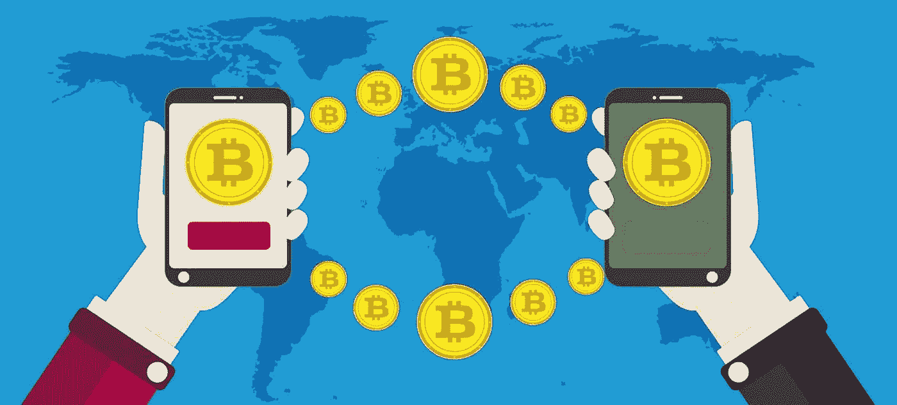

# 尼日利亚最优惠的加密交易价格

> 原文：<https://medium.com/coinmonks/best-rates-to-trade-crypto-in-nigeria-fd3ab5dbf8d0?source=collection_archive---------67----------------------->

自加密货币问世以来，它在非洲越来越受欢迎。例如，尼日利亚在使用比特币最多的国家中排名第三，仅次于美国和俄罗斯。然而，在一些国家和非洲国家，如尼日利亚和加纳(恰好是其中之一，两者都是部分禁令)，部分或完全禁止加密货币。尼日利亚和加纳的加密用户不得不依靠加密交换平台来出售他们的加密货币，因为商业银行被禁止与币安或加密钱包等加密组织合作。

除了从欺诈池中找出一个具有优惠交易政策的合法加密货币交易平台的麻烦之外，加密交易员还必须担心所选交易平台提供的汇率。这个汇率是奈拉对一美元的价值。贸易汇率会根据平台的不同而变化，贸易汇率会因各种社会经济条件而变化，加密货币的价格也会影响汇率。

为了在尼日利亚获得加密货币的最佳利率，你必须选择提供最佳利率的交易平台。

## Dart 非洲；交易加密货币的最佳利率

[Dart Africa](http://dartafrica.io) 在撰写本文时，使用 [Dart Africa 的硬币计算器](https://dartafrica.io/coincalculator)，已被证明拥有尼日利亚最好的汇率；

*   比特币的汇率是 580 元/美元
*   以太坊的汇率是 582 元/美元
*   Dogecoin 的汇率是 580 奈拉/美元
*   USDC 的汇率是 582 奈拉/美元
*   莱特币的汇率是 583 奈拉/美元
*   USDT 的汇率是 582 奈拉/美元

这些是您在加密交易市场上获得的加密货币的最佳利率(它们会根据总体经济表现而变化)。

## **关于飞镖非洲**

Dart Africa

有了 [Dart Africa](http://dartafrica.io) ，您将享受到市场上最高的交易费率、确保最快支付时间的自动化支付系统、全天候客户服务，以满足您关于平台的所有需求，以及更多更多。

Dart Africa 是一个全自动的加密货币交易平台，允许您以尽可能高的价格将比特币出售给 naira。使用 [Dart Africa 汇率计算器](https://dartafrica.io/coincalculator)计算你的比特币的奈拉金额。

交易会在几分钟内处理完毕，一旦你将密码发送到他们网站上提供的地址，在确认比特币交易后，相应的价值会在几分钟内立即发送到你的账户。事实证明，Dart Africa 既快速又可靠。

[Dart Africa 的网站](http://dartafrica.io)设计合理，在整个网站中实施了良好的用户界面和用户体验实践，这将使您的交易体验非常愉快。该网站旨在让业余和专业加密交易者都能轻松出售他们的加密货币。要出售你的加密货币，你必须[用适当的凭证在网站上注册](https://dartafrica.io/register)。

我们的客户还可以在他们的网站上找到一种 24/7 可用的沟通方式。如果客户在网站上做任何事情遇到任何问题，客户服务系统将满足您的需求。您可以[联系](https://dartafrica.io/contact)支持团队咨询任何与加密货币相关的问题。

[点击此处下载](https://play.google.com/store/apps/details?id=com.dartafrica&hl=en_US&gl=US) Dart 手机应用

## **在任何平台交易前需要考虑的事情:**

*   汇率。确保你要去的平台为你的比特币提供了市场上最好的汇率。
*   费用。找出发送你的比特币或在你当地的银行接收你的钱是否有任何附加费用。
*   极限。查看比特币和奈拉的汇率和取款限制。
*   安全。交流平台的口碑如何？平台安全吗，他们对你的数据和资金的安全性有多重视？
*   客服。这一点经常被忽视或忽略，但如果出现问题，考虑他们的客户支持系统是很重要的。此外，请记住他们可用的时间。
*   可信度。通过阅读用户评论和反馈，看大众对交换平台的观感。留意负面评论，观察公司如何应对也是一个好主意。

> 加入 Coinmonks [电报频道](https://t.me/coincodecap)和 [Youtube 频道](https://www.youtube.com/c/coinmonks/videos)了解加密交易和投资

# 另外，阅读

*   [5 款最佳加密交易终端](https://coincodecap.com/crypto-trading-terminals) | [最佳 DeFi 应用](https://coincodecap.com/best-defi-apps)
*   [比特币基地 vs 瓦济克斯](https://coincodecap.com/coinbase-vs-wazirx) | [比特鲁点评](https://coincodecap.com/bitrue-review) | [波洛涅克斯 vs 比特鲁](https://coincodecap.com/poloniex-vs-bittrex)
*   [德国最佳加密交易所](https://coincodecap.com/crypto-exchanges-in-germany) | [Arbitrum:第二层解决方案](https://coincodecap.com/arbitrum)
*   [币安交易机器人](/coinmonks/binance-trading-bots-d0d57bb62c4c) | [OKEx 评论](/coinmonks/okex-review-6b369304110f) | [Atani 评论](https://coincodecap.com/atani-review)
*   [最佳加密交易信号电报](/coinmonks/best-crypto-signals-telegram-5785cdbc4b2b) | [MoonXBT 评论](/coinmonks/moonxbt-review-6e4ab26d037)