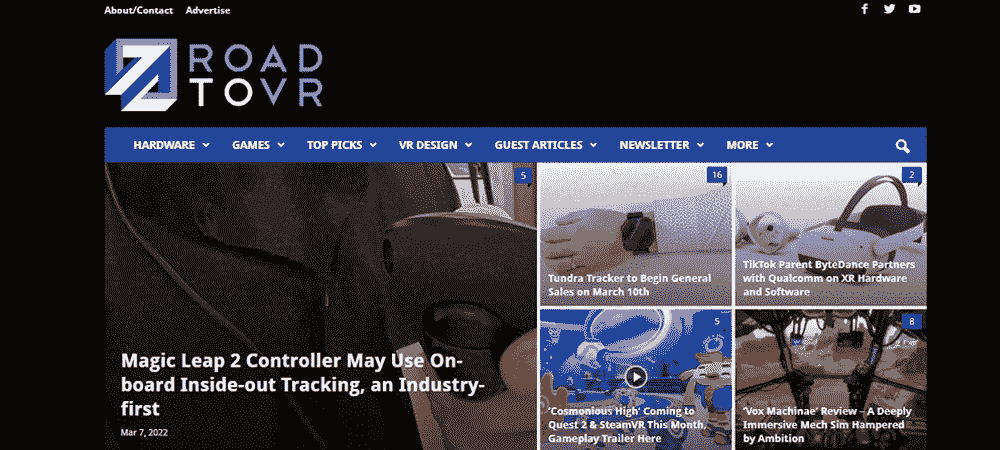

# 2023 年最佳技术博客:按主题组织的 19 个最佳资源

> 原文：<https://medium.com/coinmonks/best-tech-blogs-869002e1c483?source=collection_archive---------0----------------------->

科技博客是了解最新科技的最佳方式之一。但是每个博客都提供了关于这个主题的独特视角。了解最好的科技博客意味着了解整个故事。您将很快看到与您最关心的技术保持同步的最佳资源。

*在这篇文章中，你会发现 2023 年最佳科技博客的概述，按主题整理；科技博客关注一般趋势，科技博客关注元宇宙、虚拟现实和增强现实。*

## 目录:

1.  [技术的潜在重要性是什么？](#68d6)
2.  [为什么要用最好的技术博客来跟上最新的趋势](#08d7)
3.  [7 个最好的科技博客，关注总体趋势](#fa16)
4.  [报道元宇宙的 4 个最佳科技博客](#8faf)
5.  [关注虚拟现实(VR)的 4 个最佳技术博客](#320c)
6.  [与增强现实(AR)相关的 4 个最佳技术博客](#b33e)

# 技术的潜在重要性是什么？

当然，这确实提出了为什么技术如此重要的问题。为什么人们应该关注最好的科技博客？这归结于技术如何将生活的基本部分结合在一起。

技术创新帮助人们优化职业和个人生活。这可以通过信息技术改善信息交流来实现。但是技术的重要性在每个领域都可以看到。新技术有助于提高生活质量和寿命，改善我们的日常体验。只要我们保持消息灵通，技术为大多数问题提供了潜在的解决方案。

# 为什么要使用最好的技术博客来跟上最新的趋势

同样重要的是要记住，技术不仅仅是帮助人类。在个人意义上，跟上技术趋势也能帮助你。在职业领域尤其如此。

当人们担任领导角色时，他们总是着眼于未来。通过[科技博客](https://metamandrill.com/tech-blogs/)跟踪最新的创新可以获得这种远见。当你知道什么样的技术即将出现时，你就可以为它做准备了。这也有助于建立你的整体可信度和可靠性声誉。

了解未来趋势，比如[元宇宙趋势](https://metamandrill.com/metaverse-trends/)，可以帮助你创造性地与他们合作。你有时间让新技术坐在你的脑海里，想想它会如何影响品牌或广告。此外，您会在比赛前很久就想到这些策略。

新技术也带来了个人色彩。当人们为即将到来的技术做计划时，他们通常会扩大他们的职业和个人圈子。这是一个与对世界有类似深远看法的人集思广益的机会。这将带来新的可能性、客户和机会，给所有相关人员留下深刻印象。当然，这最终会导致职业和个人的成长。

# 探究总体趋势的 7 大最佳科技博客

技术很容易被分成几个子类。但关注边界图片也很重要。更一般化的科技博客从更大的角度看待这个行业。以下选择是 2023 年最佳科技博客的广义行业观点。

## 边缘

“边缘”项目创建于 2011 年，旨在为公众提供一个广阔的视野，了解不断发展的技术领域。它始于对数字技术正在从边缘学科向普通人生活方式的本质转变这一事实的回应。如今，《边缘》正在通过覆盖所有与技术相关的内容来完成这一使命。这包括从卫星发射到 T2 奥运会和科学。

[你可以在这里阅读《边缘》。](https://www.theverge.com/)

## 有线的

在博客出现之前,《连线》是最好的科技博客之一。它最初于 1993 年作为印刷杂志发行。《连线》很快成为新技术最权威的信息源之一。它甚至创造了众包这样的术语。《今日连线》在线延续了这一传统。它提供几乎任何与技术相关的新闻。这包括计算、技术文化、医疗技术和其他学科。

[您可以在这里阅读《连线》。](https://www.wired.com/)

## Venturebeat

Venturebeat 的历史可以追溯到 2006 年，令人印象深刻。它将长寿与独特的合格专家员工相结合，创建了一个信息异常丰富的科技博客。Venturebeat 保险几乎承保了所有与现代技术相关的保险。但它也特别强调了世界的解释面。Venturebeat 着眼于生活的许多方面，揭示了隐藏的技术基础。它还推测了发展技术的影响。

[您可以在这里阅读 Venturebeat。](https://venturebeat.com/)

## CNET

CNET 这个名字是科技的同义词。它从 90 年代就开始报道这个话题了。CNET 的历史帮助它在世界范围内建立了一支令人印象深刻的专家队伍。这让他们能够报道新技术的全球影响。这是了解全球动态的最佳科技博客之一。这包括电脑和智能手机，但也包括科技服务和娱乐。

你可以在这里阅读 CNET。

## Gizmodo

如果你想看到与科技相关的一切，Gizmodo 是最好的科技博客之一。博客的主要焦点通常集中在你日常生活中最常用的技术上。这包括电脑、智能手机、软件、服务、游戏系统和平板电脑。但是 Gizmodo 也研究了技术如何影响我们周围的世界。博客的触角甚至延伸到了科幻小说等主题。

[你可以在这里阅读 Gizmodo。](https://gizmodo.com/)

## 数字趋势

Digital Trends 的成立有一个重要的目的。创建这个博客是为了帮助过滤掉围绕技术讨论的所有噪音。科技博客通过研究科技如何赋予人们生活以力量，帮助人们驾驭这个经常令人困惑的主题。它涵盖了手机、电脑、平板电脑和配件的最新消息。但视角总是回到读者生活中的实际使用场景。

[你可以在这里阅读数字趋势。](https://www.digitaltrends.com/)

## Mashable

Mashable 作为一个激情项目开始于 2005 年。最初简单的 WordPress 博客由于展示了独特的见解而迅速走红。它把重点放在电脑和智能手机等小工具上。但是它的范围甚至延伸到了宠物科技。如果你想了解最新的技术趋势，Mashable 现在被认为是最好的技术博客之一。

你可以在这里阅读 Mashable。

# 报道元宇宙的 4 个最佳科技博客

元宇宙是最令人兴奋的新技术之一。事实上，它既至关重要又发展迅速，所以很难保持领先。但以下四个科技博客将确保你总能了解最新的元宇宙新闻。

## 建立元宇宙博客

建立元宇宙博客是覆盖这一新的数字前沿的重要博客之一。这是深入分析元宇宙的最佳科技博客之一。作者约翰·拉多夫娴熟地描述了元宇宙一些最复杂的主题。例如，他绘制了元宇宙的 7 层，以一种易于理解的方式突出了它的功能。

你可以在这里阅读建立元宇宙博客。

## Metamandrill.com

Metamandrill.com 着眼于元宇宙，它触及了实践和解释两个方面。它的主要前提围绕着元宇宙融合了网络世界和现实世界的想法。元宇宙是不断变化的，仍然是相当实验性的。但是这个科技博客致力于跟踪和向读者解释它的进展。

Metamandrill 使[元宇宙世界变得清晰](https://metamandrill.com/metaverse-meaning/)，提供关于元宇宙和相关主题的解释文章和[指南。](https://metamandrill.com/metaverse/)

你可以在这里阅读 Metamandrill.com。

## MatthewBall.vc

最佳技术博客选项为读者提供了罕见的专家意见。读者蜂拥至马修·鲍尔的博客，因为他允许这样做。Matthew Ball 在风险基金、公司咨询和元宇宙方面有着丰富的经验。这意味着他可以解释元宇宙的商业一面。这是一个特别重要的话题，因为科技行业的大腕们正在元宇宙大举投资。

[你可以在这里阅读 MatthewBall.vc。](https://www.matthewball.vc/the-metaverse)

## 瑞安·舒尔茨

元宇宙通常被视为年轻的技术。但这要追溯到 14 年前的第二人生。瑞安·舒尔茨从早期开始就走上了通用的道路。由于他的长远观点，它被认为是最好的科技博客之一。他经常能看到元宇宙的未来，因为他非常熟悉它的过去。他向读者展示了这一切。

你可以在这里阅读瑞安·舒尔茨。

# 关于虚拟现实和相关设备的 4 个最佳技术博客

科技博客帮助人们跟上一些发展最快的趋势。很难想象许多技术会像虚拟现实一样发展如此之快。虽然许多与元宇宙相关的博客都涉及虚拟现实，但以下科技博客强烈关注虚拟现实的各个方面，如虚拟现实技术、虚拟现实游戏、[虚拟现实耳机](https://metamandrill.com/vr-headsets/)和其他[设备](https://metamandrill.com/metaverse-devices/)。

## 虚拟现实之路

科技博客有很多关于虚拟现实的材料。但是《虚拟现实之路》在最好的科技博客中赢得了稳固的位置，这要归功于它帮助读者导航这个令人困惑的领域的能力。该博客创建于 2011 年，旨在探索虚拟现实的消费者方面。它涵盖了 VR 硬件和软件。它还研究了虚拟现实更重要的影响。

[你可以在这里阅读虚拟现实之路。](https://www.roadtovr.com/)

## 上传虚拟现实

Upload VR 是专注于 VR 的最好的科技博客之一。这部分归功于专门报道全球最新新闻的记者团队。但也是因为这个科技博客考察了 VR 和人的交集。它努力深入解释每一个项目。但它也研究了虚拟现实如何影响更大的文化。

[你可以在这里阅读上传虚拟现实。](https://uploadvr.com/)

## 虚拟世界

VR World 创建于 2014 年，旨在提供最新技术的新闻和分析。这个技术博客提供了大多数通用技术的内容。但顾名思义，VR 才是它的首要关注点。与大多数其他博客相比,《虚拟世界》对虚拟现实进行了更深入的研究。这包括贸易展览、商业分析、社交媒体，甚至白皮书。它还研究了新技术在虚拟现实中的作用。

[你可以在这里阅读《虚拟世界》。](https://vrworld.com/)

## 鬼魂嚎叫

这个科技博客提供了一个有趣的视角，从一个投资了虚拟现实几乎每一个元素的人那里。自从 2014 年尝试了一款 Oculus 之后，托尼就迷上了 VR。从那以后，他创建了一家虚拟现实初创公司，开发了全身沉浸技术，并在开发和公关部门工作。Tony 在撰写有关 VR 和相关技术的文章时，将这种广泛的专业知识放在了突出的位置。

你可以在这里阅读幽灵的嗥叫。

# 与增强现实(AR)相关的 4 个最佳技术博客

增强现实是一种将离线和虚拟世界融为一体的技术。公司正处于快速创新的早期阶段。以下是 2023 年最好的科技博客，让你了解最新的 AR 趋势。

## 下一个现实

最好的科技博客提供了一个观察世界的独特视角。下一个现实当然也是如此。它着眼于围绕增强、混合和虚拟现实的创新。他们还特别关注环境计算。环境计算和增强现实是[元宇宙](https://metamandrill.com/metaverse-meaning/)的重要方面，但经常被忽视。接下来，Reality 希望通过强调这些技术和类似技术的整体重要性，加速公众对它们的采用。

[你可以在这里阅读下一个现实。](https://next.reality.news/)

## AR 帖子

AR post 提供了对 XR 技术的深入探究。这里指的不仅仅是 AR，还有 VR 和混合现实。这包括重大新闻、观点和评论。AR Post 是最好的科技博客之一，部分原因是它涵盖了如此多的专业话题。博客不仅仅记录新的趋势；它探索它们。

[你可以在这里阅读 AR 帖子。](https://arpost.co/)

## AR VR 杂志

AR VR 杂志是对增强或虚拟现实感兴趣的人最好的科技博客之一。它通过提供多种格式，采用多平台的方法来处理这个问题。除了 AR 内容，博客还涵盖了 360 内容、沉浸式体验和 sim 技术。喜欢坐下来阅读博客的人也可以在移动中欣赏播客形式的内容。

[这里可以看 AR VR 杂志。](https://arvrmagazine.com/)

## AR 内幕

对于最好的科技博客，要记住的一点是陈述很重要。AR Insider 提供信息的风格让人想起一些杂志的最佳图形设计元素。它仍然提供关于 AR、VR 和空间计算的最新消息。但它通过一种使浏览成为身临其境的体验的演示来做到这一点。为了更加方便，它甚至提供每周简讯。

[你可以在这里阅读 AR 内幕。](https://arinsider.co/)

# 最佳科技博客的基础

请记住，每个技术博客都提供了一个复杂主题的独特视角。了解技术的最好方法是阅读最符合你兴趣的博客。持续的阅读确保你总是与时俱进。

> 加入 Coinmonks [电报频道](https://t.me/coincodecap)和 [Youtube 频道](https://www.youtube.com/c/coinmonks/videos)了解加密交易和投资

# 另外，阅读

*   [TraderWagon 回顾](https://coincodecap.com/traderwagon-review) | [北海巨妖 vs 双子星 vs BitYard](https://coincodecap.com/kraken-vs-gemini-vs-bityard)
*   [如何在 FTX 交易所交易期货](https://coincodecap.com/ftx-futures-trading) | [OKEx vs 币安](https://coincodecap.com/okex-vs-binance)
*   [OKEx vs KuCoin](https://coincodecap.com/okex-kucoin) | [摄氏替代品](https://coincodecap.com/celsius-alternatives) | [如何购买 VeChain](https://coincodecap.com/buy-vechain)
*   [ProfitFarmers 点评](https://coincodecap.com/profitfarmers-review) | [如何使用 Cornix Trading Bot](https://coincodecap.com/cornix-trading-bot)
*   [如何匿名购买比特币](https://coincodecap.com/buy-bitcoin-anonymously) | [比特币现金钱包](https://coincodecap.com/bitcoin-cash-wallets)
*   [瓦济里克斯 NFT 评论](https://coincodecap.com/wazirx-nft-review)|[Bitsgap vs Pionex](https://coincodecap.com/bitsgap-vs-pionex)|[坦吉姆评论](https://coincodecap.com/tangem-wallet-review)