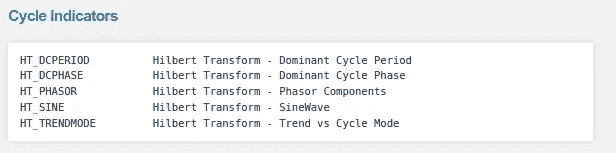

# 来自 TA-lib 的比特币最佳技术指标

> 原文：<https://medium.com/coinmonks/best-technical-indicators-for-bitcoin-fromta-lib-fa5518560e?source=collection_archive---------1----------------------->


本文由开源项目 AI4Finance 的核心团队成员 Berend Gort & [Bruce Yang](https://ai4finance.medium.com/) 撰写。这个项目是一个共享金融 AI 工具的开源社区，是纽约哥伦比亚大学的一部分。GitHub 链接:

[](https://github.com/AI4Finance-Foundation) [## ai4 金融基金会

### 一个共享金融 AI 工具的开源社区。FinRL:第一个用于财务强化的开源项目…

github.com](https://github.com/AI4Finance-Foundation) 

**简介**

这个故事是根据我[以前的文章](/coinmonks/crypto-feature-importance-for-deep-reinforcement-learning-38416616c2a36-8416616c2a36)，总结了我个人的成果:

[](/coinmonks/crypto-feature-importance-for-deep-reinforcement-learning-38416616c2a36-8416616c2a36) [## 加密特征对深度强化学习的重要性

### 本文由开源项目 AI4Finance 的核心团队成员 Berend Gort & Bruce Yang 撰写。这个…

medium.com](/coinmonks/crypto-feature-importance-for-deep-reinforcement-learning-38416616c2a36-8416616c2a36) 

构建了一个流水线，它允许特征重要性测量和用于深度强化学习的神经网络设计。在用我自己的管道工作了一周之后，我们已经从 TA-lib(技术指标库)中识别出了最好的特性。

**临时库概述**

下面几个数字显示了我们测试的技术指标。我们尚未关注模式识别指标，因为它们需要特别关注。

[https://mrjbq7.github.io/ta-lib/](https://mrjbq7.github.io/ta-lib/)



**将这些特性添加到币安处理器中**

与我的[上一篇文章](/coinmonks/crypto-feature-importance-for-deep-reinforcement-learning-38416616c2a36-8416616c2a36)中的旧处理器相比，我们更改了类方法 *add_technical_indicators()，*第 47 行。

我在一个名为*get _ features _ for _ each _ coin()*的独立单元格中添加了一个新函数

该函数现在是从 TA-lib 下载所有技术指标的特殊函数，看起来像下一个代码片段中的代码。

请注意，并不是所有的特性都在这里，因为我们已经在 TA-lib 中的完整技术指标列表上做了一些特性选择。在下一部分，我们将解释我们做了什么。

**高相关滤波器**

高相关性过滤器应用起来非常简单，但为了在目标的可预测性上有良好的表现，它是非常必要的。想象一下，每一个特性都与另一个特性高度相关，甚至**完全** **相同，你为什么要添加那个特性呢？它包含的信息与您已经拥有的功能几乎相同。**

这就是为什么我们需要删除这些高度相关的特征。


Example of current DF with 40 features

首先，我们从原始数据中再次删除目标

```
X = data.drop(['label_barrier'], axis = 1)y = np.squeeze(data[['label_barrier']].values).astype(int)
```

然后我们绘制一张热图:

结果如下所示:


Crypto features heatmap

在这个图中，首先看一下对角线轴。这里每种颜色对应完全相关，或 1。也就是说，例如，*打开*特征与*打开*特征本身完全相关，因为它们包含完全相同的信息。

同样，注意负相关(红色)也很重要；例如，特征 *minus_di* 与 *macd 完全负相关。*因此，我们可以去掉两者中的任何一个。

现在，假设我们想要丢弃所有相关性(正或负)高于 x 的要素。我们可以通过首先计算相关性矩阵来实现:

```
corr_matrix = pd.DataFrame(X).corr().abs()
```

注意，相关矩阵将围绕对角线镜像，所有对角线分量都等于 1。因此，无论我们选择相关矩阵的上三角还是下三角部分，对角元素都不应包括在内。因此，我们选择了上三角形。下面的代码可以做到这一点:

```
upper_tri = corr_matrix.where(np.triu(np.ones(corr_matrix.shape),k=1).astype(np.bool))
```

现在我们得到了上三角矩阵，它包含了丢弃某些高度相关的特征所需的剩余信息。因此，我们选择绝对相关性大于 0.95 的列，并制作一个名为 d*ropping _ these _ features:*的列列表

```
# So we are selecting the columns which are having absolute correlation greater than 0.95 and making a list of those columns named 'dropping_these_features'.dropping_these_features = [column for column in upper_tri.columns if any(upper_tri[column] > 0.9)]
```

结果如下所示:


然后我们有不高度相关的特征，因此包含有价值的信息。我们现在可以开始这些功能的培训过程。

**神经网络设计**

经过反复试验，我们最终得到了下面的神经网络。相比原来的那个[(见我之前的文章)](/coinmonks/crypto-feature-importance-for-deep-reinforcement-learning-38416616c2a36-8416616c2a36)。

主要区别是更复杂(额外的层)、更高的状态维度(29 对应于特性的数量)以及最重要的:辍学。

退出通过正则化防止过度拟合。在下面的视频中有详细的解释:

最终的训练结果如下所示，在测试集上达到 75%的准确率:

```
 Train Fold/Epoch: 0/350 [0/16475 (0%)] train_loss: 0.178466 Train Fold/Epoch: 0/350 [1600/16475 (10%)] train_loss: 0.039930 Train Fold/Epoch: 0/350 [3200/16475 (19%)] train_loss: 0.301063 Train Fold/Epoch: 0/350 [4800/16475 (29%)] train_loss: 0.026820 Train Fold/Epoch: 0/350 [6400/16475 (39%)] train_loss: 0.314050 Train Fold/Epoch: 0/350 [8000/16475 (49%)] train_loss: 0.080817 Train Fold/Epoch: 0/350 [9600/16475 (58%)] train_loss: 0.167541 Train Fold/Epoch: 0/350 [11200/16475 (68%)] train_loss: 0.329580 Train Fold/Epoch: 0/350 [12800/16475 (78%)] train_loss: 0.083508 Train Fold/Epoch: 0/350 [14400/16475 (87%)] train_loss: 0.258400 Train Fold/Epoch: 0/350 [16000/16475 (97%)] train_loss: 0.171635  Train set for fold 0: Average train_loss: 0.0000, Accuracy: 15160/16475 (92.01821%) Test set for fold 0:  Average test_loss:  0.9236, Accuracy: 3103/4119 (75.33382%)
```

**特征重要性**

基于我在[上一篇文章](/coinmonks/crypto-feature-importance-for-deep-reinforcement-learning-38416616c2a36-8416616c2a36)中描述的方法，下面列出了每个特性重要性的结果:


新的特性对重要性有巨大的影响，因为错误大大增加了。如果你想要一个更小的模型，你可以从这个重要性列表中去掉最后 10 个特性，然后重新训练。

**结论**

这些新功能，以及新的神经网络，我们将价格方向的可预测性从 38%提高到 75%；一个很好的改进。现在是时候在我们的 DRL 实施这一切了！

*感谢寻根“来自 TA-lib 的比特币最佳技术指标”！*

*~贝伦德&布鲁斯*