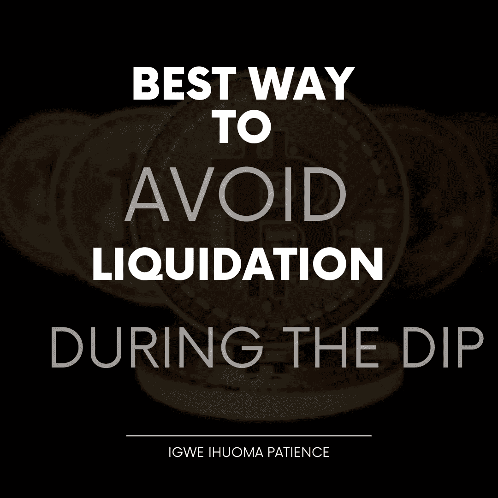
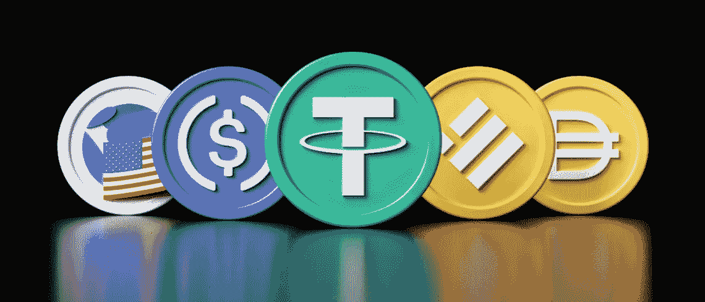
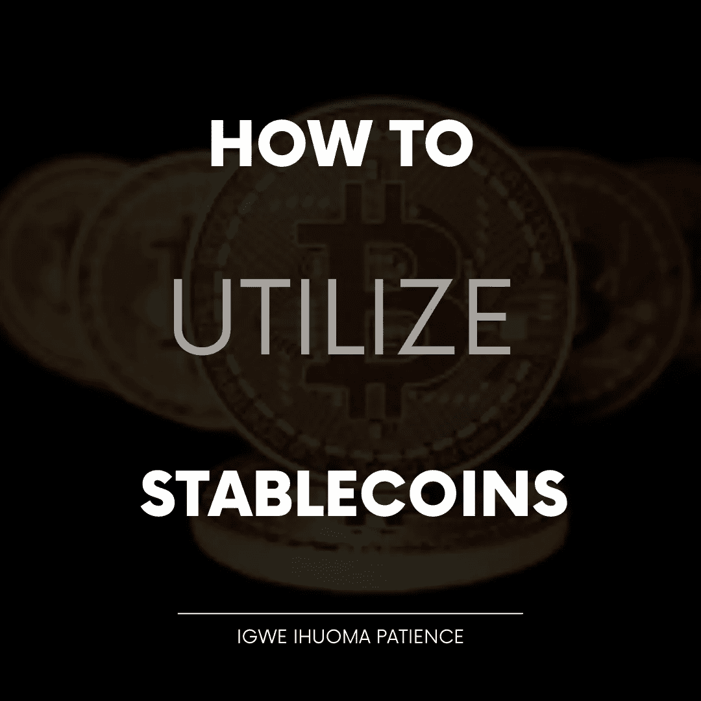
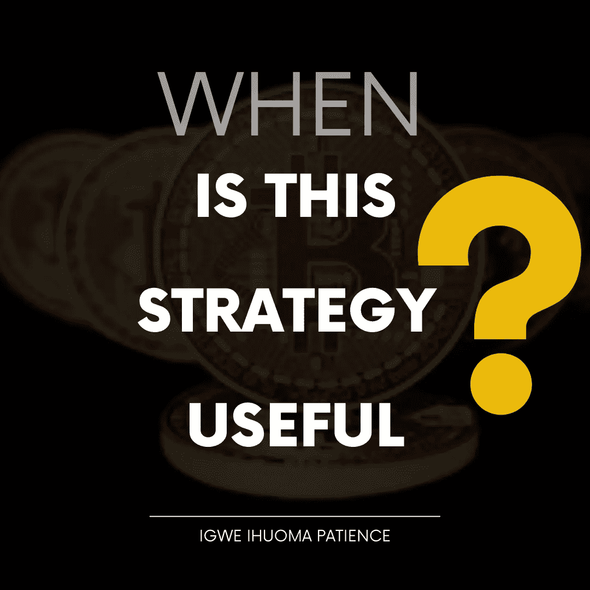

# 在下跌期间避免流动性的最佳方法

> 原文：<https://medium.com/coinmonks/best-way-to-avoid-liquidity-during-the-dip-6f065f657155?source=collection_archive---------59----------------------->

BEST WAY TO AVOID LIQUIDATION DURING THTE DIP

# 介绍

随着最近加密货币和其他数字货币的下跌，有必要降低该领域的损失率和清算率。这就是我们将要讨论的。

事实是，有各种各样的方法来避免清算，特别是如果你正在交易或投资。其中包括:创建一个策略，管理你的情绪，并转化为稳定的硬币。因此，出于本文的目的，我们将更多地关注稳定的硬币。那么，什么是稳定币呢？

## 什么是 STABLECOINS？

WHAT ARE STABLECOINS

稳定硬币是加密货币，其价值与美元挂钩，以使其更加稳定，波动性更小。稳定硬币的例子包括 USDt、Busd、Usdc 等。

这仅仅意味着它们的价格几乎不会波动，不管市场是看涨还是看跌。那么，如何利用这一点来避免下跌期间的清算呢？

## 如何利用稳定积分

HOW TO UTILIZE STABLECOINS

Stablecoins 与不同的加密货币挂钩，这意味着你可以根据相对挂钩的 stablecoins 轻松买卖任何加密货币。与稳定硬币挂钩的不同加密货币的例子包括 ETH/Busd、DOGE/USDt、BNB/TUSD、BTC/USDC 等。

在下跌期间，最好的策略之一就是把你的硬币转换成稳定的硬币。这样，你就没有被清算的机会。为此，请按照下列步骤操作:

1.  访问您希望用于交易或转换的交易所，例如币安、gate.io、bybit、kucoin 等。这也可以直接在您的加密钱包中完成，使用分散的交换，如 uniswap、pancake swap，或通常使用钱包中的交换功能。要了解有关如何选择最佳加密钱包的更多信息，请单击此链接。
2.  去市场，或者使用交易所的交易功能。
3.  选择您想要交换的硬币，并确保它与您想要交换的正确稳定硬币挂钩
4.  然后交易。您也可以使用交易所的掉期功能。

## 这个策略什么时候有用

WHEN IS THIS STRATEGY USEFUL

由于加密货币市场的波动性增加，您有必要学会识别市场趋势。事实是，把你的资金放在稳定的硬币里，不会给你的投资增加多少价值。这意味着你的资金既不会增长，也不会贬值。那么，你为什么要使用稳定的硬币呢？

当市场处于红色或下跌时，稳定的阴线是必要的。一个实际的例子是，BTC 在 7 天内从 30，000 美元跌到 21，000 美元。想象一下，如果你没有尽早将 BTC 和其他加密货币转换成稳定的货币，你会遭受多少损失。你的猜测和我的一样好。

所以，这就是为什么在这种时候你需要稳定的收入。然而，总是需要确定市场趋势，了解市场何时上涨或下跌。这样，你就不会错过好的投资机会。

## 结论

stablecoins 的使用怎么强调都不为过，因为它是用于投资目的和减少交易期间清算的有效工具。然而，市场趋势在决定将你的硬币转换成稳定硬币的最佳时机时起着重要的作用。所以，今天买些稳定的硬币，以后再感谢我吧。

今日问题:你有哪种硬币？

# 关于作者

Igwe Ihuoma Patience 是一名自学成才的创意和特定行业内容作家，也是一名加密货币爱好者，拥有 2 年多的经验和不断发展的区块链空间的知识。

我擅长内容创作、文案撰写、字幕管理、视频编辑和手机图形设计，我教其他人如何在加密货币和区块链领域起步，我的目标是让区块链的学习和更新易于任何人理解。

> *加入 Coinmonks* [*电报频道*](https://t.me/coincodecap) *和* [*Youtube 频道*](https://www.youtube.com/c/coinmonks/videos) *了解加密交易和投资*

# 另外，阅读

*   [有哪些交易信号？](https://coincodecap.com/trading-signal) | [Bitstamp vs 比特币基地](https://coincodecap.com/bitstamp-coinbase) | [买索拉纳](https://coincodecap.com/buy-solana)
*   [ProfitFarmers 回顾](https://coincodecap.com/profitfarmers-review) | [如何使用 Cornix Trading Bot](https://coincodecap.com/cornix-trading-bot)
*   [西班牙 5 大最佳文案交易平台](https://coincodecap.com/copy-trading-spain)
*   [Pionex 双投](https://coincodecap.com/pionex-dual-investment) | [AdvCash 审核](https://coincodecap.com/advcash-review) | [支持审核](https://coincodecap.com/uphold-review)
*   [面向开发者的 8 个最佳加密货币 API](https://coincodecap.com/best-cryptocurrency-apis)