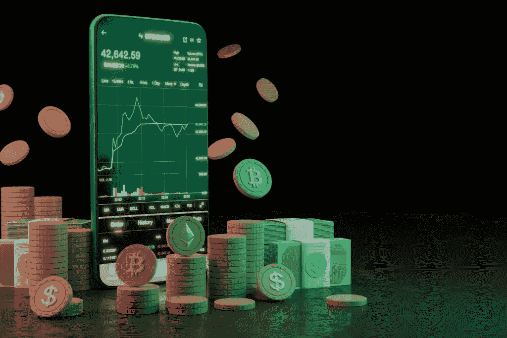
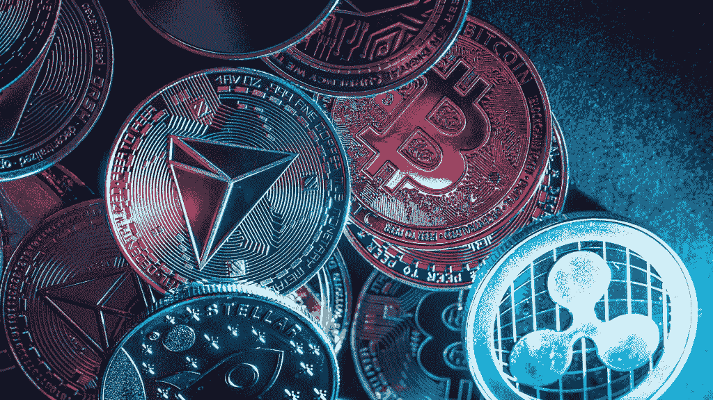

# 将加密货币转换成现金的最佳方式

> 原文：<https://medium.com/coinmonks/best-way-you-can-transfer-your-cryptocurrency-into-cash-9326a1cf16ad?source=collection_archive---------73----------------------->

# 将您的加密货币转换成现金

 [## 将加密货币转换成现金的最佳方式

### 您可以在任何地方使用您的加密货币或数字货币，通过加密银行可以使用借记卡。

koop360.com](https://koop360.com/blog/transfer-your-cryptocurrency-into-cash/) 

> 作为法定货币的热门替代品，加密货币激起了投资者和金融服务提供商的好奇心。然而，总部位于区块链的数字货币概念存在一个问题。可能很难像使用传统货币一样使用数字货币。在不久的将来，像比特币和以太坊这样的加密货币可能会被普遍采用。密码界最迫切的问题之一是 2022 年如何将比特币转换成现金？

数字货币的价值非常不稳定，每天都在大幅变化。鉴于数字货币的现状，保守的投资者可能会考虑将他们的数字货币兑换成法定现金。因此，所有将加密货币转换为现金的方法都会产生税收。为了帮助你，我们整理了这本指南，指导你如何在 2022 年兑现你持有的加密货币。

# 使用加密货币交易平台将密码转换为现金的分步指南

加密货币交换网站是我们在印度将密码转换成现金的教程中的第一个方法。之后，您可以使用交换平台或经纪人将任何加密货币兑换成现金。这类似于国际机场的货币兑换方式。

*   要使用交易所，你必须先存入一枚比特币。
*   然后，您选择的货币的提款请求将被发送到我们的系统进行处理。
*   一段时间后，钱会发到你的银行账户。

这是最安全的方法，尽管钱可能需要四天才能到达你的银行账户。同样值得注意的是，各种加密货币交易所收取的费用差异很大。

# 通过对等网络共享信息是可能的。

我们针对印度人的密码到现金转换指令的下一步是使用点对点交换。简单地在点对点市场上出售你的比特币就能让你把它们变成现金。用这种方法，你可以更快地取款，更匿名。除了更便宜的费用和更高汇率的前景，这种技术还有其他优势。

# 首先，加入一个点对点的交易网络，搜索潜在买家的位置

然后，开始在市场上寻找潜在的买家。大多数点对点系统都提供托管服务。这意味着，在你确认收到付款之前，买家将无法访问你的加密货币。

当利用点对点销售技术时，你必须小心欺诈者。在把你的比特币交给买家之前，你必须验证他们的身份。强烈建议使用对等网络，在买家付款之前锁定你的加密资产。

# 以处理加密货币银行业务的相同方式处理您的加密货币

通过使用加密货币银行，消费者可以像使用传统货币一样使用他们的数字资产。在使用加密银行时，人们也可以将他们的数字货币保存在数字钱包中。如果你以这种方式存款，你可以使用比特币借记卡。数字硬币余额可用于使用这些卡进行普通交易或提取现金，而不是作为投资。

通过[比特币](https://bitcoin.org/)交易网站获得加密借记卡是可能的。可以使用这些卡从不接受数字货币的零售商处购物，无论是在网上还是在现实世界。

如果你想在这些卡可用之前花掉你的[比特币](https://bitcoin.org/)，你必须要么找到一家接受它们的商家，要么找到一种方法将它们转换成法定货币。加密货币借记卡现在由金融科技公司与特许银行和借记卡发行商合作提供，它们利用合作伙伴的物流和监管框架自动出售你的加密货币并将其转换为现金，使企业能够接受它。您可以通过加密银行在任何接受借记卡的地方使用您的数字货币。

**结论**

目前，加密银行还需要一段时间才能赶上更成熟的金融机构。在印度，寻找将比特币兑换成现金的方法将永无止境。这篇文章的目的是向你展示如何把加密/比特币变成法定货币。另一方面，加密货币市场可能有些不稳定。正因为如此，你必须采取必要的预防措施来降低[交易加密货币](https://koop360.com/blog/cryptocurrency-trading-strategies/)的危险。

> 交易新手？尝试[加密交易机器人](/coinmonks/crypto-trading-bot-c2ffce8acb2a)或[复制交易](/coinmonks/top-10-crypto-copy-trading-platforms-for-beginners-d0c37c7d698c)