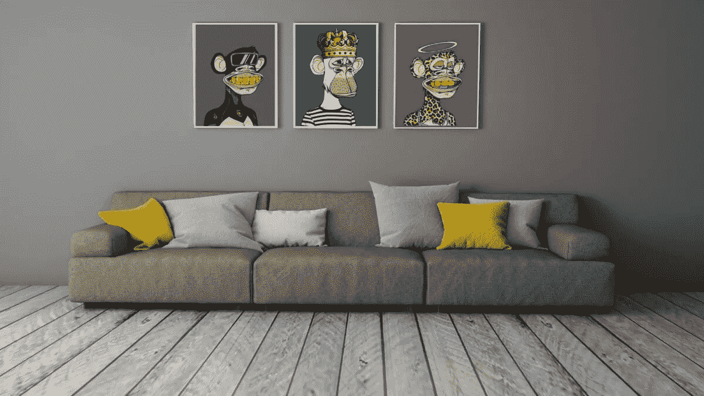
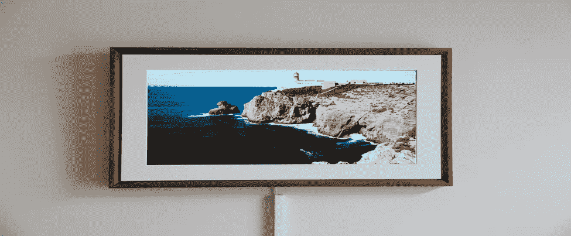
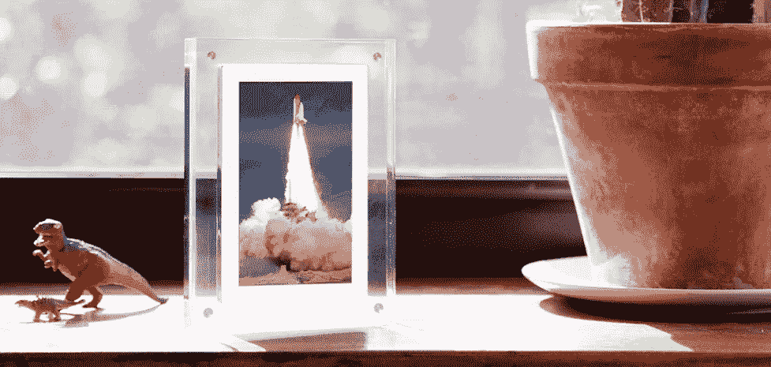
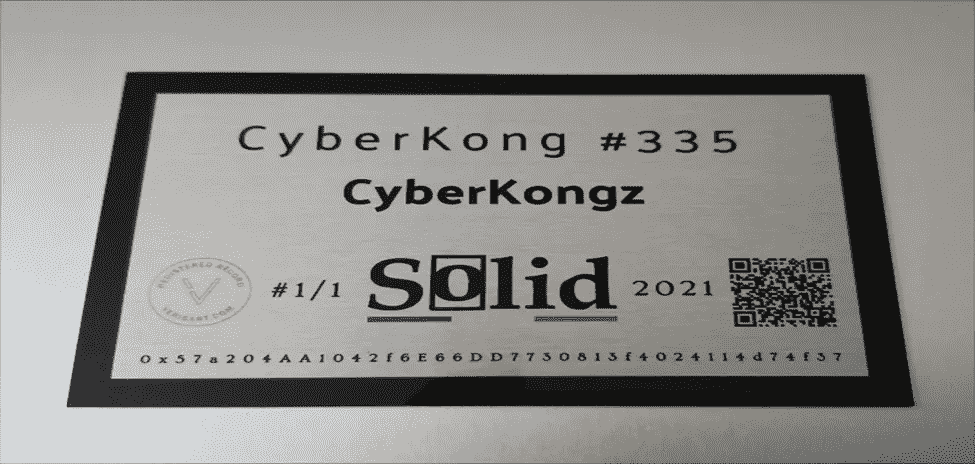

# 展示 NFT 艺术的最佳方式

> 原文：<https://medium.com/coinmonks/best-ways-to-display-your-nft-art-844bc40907f?source=collection_archive---------18----------------------->

你终于得到了你梦寐以求的 NFT 艺术。现在涌入你心中的问题是“如何展示 NFT 艺术”。

你并不孤单。许多艺术收藏家或发烧友，尤其是新手，也很难回答这个确切的问题。

此外，您可能已经投资数百或数千美元购买了这件珍贵的艺术品。

所以，如果你想吸引人地展示它，这是很正常的。炫耀一下…

你会同意实物艺术品很容易炫耀。毕竟，您可以简单地将它们框起来，放在画廊、画架或壁炉上方。

但是对于 NFT 的作品来说并不容易。目前，显示它们的选项并不完全通用。我们仍处于这种蓬勃发展的艺术类型的早期阶段。

我们并不是说展示的选择是不明显的。有很多种方式可以展示您的 NFT 系列。

最好的 NFT 框架和显示器将连接到您的 NFT 或加密钱包，并提供高质量的音频和视频输出。

谈够了。我们将帮助您简化选择展示 NFT 艺术最佳方式的复杂性和术语。

让我们开始吧…

# 展示 NFT 艺术的方式

在你的房子里或画廊周围展示你的 NFT 比悬挂传统或物理艺术品需要更多的努力。然而，结果总是诱人的。

世界各地的 NFT 拓荒者和收藏家利用数字和模拟工具，创造了一些体面而诱人的方式来展示您的 NFT 系列。

您可以通过两种主要方式自豪地展示您的 NFT 系列。

*   在现实生活中展示你的 NFT 艺术
*   在线展示 NFT 系列

让我们仔细探索这些显示选项。

## 展示您的 NFT 系列 IRL

如果您是一个艺术发烧友，只收集 NFT 艺术来享受这一经历，那么在现实生活中展示您的 NFT 艺术作品可能是您的最佳选择。

无论您是想美化您的画廊还是房子，在现实生活中展示 NFT 需要比实物艺术更多的努力。

别担心。您有许多选择来展示您的 NFTs IRL。您可以使用以下任何一种方法。

1.  数字 NFT 帧
2.  纯色 NFT 印花
3.  令牌广播
4.  带有二维码的实物打印
5.  在现实生活中的画廊中展示

1.  **数字 NFT 帧**

数字 NFT 相框可能是您展示 NFT 艺术收藏的最棒的方式。他们已经存在了一段时间，可以处理所有形式的 NFT。

与只允许显示静止图像的打印 NFT 不同，您可以以 gif、照片或视频的形式显示 NFT。

根据您想要的类型，有多种数字相框选项。

然而，选择最好的数字相框取决于两个主要因素:它是否支持你的 NFTs 文件格式和价格。

数字相框选项包括 Meural Canvas、Qonos、Samsung frame TV、Tokenframe 和无穷大对象。

**黑色帆布**

Meural Canvas 是展示 NFTs 艺术的通用选择。Netgear 是一家公司，通常被称为对家庭 WiFi 的贡献而不是艺术，它创造了高端 Meural Canvas 框架。

Meural Canvas 数字相框不仅可以显示您的 NFTs，还可以显示任何照片或视频，所以它非常昂贵。

它允许用户将他们的加密钱包连接到应用程序，这样他们就可以直接在画布上显示 NFTs。

这些框架有不同的尺寸和范围，例如桌面友好型 13.5 英寸× 7.5 英寸，画廊尺寸 19 英寸×29 英寸等。

Meural 数字相框令人兴奋的功能之一是应用程序上的播放列表功能。您可以创建自己选择的自定播放列表，并邀请朋友和家人直接将内容共享到您的画布。

你也可以使用 Netlink 的 Android 和 iOS 专有 Meural 应用程序将 NFT 的视频和照片添加到相框中。

**Qonos**

Qonos 声称，他们建造他们的框架是为了解决 NFTs 收藏家不断要求在优雅的框架上展示他们的 NFTs。

他们允许买家展示真实的 NFT 而不是复制品。该框架有两种尺寸选项，17.3 英寸和 24 英寸，均以 1920×1080 像素分辨率显示图片和视频。

Qonos 设备与 Android、iOS、Windows 和 MacOS 设备兼容。它们有 15 毫米厚，安装后看起来像现实生活中的相框。

有趣的是，Qonos 框架有接近传感器，这意味着它们只有在检测到附近有人时才会显示艺术品。

Qonos 有一个价值 5 亿美元的大型数字艺术图书馆，任何人都可以用他们的硬件探索和展示它们。

您还可以策划艺术播放列表，展示不同心情、房间或事件的艺术作品。

**三星框架电视**

三星框架电视是展示 NFT 艺术的最佳选择之一。三星电视框架是一款超薄的 4k QLED 智能电视，兼具数字框架和电视的双重功能。

当它打开时，它具有电视功能，当它关闭时，你可以将它用作 NFT 的数字相框。它可以以 3840×2160 像素的分辨率显示您的数字作品，如图像和视频。

该框架有四种颜色和五种不同尺寸，用户可以根据自己的喜好定制外观，将展示与家居装饰融为一体。

相框的局限性在于，你需要复制你的 gif、图片、视频或照片，并使用第三方应用程序来显示你想要的照片，这可能很耗时。

此外，您还需要裁剪图片，使其符合 16:9 的框架比例。然而，因为它可以兼作电视和相框，所以它是艺术爱好者的绝佳选择。

**令牌帧**

Tokenframe 是一款 NFT 数码相框，通过 TokenFrame 应用程序与 web3 钱包连接，因此您可以从钱包中播放您的 NFT 收藏。

令牌帧显示令人难以置信的特点是，用户有四个帧选项可供选择。

此外，您可以在 2k 或 4k 显示首选项之间进行选择。两者都有防眩光显示屏，主要用于展示您的最佳 NFT。

您也可以从壁挂支架或桌面显示器中进行选择。无论您选择哪一种，您都可以像使用智能手机一样将视图旋转 90 度。

令牌框架的另一个现有功能是应用程序。它给予用户完全的控制权。您可以调整 NFT 的大小、边框、宽度、颜色等。

**无限物体**

无限对象是一家总部位于纽约市的初创公司，专注于视频打印。这意味着一个无限的对象帧将永久循环一个 NFT 或视频。

简单来说，你可以选择你的视频循环在框架上，但没有办法改变它。您可以暂停或倒带视频。它永远是环形的。

这种局限性使得每一件物品都是有限的，这在消费者中很有名。框架有不同的尺寸，在 5 英寸和-7 英寸之间。

您也可以选择不同长度的视频，时长最长可达 24 小时。在你没有任何 NFT 可以印刷的情况下，该网站已经策划了艺术收藏，允许你选择其他人的作品。

您可以选择的数字相框包括:Dragon Touch、Glass 全息图、Canvia Smart 数字艺术相框和 Mono X7。

## 2.实心 NFT 印花

如果您不想使用数字相框来展示您的 NFTs 作品，您可以探索的另一种选择是纯色 NFT 印花。

它们有助于将您的 NFT 转化为物理艺术。NFT 采用独特的铝板，通过升华制成，因此非常耐用。

目标是让实体 NFT 像区块链的同类产品一样耐用。

您可以打印任何形状或大小的 NFT。这些印花采用 100%可回收材料制成，可以回收更多。根据您的喜好，您可以使印刷品哑光、有光泽或半有光泽。

您所做的任何打印都将在背面有一个身份验证证书。交易记录在区块链上，以使您获得印刷的公共认证。

## 3.你的 NFT 的实物印刷

如果你不想在你的 NFT 上花比你以前买的更多的钱，或者你想用一种便宜的方式来展示你的静态图像 NFT，你应该考虑印刷它们。

您只需自己打印您的 NFT，就像打印任何其他图像并创建一个自定义标签一样。

艺术标签将包含诸如艺术标题、艺术家姓名或您想要的其他信息。

您还可以将可扫描用于购买、验证的二维码附加到市场上 NFT 的信息页面或与之链接。

您可以在 Scanova 或二维码 Monkey 等网站上生成二维码。

对您来说，这是一个非常便宜的选择；但是，因为这是一个简单的打印，所以您只能打印图像，不能打印视频。

## 4.令牌广播

如果您有空闲时间参与设置过程，您可以使用 TokenCast 来设置您的 NFT 画廊。

此外，如果您有 Android 平板电脑、IPS 显示器或电视屏幕等小工具，您可以使用 TokenCast 应用程序来显示您的 NFT。

TokenCast 应用程序在 Android 上可用。使用 Tokencast，您可以显示您的 NFTs 和 QR 码来证明所有权。

但是，您只能使用 TokenCast 应用程序显示自己的 NFT。它直接连接到您的 Tezos 或 ETH 钱包，只显示您钱包中的 NFT。

## 5.在现实生活的艺术画廊中展示你的 NFT

你也可以决定在现实生活中的艺术画廊展示你的 NFTs。全球有好几个这样的公司。一些现实生活中的艺术画廊包括芝加哥 imnotArt 画廊，丹佛 B.L.A.C 画廊和 NFT super chief 画廊。

许多传统拍卖行也承诺支持帮助艺术收藏家展示他们的房子。其中一些已经为艺术家组织了许多高规格的展览。

# 在线展示您的 NFTs 收藏

NFT 是在互联网上开发的。因此，在互联网上展示你的 NFT 非常有意义。你基本上是把它展示给一个更好理解它的社区。

您可以通过多种方式在线展示您的 NFTs 收藏。这些网站就像是你的艺术作品的画廊。

下面是几个你可以考虑的热门。

## NFT 画廊

非艺术作品正在成为主流并越来越受欢迎，所以许多网站都在开发简单的方式来展示你的作品，比如 Instagram 页面。

这些网上 NFT 画廊也包含共同的社会功能，如喜欢，评论或分享。

## 表演时间

Showtime 打算将自己定位为 NFTs 的社交媒体，到目前为止，它做得非常好。

一旦你将钱包连接到网站，它会立即生成一个有趣的个人资料，展示你所有的 NFTs 收藏。

把 Showtime 想象成 NFTs 的 Instagram。是的，它的外观和功能与 Instagram 相似。

你可以关注其他艺术收藏家，评论和喜欢他们的 NFT。

## Lazy.com

如果你是懒人，这个选项适合你。说真的！！。该网站为艺术收藏家提供了一个简单而“懒惰”的在线展示艺术品的方法。

该网站仍处于测试阶段，所以它是一项正在进行中的工作。该网站缺乏 showtime 上的大部分功能。

主页包括一些随机的 NFT 和特性，你可以探索。您可以在收集器页面上查看所有 NFT。你也可以在 Lazy 上买卖 NFT。

## OpenSea

Opensea 是目前最大的 NFTs 市场，所以它是展示你的加密艺术收藏的最好的网站之一。

这是一个与其他艺术收藏家或爱好者联系的平台。许多收藏家来这里浏览其他人的作品。

你可以在那里炫耀你的 NFT 收藏，因为大多数观众都会访问这个网站。它还允许显示来自多个区块链的 NFT。

## 元宇宙

一篇不包括元宇宙的“如何展示 NFT 艺术”文章是什么？

它是连接虚拟现实(VR)和增强现实(AR)的虚拟世界或空间，以创建沉浸式体验。

虚拟现实会把你带到虚拟世界。通过 AR，你可以改变现实生活中的空间，向家人和朋友展示你的艺术收藏。

简单来说，在元宇宙，你可以购买土地，建立一个虚拟画廊，展示你的数字艺术品，就像你在现实生活中一样。

元宇宙可以让你在增强现实中展示你的数字艺术等等。

例如，分散地有许多画廊，并定期组织艺术展览，以连接艺术家和收藏家。

你可以使用的元宇宙平台包括分散土地、空间和网络。

# 最后的想法

在选择展示你的 NFT 艺术的最佳方式之前，你需要考虑一些特定的因素，比如你的 NFTs 的文件格式，相框的存储容量和质量。

然而，最终还是有很多选择来展示你的 NFT 艺术。最佳选择取决于你的 NFT 类型和个人展示偏好。

确保你做了自己的研究，并在选择之前考虑了所有的选择。

> 加入 Coinmonks [电报频道](https://t.me/coincodecap)和 [Youtube 频道](https://www.youtube.com/c/coinmonks/videos)了解加密交易和投资

# 另外，阅读

*   [5 款最佳加密交易终端](https://coincodecap.com/crypto-trading-terminals) | [最佳 DeFi 应用](https://coincodecap.com/best-defi-apps)
*   [在美国如何使用 BitMEX？](https://coincodecap.com/use-bitmex-in-usa) | [BitMEX 评论](https://coincodecap.com/bitmex-review)
*   [最佳期货交易信号](https://coincodecap.com/futures-trading-signals) | [流动性交易所评论](https://coincodecap.com/liquid-exchange-review)
*   [南非的加密交易所](https://coincodecap.com/crypto-exchanges-in-south-africa) | [BitMEX 加密信号](https://coincodecap.com/bitmex-crypto-signals)
*   [MoonXBT 副本交易](https://coincodecap.com/moonxbt-copy-trading) | [阿联酋的加密钱包](https://coincodecap.com/crypto-wallets-in-uae)
*   [雷米塔诺评论](https://coincodecap.com/remitano-review)|[1 inch 协议指南](https://coincodecap.com/1inch) | [购买 Floki](https://coincodecap.com/buy-floki-inu-token)