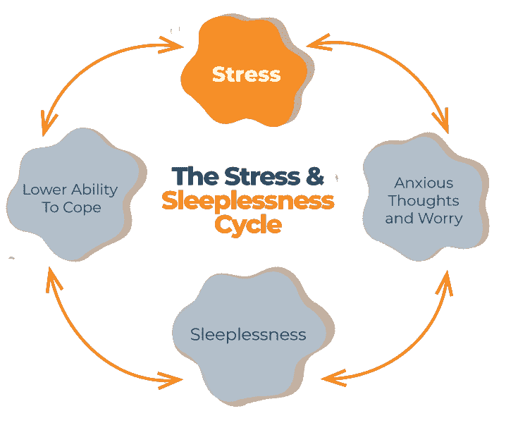
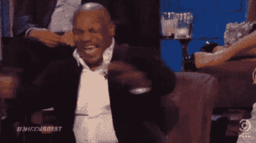
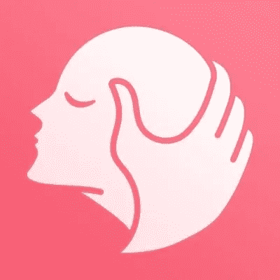

# 应对市场波动压力的最佳方法

> 原文：<https://medium.com/coinmonks/best-ways-to-manage-stress-in-market-volatility-c6df2afd6b51?source=collection_archive---------46----------------------->

在汹涌的波涛中幸存

许多平静的河流始于汹涌的瀑布，然而没有一条河流会一路奔腾而下，流向大海—米哈伊尔·莱蒙托夫

加密的土地是广阔的，大部分是未被绘制的。它的居民是充满希望的探险者，永远相信天堂就在下一个山顶的那边。

然而，在这个世界上，波动永远是王道。对于每一个成功到达希望之乡的人来说，一百个只会发现更多的山和更多的压力。

除非你学会正确地管理它，否则这种压力会越来越重，直到你再也无法扛着它越过下一个高峰。找到卸下这一重担的方法至关重要。

考虑到过去几周市场的变化，现在可能是评估你管理压力的策略的好时机。这里的关键词是“管理”不要让它发展到崩溃的边缘。有了一致性和纪律性，你就能让波动成为你的囚犯。

这些压力管理的方法为战胜熊提供了很好的起点！

# 放松技巧

无论你是在边缘徘徊，还是只是感觉有点压抑，学习一些基本的放松技巧都会让你受益匪浅。这些好处包括增强情绪和注意力，降低血压，降低心率，改善消化，减少肌肉紧张，提高能量水平。

## 专注呼吸

这可能是管理压力的最简单也是最有效的方法。有许多不同的方法，你可以在互联网上找到详细的说明，但是这里的[是一个很好的起点](https://ggia.berkeley.edu/practice/mindful_breathing)

## 自发松弛

这种技巧侧重于使用意象和身体意识。你找到让你感到放松并集中注意力的词语/想法/建议。最常见的例子就是“去你开心的地方。”

## 渐进肌肉放松

这种方法对于间歇性减压和晚上入睡都非常有效。通过绷紧然后放松某些肌肉，你可以更加意识到自己的身体状态，减少精神压力的限制

## 正念冥想

正念是一种冥想形式，在过去几年里越来越受欢迎。它围绕着训练自己“活在当下”的想法。对未来或过去的担忧极大地增加了你的压力水平，所以把注意力集中在现在是一件非常重要的事情。

# 锻炼

虽然我知道对你们中的一些人来说，锻炼的想法本身可能是一种压力源，但它的有效性已经被科学一次又一次地证明了。就我个人而言，我发现一次好的锻炼可以完全改变我的情绪和能量水平…当我真的去做的时候。

锻炼在许多方面可以像药物一样发挥作用。它释放内啡肽和内源性大麻素，可以减轻疼痛，并提供一种平静，愉快的感觉。

像跑步、骑自行车、游泳、跳舞甚至长距离散步这样的有氧运动是最有效的减压方式。

# 睡眠

压力和睡眠之间的关系是一个恶性循环。压力的增加通常会导致人们难以入睡，而失去高质量的睡眠会增加更多的压力。我知道有相当多的人陷入了这个恶性循环的噩梦中。

如果你想想典型的隐姓埋名者的日常生活，很容易想象不良睡眠习惯是如何形成并开始循环的。睡眠对于管理压力绝对至关重要，尤其是对于像我们这样长时间坐在屏幕前的人来说。

尽管日常事务可能不是加密社区最喜欢的主题，但它是改善睡眠习惯的关键。定期锻炼，稳定的睡眠时间表，增加阳光照射，减少咖啡因/酒精的摄入都是获得更好睡眠的好方法。事实证明，睡前 30 分钟至 1 小时关闭所有电子设备非常有效，但这对于像我这样的德根来说可能很难做到。

# 规定饮食

我将第一个承认我的饮食需要做很多工作。对于一个三十多岁的人来说，我的饮食习惯是一场灾难。正常的一天可能从一碗含糖的麦片开始，然后我可能会忘记吃其他任何东西(尽管我从来不会忘记开几瓶啤酒)，直到和家人一起吃一顿丰盛的晚餐。

复合碳水化合物、脂肪酸、瘦蛋白和抗氧化剂有助于减轻压力和压力对身体造成的伤害。专家特别指出，维生素 C、镁和 Omega-3 脂肪酸有助于减轻压力。

然而，最重要的提示可能是避免无意识的进食，这是当你一次进入一个秘密的兔子洞几个小时时的一个常见习惯…

# 笑疗法

在过去的两到三年里，我注意到一些简单的社交互动和大笑可以改善我的情绪，消除一些压力。我们是真正需要与他人互动来保持心理健康的社会存在，尽管 Twitter 空间和 Discord 聊天可以部分满足我们的需求，但没有什么比面对面的互动更好了。

具体来说，笑是我在紧张的日子后的必做之事……这在过去几周的密码市场中几乎是每天都有的。

开怀大笑可以增加氧气的摄入，从而增强你的心脏、肺部和肌肉组织。这导致释放那些对缓解压力至关重要的感觉良好的荷尔蒙。从长远来看，笑还能增强你的免疫系统，减少疼痛，长时间改善情绪。

# [收起治疗刀](https://uphealdao.xyz/)

Up Heal 是我最喜欢的新兴项目之一。这是一个致力于提高心理健康意识/支持的日益分散的社区，我坚信这不仅是当今世界非常需要的领域，而且它完全符合区块链/分散的概念。

这个 DAO 的未来是光明的，我很高兴看到他们利用 crypto 可以提供的所有机会。

无论你是有兴趣贡献自己的一份力量，还是只是在市场艰难的日子里寻找一些支持，都可以在 [Twitter](https://twitter.com/UpHealDAO) 和 [Discord](https://t.co/YE1UJCsnPz) 上查看，了解更多信息！

# “没有免费的午餐”

我对压力和焦虑并不陌生。事实上，对于像我这样情绪化的人来说，在动荡的密码市场全职工作可能不是最好的主意。

不管怎样，我会留在这里，所以学会管理压力将继续是我个人发展的重要部分。对我来说，这意味着“少喝啤酒和酒精，多冥想和锻炼。”

这个世界上没有免费的午餐，那些能够有效应对压力的人更有可能成功，并在秘密彩虹的尽头找到宝藏。

在 Twitter 和其他平台上关注我！请到 linktr.ee/docwrites[查看我的所有链接，一如既往，随时欢迎联系我！](https://linktr.ee/docwrites)

参考资料:

https://www . health . Harvard . edu/mind-and-mood/减轻压力的六种放松技巧

[https://www . mayo clinic . org/healthy-life style/stress-management/in-depth/relaxation-technique/art-2004 53 68](https://www.mayoclinic.org/healthy-lifestyle/stress-management/in-depth/relaxation-technique/art-20045368)

[https://www . webmd . com/balance/stress-management/stress-management](https://www.webmd.com/balance/stress-management/stress-management)

[https://www . sleep advisor . org/WP-content/uploads/2020/05/illustration-of-Stress-and-sleep-cycle . png](https://www.sleepadvisor.org/wp-content/uploads/2020/05/illustration-of-Stress-and-Sleeplessness-Cycle.png)

[https://uphealdao.xyz/](https://uphealdao.xyz/)

> 加入 Coinmonks [电报频道](https://t.me/coincodecap)和 [Youtube 频道](https://www.youtube.com/c/coinmonks/videos)了解加密交易和投资

# 另外，阅读

*   [3 商业评论](/coinmonks/3commas-review-an-excellent-crypto-trading-bot-2020-1313a58bec92) | [Pionex 评论](https://coincodecap.com/pionex-review-exchange-with-crypto-trading-bot) | [Coinrule 评论](/coinmonks/coinrule-review-2021-a-beginner-friendly-crypto-trading-bot-daf0504848ba)
*   [莱杰 vs n rave](/coinmonks/ledger-vs-ngrave-zero-7e40f0c1d694)|[莱杰 nano s vs x](/coinmonks/ledger-nano-s-vs-x-battery-hardware-price-storage-59a6663fe3b0) | [币安评论](/coinmonks/binance-review-ee10d3bf3b6e)
*   [Bybit Exchange 审查](/coinmonks/bybit-exchange-review-dbd570019b71) | [Bityard 审查](https://coincodecap.com/bityard-reivew) | [Jet-Bot 审查](https://coincodecap.com/jet-bot-review)
*   [3 commas vs crypto hopper](/coinmonks/3commas-vs-pionex-vs-cryptohopper-best-crypto-bot-6a98d2baa203)|[赚取加密利息](/coinmonks/earn-crypto-interest-b10b810fdda3)
*   最好的比特币[硬件钱包](/coinmonks/hardware-wallets-dfa1211730c6) | [BitBox02 回顾](/coinmonks/bitbox02-review-your-swiss-bitcoin-hardware-wallet-c36c88fff29)
*   [BlockFi vs 摄氏度](/coinmonks/blockfi-vs-celsius-vs-hodlnaut-8a1cc8c26630) | [Hodlnaut 审核](/coinmonks/hodlnaut-review-best-way-to-hodl-is-to-earn-interest-on-your-bitcoin-6658a8c19edf) | [KuCoin 审核](https://coincodecap.com/kucoin-review)