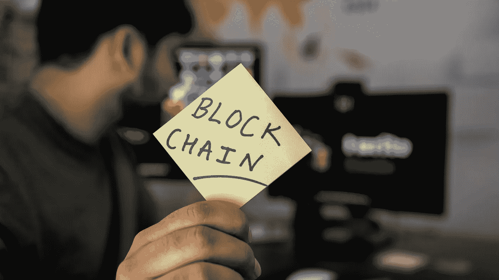

# 优化区块链网站的最佳方法

> 原文：<https://medium.com/coinmonks/best-ways-to-optimize-a-blockchain-website-74d2338c924c?source=collection_archive---------46----------------------->

Source photo Unspash.com

根据剑桥商学院(Cambridge Business School)进行的一项民意调查，到 2023 年，全球估计将有约 1.01 亿名身份得到证实的比特币用户。区块链技术满足了数字经济中对匿名的渴望。

随着加密货币网站的市值、价值、受欢迎程度和需求，搜索引擎优化(SEO)对加密货币网站变得越来越重要