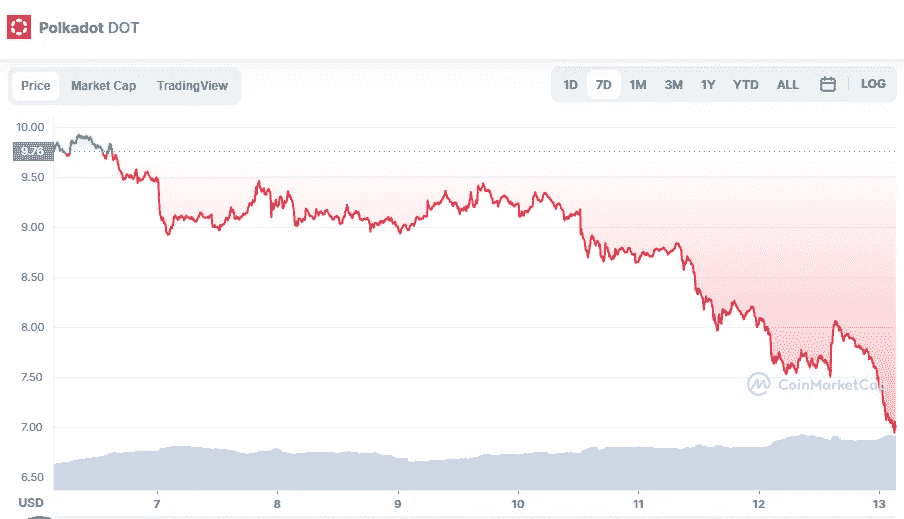

# 最佳 Web3.0 替代币

> 原文：<https://medium.com/coinmonks/best-web3-0-altcoins-ad53c36b7dda?source=collection_archive---------42----------------------->

# 波尔卡多(点)

Source photo [Polkadot price today, DOT to USD live, marketcap and chart | CoinMarketCap](https://coinmarketcap.com/currencies/polkadot-new/)

Polodot 允许企业在许多包含数字令牌的区块链之间转移资产或数据。本地 Polkadot 网络允许用户跨越几个区块链进行协作。在很大程度上，Polkadot 维护了与其他项目(如以太坊)不同的副链，但它们都可以流畅地交互，这是 web3 的核心。