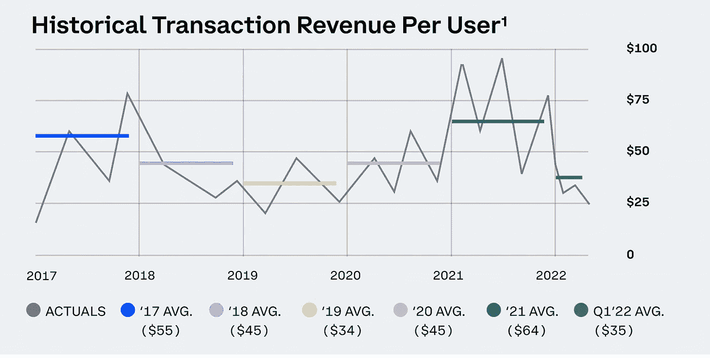
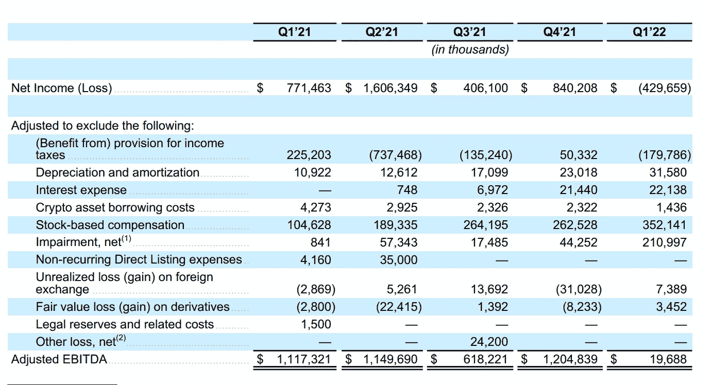

# 在世界流血的时候，在 Web3 上下大赌注

> 原文：<https://medium.com/coinmonks/betting-big-on-web3-while-the-world-bleeds-67cde5a80aa5?source=collection_archive---------31----------------------->

# 内容(3 分钟阅读):

*   🚷更多的裁员正在进行中
*   🎰在 Web3 上下大赌注
*   🏖️个人退休帐户，避税帐户
*   📰基督教青年会
*   🙏🏻感激…
*   💸优惠券

# 🚷更多的秘密裁员正在进行中

比特币基地到[裁员 18%](https://www.reuters.com/markets/currencies/coinbase-slashes-18-workforce-2022-06-14/) ,为严冬做准备。该公司透露，将裁员 1100 人，并指出经济状况正在“迅速变化”，世界似乎正在进入衰退。阿姆斯特朗说，这“可能导致另一个隐秘的冬天，并可能持续很长一段时间。”

比特币基地的每用户收入大幅下降。2022 年的 Q1 数字几乎与 2019 年的数字不相匹配。正如我们在下面看到的，他们在今年第一季度亏损了近 5 亿美元。

BlockFi 将裁员五分之一，在其他地方，像 Robinhood 、Crypto.com 和许多其他公司已经宣布大规模裁员或冻结招聘。一些资深专家表示，他们回想起 2018 年，当时加密初创公司[解雇了几十名员工](https://www.coindesk.com/markets/2018/12/14/ethereum-chat-startup-status-lays-off-25-of-staff/)，该行业休眠了几年。目前的裁员可能预示着另一个长期的加密低迷，并导致根本性的转变。反弹可能需要数年时间。

# 🎰在 Web3 上下大赌注

加密市场正在自由落体，一些投资者怀疑 web3 的潜力。但是许多其他人都在下一代互联网上下了双倍的赌注，并把他们的钱用在了他们的嘴上。

*   风险投资公司 True Global Ventures 4 Plus(TG v4 Plus)宣布[结束一轮 1.46 亿美元的融资，该轮融资专门用于广泛的 Web3 项目——这凸显了投资者对加密的持续兴趣，尽管熊市仍在持续。](https://cointelegraph.com/news/true-global-ventures-doubles-down-on-web3-with-146m-follow-on-fund)
*   数字资产交易所(digital asset exchange)Huobi Global(Huobi Global)推出了一个新的投资部门，管理着超过 10 亿美元的加密资产，专注于分散金融(DeFi)和 Web3 项目，进一步凸显了风险资本对区块链经济的兴趣。
*   [增强现实和 Web3 公司 Kaleidoco](https://www.kaleidoco.com/) 从区块链游戏社区获得了新一轮 700 万美元的资金。该公司将在 TED2022 活动的开幕式上首次亮相其粒子墨水元宇宙，它在拉斯维加斯也有一个现场 AR 装置。
*   全球风险投资和成长型投资者红杉资本[宣布推出两只新基金](https://cryptopotato.com/sequoia-capital-launches-two-new-funds-to-expand-web3-investment/)——一只 20 亿美元的早期风险投资和印度成长型产品，以及一只 8.5 亿美元的东南亚专用基金。重点将放在 Web3 生态系统上，“net 3 系统在马来西亚、泰国、越南以及菲律宾等市场快速增长。
*   Tellie 是为 web2 和 web3 创建者提供的最快、最容易使用的网站构建器，今天宣布在首轮融资中筹集 1000 万美元。新的投资者 Malibu Point Capital、Galaxy Digital、Osage Venture Partners、Dapper Labs、SXSW Innovation Fund 和 Gaingels 加入了现有投资者的行列，包括柯拉松资本、TQ Ventures 和孵化该公司的 advanced Ventures。
*   Web3 技术平台 [Nefta](https://nefta.io/) 宣布获得 Picus Capital 的 100 万美元投资。该公司目前与处于不同发展阶段的游戏工作室合作，并将利用这笔投资来扩大团队规模，并在未来加入更多的游戏公司。

[立即订阅](https://yarocelis.substack.com/subscribe?utm_medium=web&utm_source=subscribe-widget&utm_content=59817760)

## [连同 iCapital](https://itrustcapital.com/referral100?utm_source=partner&utm_medium=youtube&utm_campaign=partner637&oid=10&affid=637)

加密货币是这些天每个人都在谈论的东西之一。有各种不同的交易所进行加密交易……但是很多人没有意识到他们在税费上损失了多少。

iTrustCapital 允许其客户通过个人退休账户或个人退休帐户投资 crypto，而不必担心税收或费用。

IRA 是避税账户，这意味着你所有的加密交易都是免税的，并且可以随着时间的推移免税增长**。**

没有隐藏的费用。[要了解更多信息，请点击此处并开通免费账户。](https://itrustcapital.com/referral100?utm_source=partner&utm_medium=youtube&utm_campaign=partner637&oid=10&affid=637)

[分享 Yaro 的技术& WebX 简讯](https://yarocelis.substack.com/?utm_source=substack&utm_medium=email&utm_content=share&action=share)

# 📰基督教青年会

*   [随着 BTC 产量下降，公共比特币矿商艰难地跟上步伐](https://bitcoinist.com/bitcoin-miners-struggle-to-keep-up-with-difficulty/)
*   [比特币仍处于下跌趋势，有跌破 2 万美元的风险](https://www.newsbtc.com/analysis/btc/bitcoin-remains-in-downtrend-20k/)
*   [BlockFi 是取消三箭资本赎回权的公司之一](https://forkast.news/headlines/blockfi-foreclosed-three-arrows-capital-report/)
*   [阿尔格兰德(ALGO)在突破 791 天支撑线后争夺支撑](https://beincrypto.com/algorand-algo-scrambles-for-support-after-breakdown-from-791-day-support-line/)
*   巴拿马总统部分否决了该国的加密法案
*   [监管机构吊销执照后，Huobi 宣布关闭泰国子公司](https://cryptopotato.com/huobi-announces-closure-of-thai-unit-after-regulator-revokes-license/)
*   哈萨克斯坦现在将允许密码交易所拥有自己的银行账户
*   德克萨斯州、新泽西州、阿拉巴马州和美国其他州已经对 Celsius Network 展开调查
*   [Celsius 聘请花旗银行作为顾问寻找解决方案](https://beincrypto.com/celsius-hires-citigroup-bank-as-advisors-to-find-solutions/)
*   [投资者已经 100%做空比特币基地股票](https://seekingalpha.com/news/3849026-investors-have-made-over-100-ytd-shorting-coinbase-other-crypto-stocks-report)

> 加入 Coinmonks [电报频道](https://t.me/coincodecap)和 [Youtube 频道](https://www.youtube.com/c/coinmonks/videos)了解加密交易和投资

# 另外，阅读

*   [TraderWagon 回顾](https://coincodecap.com/traderwagon-review) | [北海巨妖 vs 双子星 vs BitYard](https://coincodecap.com/kraken-vs-gemini-vs-bityard)
*   [如何在 FTX 交易所交易期货](https://coincodecap.com/ftx-futures-trading) | [OKEx vs 币安](https://coincodecap.com/okex-vs-binance)
*   [OKEx vs KuCoin](https://coincodecap.com/okex-kucoin) | [摄氏替代品](https://coincodecap.com/celsius-alternatives) | [如何购买 VeChain](https://coincodecap.com/buy-vechain)
*   [ProfitFarmers 回顾](https://coincodecap.com/profitfarmers-review) | [如何使用 Cornix Trading Bot](https://coincodecap.com/cornix-trading-bot)
*   [如何匿名购买比特币](https://coincodecap.com/buy-bitcoin-anonymously) | [比特币现金钱包](https://coincodecap.com/bitcoin-cash-wallets)
*   [瓦济里克斯 NFT 评论](https://coincodecap.com/wazirx-nft-review)|[Bitsgap vs Pionex](https://coincodecap.com/bitsgap-vs-pionex)|[坦吉姆评论](https://coincodecap.com/tangem-wallet-review)
*   [如何使用 Solidity 在以太坊上创建 DApp？](https://coincodecap.com/create-a-dapp-on-ethereum-using-solidity)