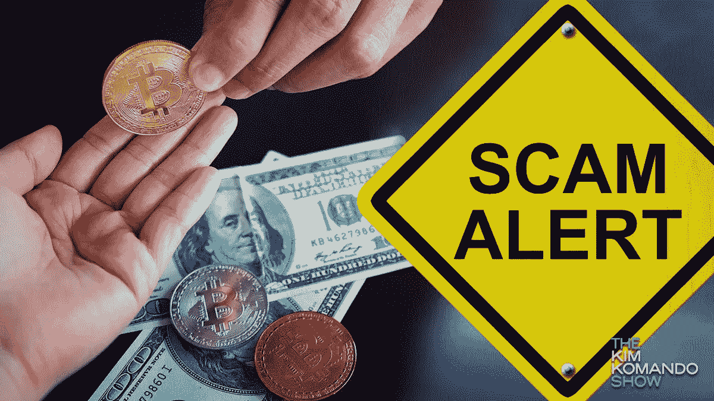

# 警惕加密货币骗局

> 原文：<https://medium.com/coinmonks/beware-of-cryptocurrency-scams-206ee7781809?source=collection_archive---------29----------------------->

Credit: Kim Komando

自推出以来，加密货币持续以指数级增长，超出了当时爱好者的预测。尽管它们非常不稳定且不可预测，但它们正迅速成为全球通用的数字货币。与普通或法定货币不同，没有中央机构监管[加密货币交易](https://www.kaspersky.com/resource-center/definitions/what-is-cryptocurrency)。交易一旦进行，就无法撤销或恢复，这使其成为欺诈者的一大关注点。出于这个原因，你必须能够区分合法的加密货币程序和彻底的骗局，以防止你的投资或交易遭受巨大损失。

在本文中，我们将讨论三大[加密货币骗局](https://www.consumer.ftc.gov/articles/what-know-about-cryptocurrency-and-scams#:~:text=Some%20scammers%20tell%20you%20to,fake%20promises%2C%20and%20false%20guarantees.)以及避免它们的方法。

1.  **高收益投资计划(HYIP)**

这些程序也被称为庞氏骗局，人们被说服以高回报的承诺进行投资。在这里，老投资者从新投资者的投资中获得回报，这种情况通常会持续很短时间，然后就会崩溃。这些项目从来没有成功过，因为新投资者最终会失去他们的钱。

**2。假密码交易所**

这些类型的骗局通常发生在社交媒体渠道，你可能会遇到一个广告，说你可以低于市场价格购买比特币或任何其他硬币。这只是引诱你访问他们的网站，一旦你这样做，如果你不小心，你可能会被骗。你付款，但不会收到承诺的硬币。

3.**比特币钓鱼骗局**

这是指当您收到一封电子邮件，告知您已经获得了一定数量的加密，但实际上，邮件中要求获得硬币的链接实际上是为了让网络钓鱼者能够控制您的 exchange 钱包。

**避免加密货币诈骗**

1.  你需要做的第一件大事是对你打算与之做生意的公司进行调查。只需访问博客，阅读评论，并检查论坛，以了解更多关于该公司的信誉。
2.  确保你访问的任何网站都有“HTTPS”的链接，而不是“HTTP
3.  永远相信你的直觉，如果一笔交易听起来好得不像真的，那很可能就是真的，那就选择退出。不要仅仅因为承诺的高回报率而达成交易。
4.  请务必核实广告中列出的信息。在你参与之前，花时间去了解所有需要知道的事情
5.  投资于公开审计的公司，因为只有它们能让你阅读他们的[储备加密审计证明](https://www.kraken.com/proof-of-reserves)。这将使你更容易验证他们的密码持有。希望这对你有帮助。

> *加入 Coinmonks* [*电报频道*](https://t.me/coincodecap) *和* [*Youtube 频道*](https://www.youtube.com/c/coinmonks/videos) *了解加密交易和投资*

# 另外，阅读

*   [3 商业评论](/coinmonks/3commas-review-an-excellent-crypto-trading-bot-2020-1313a58bec92) | [Pionex 评论](https://coincodecap.com/pionex-review-exchange-with-crypto-trading-bot) | [Coinrule 评论](/coinmonks/coinrule-review-2021-a-beginner-friendly-crypto-trading-bot-daf0504848ba)
*   [莱杰 vs n rave](/coinmonks/ledger-vs-ngrave-zero-7e40f0c1d694)|[莱杰 nano s vs x](/coinmonks/ledger-nano-s-vs-x-battery-hardware-price-storage-59a6663fe3b0) | [币安评论](/coinmonks/binance-review-ee10d3bf3b6e)
*   [Bybit Exchange 审查](/coinmonks/bybit-exchange-review-dbd570019b71) | [Bityard 审查](https://coincodecap.com/bityard-reivew) | [Jet-Bot 审查](https://coincodecap.com/jet-bot-review)
*   [3 commas vs crypto hopper](/coinmonks/3commas-vs-pionex-vs-cryptohopper-best-crypto-bot-6a98d2baa203)|[赚取加密利息](/coinmonks/earn-crypto-interest-b10b810fdda3)
*   最好的比特币[硬件钱包](/coinmonks/hardware-wallets-dfa1211730c6) | [BitBox02 回顾](/coinmonks/bitbox02-review-your-swiss-bitcoin-hardware-wallet-c36c88fff29)
*   [BlockFi vs Celsius](/coinmonks/blockfi-vs-celsius-vs-hodlnaut-8a1cc8c26630)|[Hodlnaut 点评](/coinmonks/hodlnaut-review-best-way-to-hodl-is-to-earn-interest-on-your-bitcoin-6658a8c19edf) | [KuCoin 点评](https://coincodecap.com/kucoin-review)
*   [Bitsgap 审查](/coinmonks/bitsgap-review-a-crypto-trading-bot-that-makes-easy-money-a5d88a336df2) | [Quadency 审查](/coinmonks/quadency-review-a-crypto-trading-automation-platform-3068eaa374e1) | [Bitbns 审查](/coinmonks/bitbns-review-38256a07e161)
*   [密码本交易平台](/coinmonks/top-10-crypto-copy-trading-platforms-for-beginners-d0c37c7d698c) | [Coinmama 审核](/coinmonks/coinmama-review-ace5641bde6e)