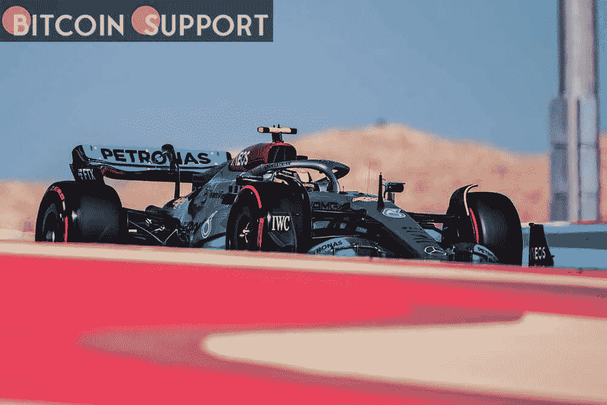
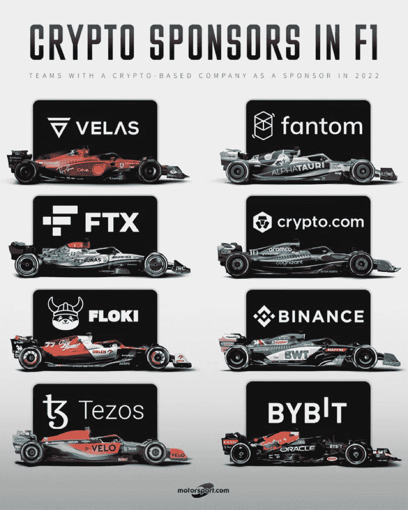
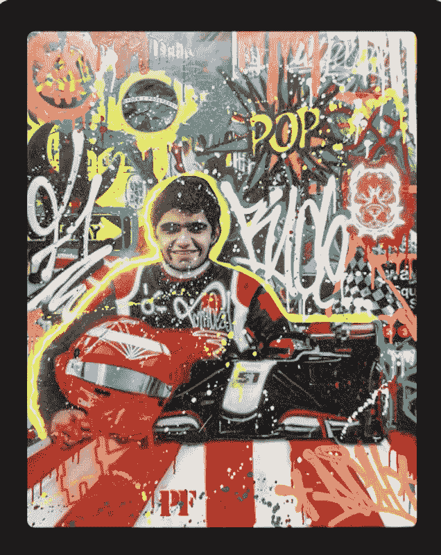

# 除了赞助，加密和非金融代币给一级方程式赛车增加了什么？

> 原文：<https://medium.com/coinmonks/beyond-sponsorships-what-do-crypto-and-non-financial-tokens-add-to-formula-one-c4329e7eefc4?source=collection_archive---------79----------------------->

**Visit our website:-** [**https://bitcoinsupports.com/**](https://bitcoinsupports.com/)

加密企业赞助 F1 是为了魅力和魅力，还是 NFTs 将表明这些关系具有现实世界的应用？

去中心化和国际化对加密货币生态系统一直很重要。因此，许多加密货币公司赞助一级方程式(F1)赛车队以扩大受众范围也就不足为奇了。

据尼尔森体育报道，一级方程式赛车今年有望在全球范围内拥有约 10 亿车迷，其中 16 至 35 岁年龄段的车迷占最大份额。一级方程式赛车越来越受欢迎，比特币公司也纷纷加入以示支持。在这种背景下，2022 年一级方程式赛季将有 10 支球队，加密业务目前赞助了其中的 8 支球队。

**Visit our website:-** [**https://bitcoinsupports.com/**](https://bitcoinsupports.com/)

总部位于纽约的营销公司 DiGo 的创始人兼创意总监 Mark DiMassimo 表示，从营销的角度来看，加密公司对 F1 的兴趣是有道理的。“从赞助的角度来看，你可以说 F1 是加密公司的自然延伸，因为这两个行业都是全球性的，令人兴奋，并且涉及金钱，”他说。

迪马西莫指出，F1 赛车公司红牛车队最近与新加坡加密交易平台 Bybit 签署了一份为期三年、每年价值 5000 万美元的协议。在此之前，Crypto.com 宣布与 f1 合作 1 亿美元，用于 2021 年的“冲刺系列”。

Bybit 的传播主管 Igneus Terrenus 告诉记者，体育赞助是 crypto exchange 全球营销战略的重要组成部分，旨在提高关键地区的品牌知名度和情感。“我们也是一些世界上最好的电子竞技团队的合作伙伴，”Terrenus 说，“但 f1 仍然是最受欢迎的国际赛车系列。”他接着说，一级方程式赛车拥有比几乎任何其他运动都更大、更全球化的粉丝群:

**“2021 年阿布扎比大奖赛在红牛车队的马克斯·维斯塔潘和梅赛德斯的刘易斯·汉密尔顿之间精彩的最后一圈比赛中结束，吸引了 1.08 亿观众。公羊队和孟加拉队之间的超级碗 2022 拥有破纪录的 1.01 亿观众。币安首席通信官帕特里克·希尔曼说，鉴于 F1 的全球知名度和粉丝基础，它是一项受密码行业吸引的运动币安最近与 BWT Apline 一级方程式车队建立了关系。“F1 是为数不多的真正全球化的运动之一，”他说。

f1 也开始与区块链的初创企业联系在一起。一级区块链平台 Fantom Foundation 于 2022 年 1 月宣布赞助意大利一级方程式赛车队 Scuderia Alpha Tauri。Fantom 首席执行官 Michael Kong 表示，由于各种原因，这种合作至关重要，曝光是其中之一。“它让更多的人来到 Fantom，因为 F1 在全世界有数亿人观看。”“这有助于 Fantom 网络的用户增长，”他解释说。

**随着 NFT 越来越受欢迎，F1 赞助商也越来越多**

然而，虽然加密业务最初可能是出于营销原因而被 F1 赞助商所吸引，但不可兑现代币(NFT)的增长为 F1 车队开辟了新的前景。根据德勤全球(Deloitte Global)最近的一份报告，仅在 2022 年，体育 NFT 就将产生超过 20 亿美元的交易，比 2021 年的交易量翻了一倍多。据报道，到今年年底，全世界大约有 500 万体育迷将拥有一件 NFT 体育收藏品。因此，大多数赞助一级方程式赛车队的加密和区块链组织也推出了 NFTs 来支持他们的赞助。2022 年 3 月 22 日，Fantom 宣布与巴西裔美国一级方程式赛车手 Pietro 和 Enzo Fittipaldi 达成赞助协议。根据孔的说法，这两位车手将在 F1 2022 赛季的比赛服和头盔上佩戴 Fantom 图案。除了赞助协议之外，菲蒂帕尔迪兄弟还将在 Fantom 网络上推出他们的第一部 NFT 系列。“皮埃特罗和恩佐都对尖端技术表现出浓厚的兴趣。这些 NFT 将为球迷提供无与伦比的接触他们最喜爱的球员的机会，让他们通过一种新的媒介与他们互动，”孔说。**

**Visit our website:-** [**https://bitcoinsupports.com/**](https://bitcoinsupports.com/)

Pietro Fittipaldi 还表示，由于他们参与了加密领域，他和他的兄弟决定与 Fantom:

**一起推出 NFT 系列。“我们希望能够与 NFT 社区的朋友和支持者分享我们最独家的产品，”该团队表示。在数字方面，我们一直都很投入。我哥哥和我在一级方程式中赢得了第一个虚拟世界冠军，所以能够使用 NFTs 实现其他数字功能变得很自然。**

据菲蒂帕尔迪介绍，国家艺术博物馆将由以涂鸦作品闻名的巴西艺术家里奇设计这些艺术作品随后将被数字化为独一无二的 NFTs，允许访问特殊的 F1 锦标赛以及我的 indy 500 F1 头盔和虚拟迷你世界锦标赛副本头盔，”Fittipaldi 解释道。

**Visit our website:-** [**https://bitcoinsupports.com/**](https://bitcoinsupports.com/)

菲蒂帕尔迪兄弟的销售将得到 NFT 机构 Infinity NFT 的支持，该机构将提供四个 NFT 类别供粉丝选择，每个类别都有不同程度的直接互动。

除了 Fantom 最近在 NFT 的首次亮相，Terrenus 表示，Bybit 将成为甲骨文红牛车队 NFTs 的主要市场。虽然 Bybit 的 NFT 市场在 2022 年 1 月才首次亮相，但 Terrenus 认为它已经从社区获得了很多积极的反馈。Bybit 还将为即将到来的甲骨文红牛车队出售粉丝代币，该车队将于明年首次亮相。根据 Terrenus 的说法，粉丝令牌将确保在团队的决策过程中听到社区的声音。

**一级方程式社区了解区块链技术**

虽然值得注意的是加密公司正在支持 F1 车队和车手，但有些人可能想知道这些合作和 NFT 将如何被公众接受。考虑到非加密本地人仍在学习 NFTs，这可能是一个令人困惑的概念，这一点尤其重要。根据 NFT 俱乐部的新研究，尽管自 2020 年 12 月以来，NFT 越来越受欢迎，但 2021 年最常被问及的问题是“从哪里收购 NFT”这表明相当一部分人仍然不熟悉 NFT 行业。

当 Fantom 与 Alpha Tauri F1 车手 Pierre Gasly 在 NFT 首次合作时，孔说 Fantom 与 Alpha Taur 的合作经历非常愉快，并指出该公司能够解释 NFT、其好处和前景。“希望我们能够让他们更好地了解区块链的技术，”孔说。Fittipaldi 还认为，由于 NFT 的实用性，它们将受到非加密本地人的欢迎。“许多人认为 NFT 仅仅是为了购买数字艺术品，但这些作品也为你提供了独家一级方程式锦标赛的机会。”考虑到这一点，菲蒂帕尔迪和他的兄弟表示，他们打算在未来创造更多的 NFT 系列。“这种下降的全部意义在于给我们的社区和粉丝一些特别的东西，这是我们未来的目标。”

此外，加密赞助似乎受到 F1 车队老板的欢迎。在最近一篇关于 motorsport.com 的文章中，梅赛德斯一级方程式车队负责人托托·沃尔夫(Toto Wolff)声称，“掌握加密交易很有趣”，他指的是 FTX 对梅赛德斯的赞助。

**访问我们的网站:-**[**https://bitcoinsupports.com/**](https://bitcoinsupports.com/)

**免责声明:以上为作者观点，不应视为投资建议。读者应该自己做研究。**

> 加入 Coinmonks [电报频道](https://t.me/coincodecap)和 [Youtube 频道](https://www.youtube.com/c/coinmonks/videos)了解加密交易和投资

# 另外，阅读

*   [nny 贸易评论](https://coincodecap.com/anny-trade-review) | [CoinSpot 评论](https://coincodecap.com/coinspot-review)
*   [新加坡十大最佳加密交易所](https://coincodecap.com/crypto-exchange-in-singapore) | [购买 AXS](https://coincodecap.com/buy-axs-token)
*   [投资印度的最佳加密软件](https://coincodecap.com/best-crypto-to-invest-in-india-in-2021) | [WazirX P2P](https://coincodecap.com/wazirx-p2p)
*   [7 个最佳零费用加密交易平台](https://coincodecap.com/zero-fee-crypto-exchanges)
*   [最佳网上赌场](https://coincodecap.com/best-online-casinos) | [期货交易机器人](/coinmonks/futures-trading-bots-5a282ccee3f5)