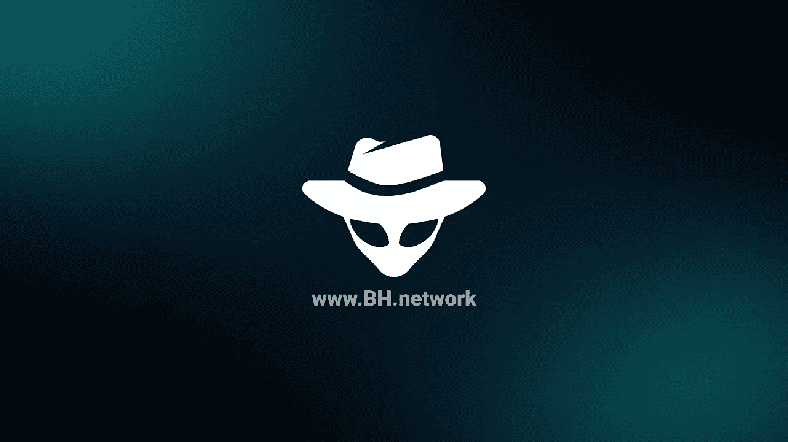

# ⚡BH NETWORK⚡-自由职业者的互联网&第一区块链市场

> 原文：<https://medium.com/coinmonks/bh-network-the-internet-of-freelancers-first-blockchain-marketplace-c02dae230072?source=collection_archive---------65----------------------->

这篇文章将让你更好地了解一个新的自由职业生态系统，以及基于埃尔隆德区块链的最大项目之一。

如果你是一名自由职业者，这个平台可能是一个很好的收入来源，考虑到它是由自由职业者或拥有在线业务的人创建的，作为他们的主要收入来源。

他们的主要目的是创造一个环境，让用户不会为购买服务付出太多，不会等待太长时间来提取他们的血汗钱，也不会总是面临欺诈性退款的风险。

根据 BlackHat Network 的数据，30%的财富 500 强企业已经在使用自由职业者网站，据估计，未来 53%的下一代工人将成为自由职业者。

BlackHat Network 建立在埃尔隆德区块链的基础上，拥有所有出色的功能，它希望大幅降低那些让我们生活艰难的费用，使其变得微不足道。他们希望给每个人平等的机会来成名，而不是每个部门的顶尖人物得到所有的工作。

买家也应该有自己的位置。在这个平台上，他们可以决定向谁购买，而不用担心得不到他们想要的东西。每位买家都有清晰、简单的选项可供选择。我认为这是一个很好的方法。自由职业者将为他们所做的工作获得公平的报酬，而买家将支付更少的费用。

根据他们的官方白皮书，BlackHat Network 项目的主要目的是创建一个可持续的、面向社区的数字资产市场，并将加密货币作为主要交易货币。

太多的法定货币市场存在持续的、似乎无法解决的问题，例如:

*   欺骗用户的能力
*   高额费用
*   取现时间长
*   基于可能的虚假评论的偏见观看
*   对新人不友好

BlackHat Network 团队旨在利用埃尔隆德区块链的基础设施，通过一个分散的市场来解决这些问题以及更多问题。

**路线图和目标**

*   在 2022 年第一季度，他们将社区的目标锁定为全球买家和卖家，同时测试所有登录方法的集成并设置市场的核心功能。
*   对于第二季度，他们计划为市场和本机令牌构建和实施市场经济、费用、功能和奖励系统。
*   第三季度对市场的持续测试将包括严格的内部安全和经济审计，同时建立奖金计划。
*   到 2022 年底，在 Marketplace 的测试版发布之后，他们将在正式发布之前完成最终的更改和修复，并允许社区对更改和费用进行投票。
*   在 2023 年第一季度，该团队预计市场将与整个管理团队一起完全活跃，同时增加用户以满足或超过 1000 个卖家和 10000 笔交易。

说到目标，我们必须承认，BlackHat Network 团队志在登顶。让我们看看他们为我们准备的十个优点，以便对项目有一个清晰的了解。

**1。降低市场费用**

使用埃尔隆德区块链，费用将减少多达 18 倍相比，菲亚特市场。

当你考虑菲亚特市场上的费用时，你是在向平台和支付处理器支付大量的钱，这对用户来说是不公平的。

**2。一个对所有人都更公平的市场**

想象一下，你是一个新的自由职业者，你做了所有的研究，有极具竞争力的价格，并且非常擅长你的工作。你仍然几乎不可能在市场上获得任何吸引力。这是因为菲亚特市场希望买家看到既定的卖家。这意味着新来者将试图滥用和操纵系统，使用虚假评论来欺骗算法。

**3。无欺诈性退款**

传统的银行和支付处理方法仍然在平面市场中使用。这种方法导致欺诈性退款，即使在产品交付后，买家也能获得退款。

使用区块链技术，买家无法利用这些平台的明显弱点。区块链不允许退款。

**4。区块链上的终生足迹**

如果你花了钱买了一个域名，在网站上做了很多工作，然后想转售，你可以证明你支付的价格，甚至在多年后，使用区块链的交易散列。

**5。互操作性**

埃尔隆德区块链的互通性让你一挣到钱就可以使用你的血汗钱。仅在买家发送您的资金后几秒钟，您就可以完全控制，允许您持有、交换、入股或花费您的资金，而无需等待银行和损失大量佣金。

**6。采用——将加密技术引入主流，反之亦然**

多年来，自由职业者和机构一直在寻找一种方法来减少甚至消除不必要的费用。

**让我们创建一个场景:**

你，对平面设计有热情和天生的技能，想通过自由职业用你的热情来发展和资助你的热情。

你在互联网上搜索，发现了一个杰出、干净、基于菲亚特的市场，拥有巨大的流量池，许多人有兴趣购买你的服务。

由于你是这个平台的新手，由于算法的原因，你一个月只能得到 1 到 5 个订单。

你以 100 美元的价格出售一个定制的标志设计。当买家付款时，默认情况下，平台会向他们收取销售成本的 1%至 3%，但你看不到这一点。

作为卖家，你也将被收取高达 20%的费用。

当你通过第三方支付处理器提取现金时，他们还会向你收取 2%至 6%的费用，用于将资金转入你的菲亚特银行账户。

更糟糕的是，你将需要缴税；如果你拥有一家小公司，还会有会计费用。

总结一下:你，从你辛苦赚来的 100 美元中，将得到大约 50 到 70 美元用于消费，这取决于你生活在哪个国家和你拥有哪种商业实体。最糟糕的情况是，由于大量的政府税收，自由职业者的收入还不到总收入的 40%。

BlackHat marketplace 将提供的最重要的优势之一是，卖家将不会支付巨额费用，买家将看到一个准确的价格，而不是你在菲亚特市场上经常看到的虚高的成本。

**7。更轻松的全球适应**

该平台将成为首批可用的区块链市场之一。大多数用户在计算机科学和整个互联网方面已经有了相对较好的背景。这将创造一个从法定货币到加密货币的简单、容易的变化，让每个人都轻松体验。

**8。稳定-不喜欢波动的买家和卖家的硬币**

大多数市场限制人们使用本国货币，禁止加密货币，让事情变得困难。因此，BlackHat 决定不限制参与者使用本地令牌 B-HAT，并允许通过 EGLD 等合作伙伴硬币以及 BUSD 或 USDC 等稳定硬币进行支付。

**9。用户界面和用户体验**

平台的交互会从用户的角度尽量“简单”。

10。避免通过虚假评论操纵市场

web 3.0 和区块链技术的美妙之处在于，相似或互补的项目不会将对方视为竞争对手，而是会共同努力实现最终目标。

BlackHat 旨在为所有人(从年长的卖家到新人，以及介于两者之间的所有人)提供首页位置，并在不同时间让所有买家都能看到，同时提供旋转幻灯片。

在研究他们的白皮书时，一些事情吸引了我们的注意力，并提醒我们为什么 web 3.0 更加民主。

BlackHat 宣称，去中心化市场的好处是多方面的。然而，有一些要点我们想进一步阐述:

1.每个人都受到平等对待和尊重。对任何人都没有更显著的好处，即使是 BlackHat Network 核心团队。

2.如果有要求或请求，机构群体投票将允许以民主和直接的方式对变更进行投票。

3.市场投诉将始终得到公平和尊重的处理。然而，对同一问题的重复投诉可能会导致买家或卖家使用市场的权利受到限制或被取消。

此外，所有 BlackHat 网络成员都将拥有投票权。每个拥有一定数量 B-HAT 代币的人都有机会就如何管理市场发表意见。如果您持有一定数量的代币，您将能够对市场的微小和重大变化进行投票，例如:

*   添加功能
*   移除功能
*   主意
*   丰富

BlackHat 网络将提供一个人工智能客户服务代理，支持市场的所有客人和参与者。代理将获得最常见问题的答案。然而，如果你没有找到你的答案，现场代理将随时准备帮助你。

**记号组学**

总供应量为 5 亿个 B-HAT 代币。其中，16%,即 8000 万 B-HAT 将作为赌注奖励分六轮发放，18%,即 9000 万 B-HAT 将代表流动性和交易所上市

只有 2%或 1000 万顶帽子在公开销售中分发，20%或 1 亿顶帽子在私人销售中分发，而团队拥有总供应量的 17%，顾问拥有 2.5%。

如今，营销投资是至关重要的，因此总供应量的 7.5%或 3750 万 B-HAT 将以这种方式分配。

为了在危机中保持项目势头，有必要设立一笔特别准备金，因此项目金库中将保留 8500 万百慕大元。

BH Network 背后的团队或帽子是一个自由职业者和企业主的团队，他们希望在在线市场的世界中有所作为。每个项目成功的最真实的标志之一是团队。我们建议你不要把你的钱投资在那些不会暴露他们团队身份的项目上。

我们希望这篇文章是有帮助的。谢谢你看完。

**下次见，小心你的钱！**

> *加入 Coinmonks* [*电报频道*](https://t.me/coincodecap) *和* [*Youtube 频道*](https://www.youtube.com/c/coinmonks/videos) *了解加密交易和投资*

# 另外，阅读

*   [Bookmap 评论](https://coincodecap.com/bookmap-review-2021-best-trading-software) | [美国 5 大最佳加密交易所](https://coincodecap.com/crypto-exchange-usa)
*   最佳加密[硬件钱包](/coinmonks/hardware-wallets-dfa1211730c6) | [Bitbns 评论](/coinmonks/bitbns-review-38256a07e161)
*   [新加坡十大最佳加密交易所](https://coincodecap.com/crypto-exchange-in-singapore) | [收购 AXS](https://coincodecap.com/buy-axs-token)
*   [红狗赌场评论](https://coincodecap.com/red-dog-casino-review) | [Swyftx 评论](https://coincodecap.com/swyftx-review) | [CoinGate 评论](https://coincodecap.com/coingate-review)
*   [投资印度的最佳加密软件](https://coincodecap.com/best-crypto-to-invest-in-india-in-2021)|[WazirX P2P](https://coincodecap.com/wazirx-p2p)|[Hi Dollar Review](https://coincodecap.com/hi-dollar-review)