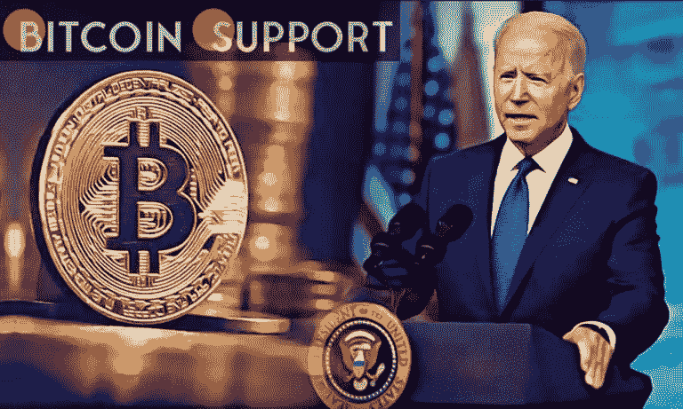

# 拜登本周将签署加密行政命令——这对美元来说是坏消息吗？

> 原文：<https://medium.com/coinmonks/biden-to-sign-crypto-executive-order-this-week-is-this-bad-news-for-the-dollar-a35cd188516f?source=collection_archive---------22----------------------->

[https://bitcoinsupports.com/](https://bitcoinsupports.com/)

一位了解情况的政府人士表示，美国总统乔·拜登将于本周发布一项加密行政命令。

为了建立一个全面的监管框架，EO 将指导政府机构对加密资产生态系统的许多方面进行详尽的研究。

消息人士称，总统令将指示财政部、国务院和总检察长办公室研究美国美联储发行数字货币的可行性。消息人士称，由于财政部长珍妮特·耶伦和白宫官员在提议的 EO 范围上存在分歧，拜登的加密政策的发布被推迟。

**关于加密货币的行政命令:为了金融稳定**

根据葡萄藤的说法，EO 本应在上个月签署，但由于耶伦的工作人员和国家经济委员会官员之间的分歧而被推迟，但一名财政部官员否认该报告“不正确”。拜登政府集中精力在国家层面监管该行业。

司法部聘请了一名经验丰富的计算机欺诈检察官来领导其国家加密货币执法团队，联邦调查局成立了一个专门负责区块链研究和加密资产扣押的特别小组。美国金融稳定监督委员会成立于 2008 年金融危机之后，旨在调查系统性风险，该委员会将受托调查与虚拟资产相关的经济稳定问题。拜登的道德操守办公室将处理广泛的问题

道德操守办公室还将考虑如何保护企业、消费者和投资者。对隐私、分布式账本技术和稳定账户的关注也将得到解决。

自 2021 年 1 月上任以来，拜登已经签署了 81 项行政命令，是历届总统中最多的。上届政府在四年时间里发布了 220 项行政命令，而巴拉克·奥巴马总统在八年任期内发布了 276 项。近年来，联邦机构对数字资产采取了零敲碎打的方式，拜登的团队面临着在这个问题上发挥主导作用的压力。行业高管经常抱怨美国标准缺乏清晰度和一致性，而其他人则担心中国和其他国家对政府支持货币的支持可能会危及美元的主导地位。一些国家已经发行了他们自己的数字货币，但是据报道，包括中国和韩国在内的十几个国家正在开发他们自己的数字货币。作为白宫对数字货币全面施压的一部分，政府机构将被期待应对在长期处理该资产类别时出现的问题和担忧。与此同时，随着加密市场膨胀到超过 2 万亿美元，监管机构对缺乏投资者“安全网”和金融稳定的潜在危险表示担忧。

**免责声明:以上为作者观点，不应视为投资建议。读者应该自己做研究。**

> 加入 Coinmonks [电报频道](https://t.me/coincodecap)和 [Youtube 频道](https://www.youtube.com/c/coinmonks/videos)了解加密交易和投资

# 另外，阅读

*   [印度的加密税](https://coincodecap.com/crypto-tax-india) | [altFINS 审核](https://coincodecap.com/altfins-review) | [Prokey 审核](/coinmonks/prokey-review-26611173c13c)
*   [赢取注册奖金——10 大最佳加密平台](https://coincodecap.com/earn-sign-up-bonus)
*   [Blockfi vs 比特币基地](https://coincodecap.com/blockfi-vs-coinbase) | [BitKan 点评](https://coincodecap.com/bitkan-review) | [Bexplus 点评](https://coincodecap.com/bexplus-review)
*   [南非的加密交易所](https://coincodecap.com/crypto-exchanges-in-south-africa) | [BitMEX 加密信号](https://coincodecap.com/bitmex-crypto-signals)
*   [MoonXBT 副本交易](https://coincodecap.com/moonxbt-copy-trading) | [阿联酋的加密钱包](https://coincodecap.com/crypto-wallets-in-uae)
*   [雷米塔诺审查](https://coincodecap.com/remitano-review)|[1 英寸协议指南](https://coincodecap.com/1inch)
*   [iTop VPN 审查](https://coincodecap.com/itop-vpn-review) | [曼陀罗交易所审查](https://coincodecap.com/mandala-exchange-review)
*   [40 个最佳电报频道](https://coincodecap.com/best-telegram-channels) | [喜美元评论](https://coincodecap.com/hi-dollar-review)
*   [折叠 App 评论](https://coincodecap.com/fold-app-review) | [StealthEX 评论](/coinmonks/stealthex-review-396c67309988) | [Stormgain 评论](https://coincodecap.com/stormgain-review)
*   [购买 PancakeSwap(蛋糕)](https://coincodecap.com/buy-pancakeswap) | [Coinswitch 俱吠罗评论](/coinmonks/coinswitch-kuber-review-1a8dc5c7a739)