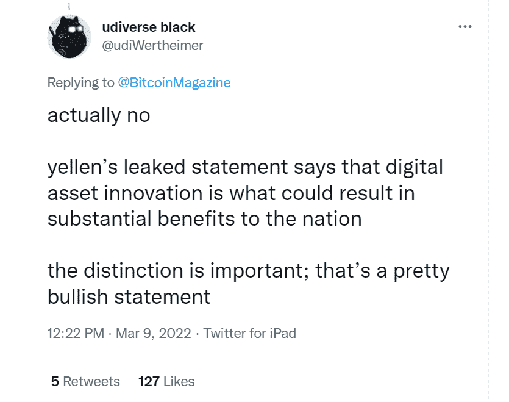

# 珍妮特·耶伦泄露了拜登关于加密货币的行政命令

> 原文：<https://medium.com/coinmonks/bidens-executive-order-on-cryptocurrency-was-leaked-by-janet-yellen-c0ef8d9dd105?source=collection_archive---------30----------------------->

**Visit our website:-** [**https://bitcoinsupports.com/**](https://bitcoinsupports.com/)

财政部的声明提前一天发布，现在已经从网站上撤下，但在此之前，耶伦部长对拜登总统即将发布的指令的回应细节已经披露。美国财政部长珍妮特·耶伦(Janet Yellen)表示，美国总统乔·拜登(Joe Biden)关于数字资产的行政命令要求采取措施促进创新，同时应对市场风险。

耶伦的言论被错误地提前一天发布，并很快被删除，尽管它被存档在互联网上。它提供了拜登总统行政命令的早期细节，预计将很快宣布。根据该命令，“数字资产政策的协调和全面的方法”。根据耶伦的声明，总统令可能“给国家、消费者和公司带来实质性的好处”。

**“它还将解决与非法金融相关的风险，保护消费者和投资者，并防止对金融系统和更广泛经济的威胁”**

耶伦还描述了财政部在了解数字资产以及如何在行政命令的界限内管理它们方面的下一步措施。据一位未透露姓名的消息人士称，自 1 月以来，拜登总统的白宫一直在努力制定一项与数字资产相关的行政命令，这将有助于“为政府在该领域的努力提供一致性”。

[https://twitter.com/TheBlueMatt/status/1501376145803001857](https://twitter.com/TheBlueMatt/status/1501376145803001857)

其他机构将联合制定一份“关于货币和支付系统的未来”的报告，以协助财政部的努力。为了“建立健全的标准和公平的竞争环境”，这将需要国际行动者的参与。

**Visit our website:-** [**https://bitcoinsupports.com/**](https://bitcoinsupports.com/)

珍妮特·耶伦(Janet Yellen)泄露了拜登关于加密货币的行政命令
,财政部还将召集金融稳定监督委员会(Financial Stability Oversight Council)召开会议，检查“足够的保障措施”是否到位。这些努力将被添加到现有的稳定货币工作中，耶伦说她的部门正在与联邦存款保险公司(FDIC)和货币监理署(OCC)合作。声明称，这项行政命令将产生全球性的影响，因为“我们将与我们的国际盟友合作，建立严格的标准和公平的竞争环境。”

根据耶伦的说法，财政部将继续与投资者保护团体和其他专业人士合作，并且:

**“财政部将致力于建立一个更加公平、包容和高效的金融体系，以我们现有的打击非法资金和避免金融稳定和国家安全威胁的努力为基础。”到目前为止，密码世界的杰出成员已经有了相互矛盾的反应。以太坊周的创始人埃文·凡·内斯称这次演讲为“无中生有的声明”改变的国家机器(ASM)的创始人亚伦·麦克唐纳对这一声明的反应更为严肃。他说，耶伦的话表明她正在寻找一种方式来“确保我们保留我们武器库中最致命的武器。”美元是全球结算货币。"

**访问我们的网站:-**[**https://bitcoinsupports.com/**](https://bitcoinsupports.com/)

**免责声明:以上为作者观点，不应视为投资建议。读者应该自己做研究。****