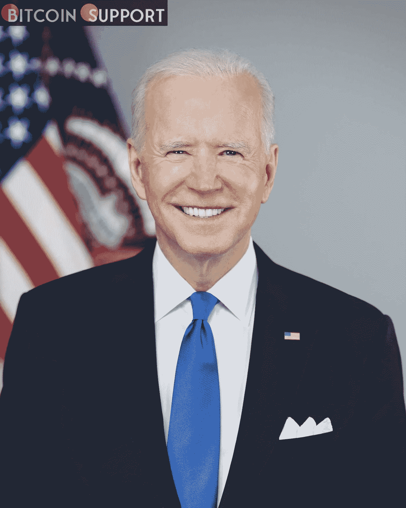
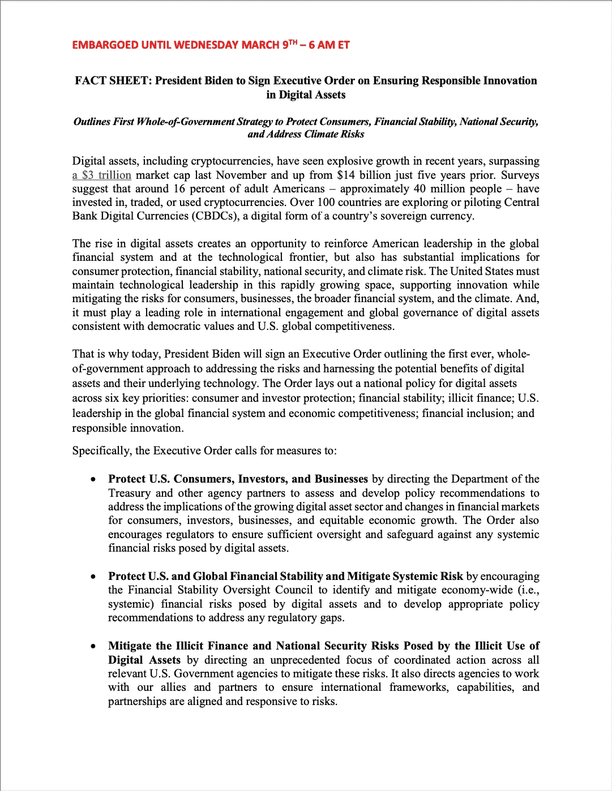
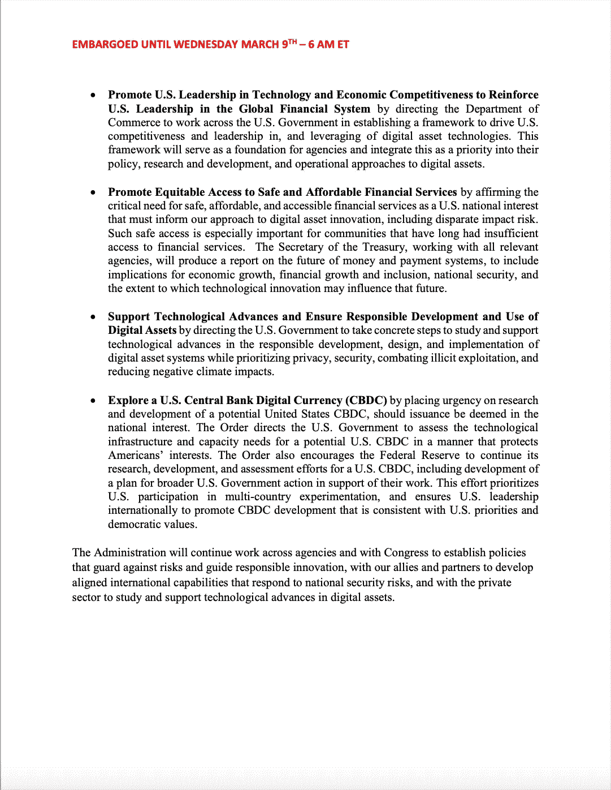

# 拜登关于数字资产的行政命令应该在四个小时后生效，但我们提前了

> 原文：<https://medium.com/coinmonks/bidens-executive-order-on-digital-assets-is-supposed-to-go-into-effect-in-four-hours-but-we-have-b6adf6e40a56?source=collection_archive---------60----------------------->

**Visit our website:-** [**https://bitcoinsupports.com/**](https://bitcoinsupports.com/)

预计约瑟夫·拜登总统将于今天上午晚些时候签署一项关于加密货币的行政命令。比特币支持公司获得了一份概述该命令主要方面的信息表，该信息表被吹捧为美国监管该行业的“有史以来第一个政府整体”方法。

根据比特币支持公司获得的一份资料，约瑟夫·拜登总统将于美国东部时间早上 6 点发布备受期待的行政命令。

“概述了有史以来第一个解决风险和利用数字资产及其基础技术的潜在利益的整体政府方法，”根据情况介绍。这份文件发布给了比特币支持者，可以在下面看到它的全部内容。它被标记为在美国东部时间早上 6 点之前处于禁运状态，尽管事实上比特币支持者从未参与这项安排。根据以前的报道，尽管早期担心即将到来的打击，但该指令似乎相当温和。然而，它强调了整个政府的方法，要求财政部、金融稳定监督委员会、美联储和国家安全机构对加密生态系统的相关方面进行新的研究。财政部长珍妮特·耶伦关于新行政命令的声明在被撤下之前偶然出现在了财政部的网站上，但不是在它的网络档案被保留之前。“这项工作将补充财政部正在进行的努力，”耶伦说，呼应了情况说明书对协调的强调和机构对加密兴趣的现有基础。

**Visit our website:-** [**https://bitcoinsupports.com/**](https://bitcoinsupports.com/)

**访问我们的网站:-**[**https://bitcoinsupports.com/**](https://bitcoinsupports.com/)

**免责声明:这些是作者的观点，不应被视为投资建议。读者应该自己做研究。**