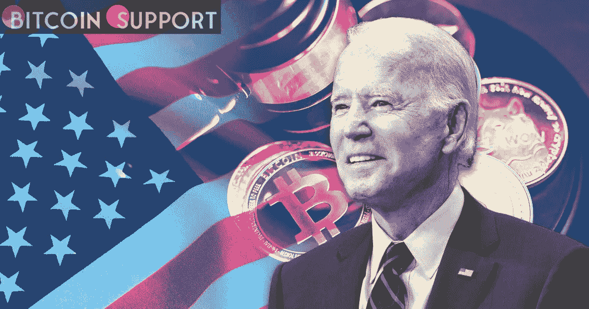

# 拜登禁止非法加密交易并建立数字货币的行政命令

> 原文：<https://medium.com/coinmonks/bidens-executive-order-to-suppress-illegal-crypto-transactions-and-establish-a-digital-currency-51216a51c6a2?source=collection_archive---------62----------------------->

**Visit our website:-** [**https://bitcoinsupports.com/**](https://bitcoinsupports.com/)

白宫周三宣布了美国副总统乔·拜登(Joe Biden)计划就加密货币法采取的行政行动的核心组成部分。该指令将为该国数字资产的认可和监管提供一个框架，并促进建立一种由中央银行发行的数字货币(CBDC)。根据白宫发布的消息，该命令将专注于投资者保护，遏制通过加密进行的非法活动，并促进数字支付系统的发展。当天晚些时候，拜登将签署这项命令。该决定是美国政府首次在加密立法上采取联邦立场。虽然声明没有具体提到加密货币监管，但它指示联邦机构合作发展该领域。

此举正值监管机构在俄乌危机后加大对加密货币的重视。这场战斗不仅标志着一个国家首次寻求加密货币捐赠，也引发了人们对受制裁机构利用加密规避限制的担忧。这是拜登计划中的一个关键因素，旨在建立一个全球框架，以减轻地下数字资产交易带来的危险。此外，该指令将鼓励美联储建设 CBDC，并试图促进与其他国家的合作。中国是今年首批引入数字货币的国家之一，在冬奥会期间推出了数字人民币。

**财政部关于“货币的未来”的报告**

根据命令，财政部长珍妮特·耶伦(Janet Yellen)将准备一份关于“货币的未来”和支付系统的报告，特别强调对数字货币不断增长的需求。周二泄露的耶伦评论的细节证实了白宫的发现。耶伦表示，财政部将与许多政府机构以及消费者和投资者保护组织合作进行这项研究。鉴于最近包括伊丽莎白·沃伦在内的参议员的批评，该指令减轻了人们对政府将对加密货币采取强硬态度的担忧。周二，市场对披露的信息反应积极，比特币上涨超过 6%，超过 42，000 美元。

**访问我们的网站:-**[**https://bitcoinsupports.com/**](https://bitcoinsupports.com/)

**免责声明:以上为作者观点，不应视为投资建议。读者应该自己做研究。**