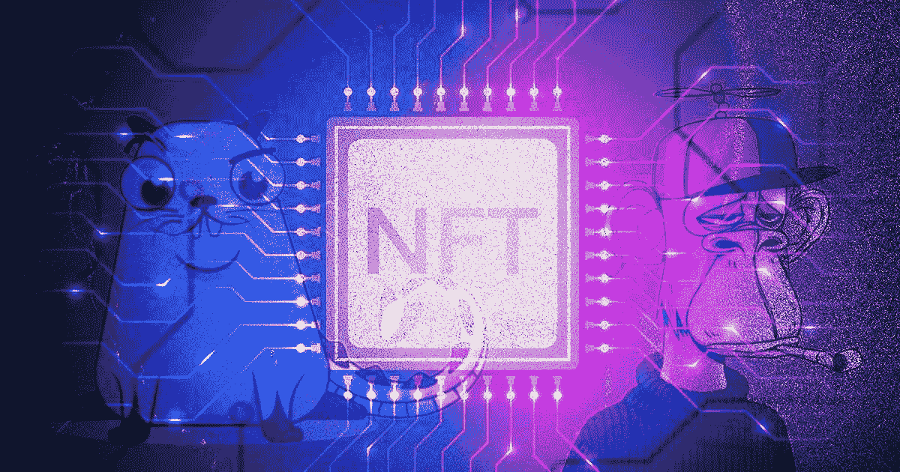

# 大云加入 NFT 党，尽管正在进行加密混乱

> 原文：<https://medium.com/coinmonks/big-cloud-joins-the-nft-party-in-spite-of-ongoing-crypto-mayhem-dd0b231b389a?source=collection_archive---------22----------------------->

## 阿里巴巴拓展 web3 区块链解决方案。Salesforce 推出云 NFT 专用试点。短暂的幻想还是持久的现实？

Invictus NFT Lab — Out of Africa Collection

短暂而激烈的技术革新，我们以前见过很多…大肆宣传的 Quibi 智能手机流媒体服务在 2020 年引人注目，使他们在六个月后陷入困境，当时该公司迅速关闭；智能手表 Puls 的基于语音的情绪检测器只能返回“烦恼”的结果，它有很多功能，但并不完全智能；回想一下，你还记得谷歌眼镜吗？2012 年 4 月，它被宣布为“为你工作的技术”，由于隐私和健康问题，以及糟糕的美学，它在发布后一年就失败了。这些只是过去十年中一长串有趣且引人注目的时尚中的一部分。但是 NFTs 呢？这种强大的海浪能撞击并打破(T2 的)悬崖吗？场景毕竟不会如此 [Rar(ibl)e](https://rarible.com/) 。事实上，一点也不罕见。

根据 UTA 公司 2022 年 4 月进行的一项消费者研究，80%的 16-54 岁的美国消费者认为非食物疗法不是炒作。尽管还处于早期阶段，1000 万美国人已经拥有了 NFT，6500 万人正在考虑。NFT 业主的平均家庭收入为 9.2 万美元，受过教育，此前曾投资于其他资产类别。虽然目前的市场可能由数字艺术和收藏品主导，但超过 90%有兴趣了解更多信息或购买 NFT 的消费者认为，品牌的未来将与这些可投资的项目密切相关。更准确地说，40%的人将 NFT 视为帮助品牌转型的工具，在这个世界中，NFT 将把实物商品和奖励与虚拟体验联系起来。这种混合环境被称为“物理的”。

与普遍的看法相反，NFT 自 2014 年以来就存在了——Quantum 是有史以来第一个交易的 NFTs 但直到最近，我们大多数人才开始欣赏它们的受欢迎程度。根据 [Chainanalysis](https://go.chainalysis.com/nft-market-report.html) 发布的一份报告，2021 年，这一爆炸性趋势的价值为 410 亿美元——几乎相当于整个全球艺术品市场。一些令人难忘的交易包括:[合并](https://www.barrons.com/articles/paks-nft-artwork-the-merge-sells-for-91-8-million-01638918205)——一件帕克的作品——它在 2021 年 12 月 2 日以 9180 万美元的交易正式成为有史以来最昂贵的 NFT 作品；NFT [时钟](https://nftnow.com/news/pak-julian-assange-clock-nft-auction/)每天更新，显示朱利安·阿桑奇被监禁的时间，于 2022 年 2 月以 5270 万美元售出；此外，我们也不会忘记去年由幼虫实验室制作的 12 个[密码朋克](https://www.larvalabs.com/cryptopunks)，它们的总售价超过了 8500 万美元。至少可以说，很狂野。

# 什么是 NFT 来着？

很高兴你问了。有些话题最好自下而上解决。NFT(不可替代的代币)是代表有形物品的数字资产，如艺术、音乐、音频文件、卡片、视频和我们三维现实中的几乎任何东西。起源于一个物理对象的创造 NFT 过程被称为“铸造”。底层代码与许多 cryptos 使用的代码相同(稍后将详细介绍)。NFT 也有特殊的标识符，使它们是独一无二的和“不可替代的”，这表示一类中的一个或极少数中的一个。一个特定的 NFT 是不能被复制、替换、改变或精确复制的。一言以蔽之，如果交易了，就不能换成另一个同等相同的。

现在是代币部分。NFT 利用区块链技术——一种记录交易和跟踪资产的共享、不可变的公共分类账。以太坊是最受欢迎的 NFT 连锁店，但是其他的也可以。使用这种基础设施的好处有几个:关于所有者可能是谁总是清晰和公开的；创建者可以在 NFT 的元数据中添加解释、个人注释或任何信息；此外，令牌转移是所有者之间相对容易的交换，这让我们更接近为什么 NFT 如此特殊的罪魁祸首。

事实上，我们可能会奇怪，为什么有人愿意支付任何东西，更不用说数百万美元，来拥有一个全世界都可以在他们的屏幕上免费看到的物理项目的数字版本。答案就在这种令牌的结构中:NFT 带有原始物品所有权的证明，由内置的权威且无可辩驳的自动认证系统支持。这可能对你来说没什么意义，但是收藏家们非常看重这一点。权利和证据变得几乎比附带的物品更珍贵。从某种意义上说，当支持它们的技术成为真正的杰作时，即使是平庸的视觉流行形式也会突然变得有趣。

# 移动

在这个节骨眼上考虑与 NFTs/Web3 领域的合作似乎是违反直觉和不合时宜的。超过 3000 亿美元已经被当前的加密货币崩溃抹去，这使得许多人开始怀疑分散市场的有效性。据 Bitcoin.com 报道，自五月以来，NFT 的月销售额[下降了 65%](https://news.bitcoin.com/monthly-nft-sales-have-dropped-over-65-lower-than-the-month-prior-nft-google-queries-sink/) 。确切地说，上个月 NFT 的销售额为 46 亿美元，但在过去的 30 天里，NFT 的销售额只有 15.9 亿美元。对于大大小小的投资者来说，他们可能正感受到一波恐慌在他们的系统中蔓延，有一点是正确的:在低迷时期有计划的行动可以在潮流再次改变时建立一座通往高点的桥梁。斯堪的纳维亚谚语“is i magen”，大致翻译为“往你的肚子里放些冰”，多年前就教会了我，即使在最动荡的情况下，我们也需要保持冷静。你知道哪里总是很酷吗？在云端。

2022 年 6 月 8 日，Salesforce Inc .推出了新的 [Customer 360](https://c212.net/c/link/?t=0&l=en&o=3560907-1&h=3069095470&u=https%3A%2F%2Fwww.salesforce.com%2Fproducts%2F&a=Customer+360) 升级，旨在在一个平台上同步营销、商业和服务数据。目标是让公司能够有意义地利用、自动化和个性化与客户的互动。在 CRM 巨头详述的创新中，进入不可替代的令牌业务是其中的一部分。NFT 云是试点服务计划的名称，该计划将使品牌能够直接在 Salesforce Customer 360 平台上创建、销售和交易 NFT。此外，他们将能够安全地连接客户数据，以便全面了解客户的物理和数字环境。这一战略决策旨在以安全和可持续的方式将客户体验扩展到 Web3。值得注意的是，Salesforce 不会实施消耗能源的工作验证协议，而是仅运行利益验证区块链技术，这大大降低了能耗。NFT 云将计算并显示区块链使用的碳排放量，这样用户就可以从平台上直接跟踪它。

# 走向全球

Salesforce 并不是唯一一个就此话题发布类似消息的云领导者。大约在同一时间，中国电子商务巨头阿里巴巴集团控股有限公司的云业务部门也宣布推出新的 NFT 服务。该解决方案将包括为 mainland China 以外的国际客户提供“网络托管、数字营销和内容交付”基础设施。阿里巴巴专注于元宇宙的服务包括远程渲染、数据分析和人工智能，以及作为私有阿里云区块链一部分的区块链即服务(BaaS)。该公司指出，在这种解决方案下，NFTs 可以集成到基于阿里巴巴服务的元宇宙中。

阿里云弹性计算服务(ECS)和面向企业增长的自动扩展将帮助用户建立一个 NFT 市场，卖家与买家建立联系。阿里云对区块链未来主义来说并不陌生。鉴于中国严格的监管环境，这可能会让一些人感到惊讶，但政府已经表示，他们无意禁止 NFT(与此同时，加密货币仍被禁止)。政治开放鼓励了像阿里巴巴和腾讯这样的大公司申请新的 NFT 专利，并创造性地探索数字产品。尽管有潜在的下降趋势，阿里云的领导层似乎并不害怕瞄准新的细分市场和行业。

# 寒冷的氛围

Fab 或 fad，当占主导地位的云玩家探索新趋势时，它会发出跨行业的信号。目前，我们可能会将 NFT 与收藏品联系起来，但云提供商在其中看到的真正潜在价值超出了艺术形式；品牌增长和客户忠诚度才是真正的目标。NFT 由智能合约支持，智能合约是一种执行预配置业务逻辑的分散式应用程序，因此可以轻松地更改 NFT，根据客户参与度释放物理和数字奖励。由于它们接触物理和虚拟环境，因此与单一环境中的其他应用程序、网站和平台相比，它们有可能为组织捕获更大范围的数据。开拓这一领域可能看起来有争议，但也可能结出比最初假设的风险更大、更好的果实。这个夏天比以往任何时候都更酷，技术朋友和*技术很快就会来找你*！

> 加入 Coinmonks [电报频道](https://t.me/coincodecap)和 [Youtube 频道](https://www.youtube.com/c/coinmonks/videos)了解加密交易和投资

# 另外，阅读

*   [TraderWagon 回顾](https://coincodecap.com/traderwagon-review) | [北海巨妖 vs 双子星 vs BitYard](https://coincodecap.com/kraken-vs-gemini-vs-bityard)
*   [Exness 回顾](https://coincodecap.com/exness-review)|[moon xbt Vs bit get Vs Bingbon](https://coincodecap.com/bingbon-vs-bitget-vs-moonxbt)
*   [如何开始通过加密贷款赚取被动收入](https://coincodecap.com/passive-income-crypto-lending)
*   [加密货币储蓄账户](/coinmonks/cryptocurrency-savings-accounts-be3bc0feffbf) | [加密交易机器人](https://coincodecap.com/best-crypto-trading-bots)
*   [BigONE 交易所评论](/coinmonks/bigone-exchange-review-64705d85a1d4) | [CEX。IO 审查](https://coincodecap.com/cex-io-review) | [交换区审查](/coinmonks/swapzone-review-crypto-exchange-data-aggregator-e0ad78e55ed7)