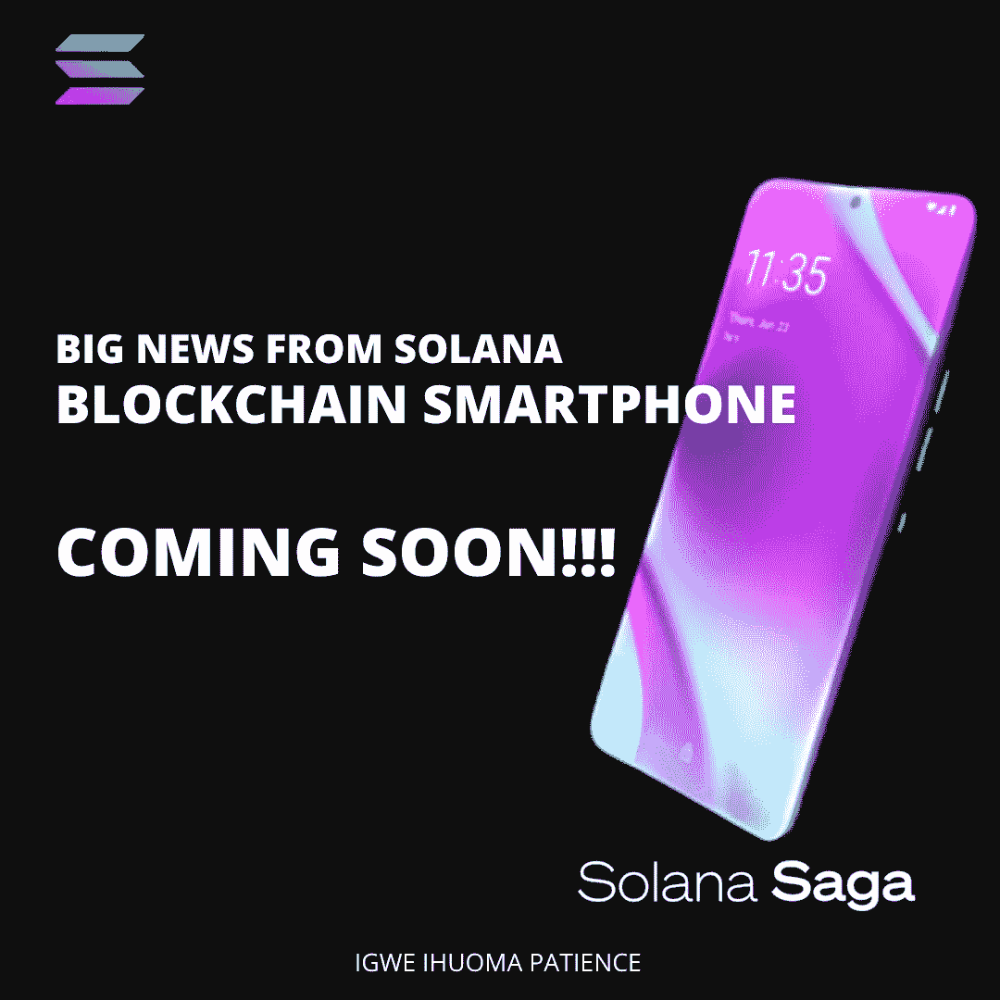
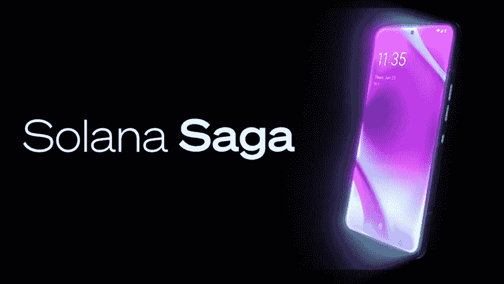

# 来自 SOLANA 的重大消息——区块链智能手机即将上市！！！

> 原文：<https://medium.com/coinmonks/big-news-from-solana-blockchain-smartphone-coming-soon-192dbb8788cb?source=collection_archive---------17----------------------->

SOLANA SMARTPHONE

排名前十的加密公司之一 Solana 决定将去中心化提升到一个全新的水平，并在《纽约时报》的一次活动中宣布推出面向 Android 的 Solana Mobile Stack (SMS)软件，以及即将推出的名为 Saga 的 Android 智能手机。

尽管这不是第一次尝试生产区块链本土手机，但这是索拉纳生态系统中的一次新浪潮，而且完全有可能成功，尤其是在索拉纳区块链有大量开发者的情况下。现在，我们再来谈谈佐贺。

Saga 是即将推出的 Solana 智能手机，由 Solana Labs 与其他公司联合开发。据说这款智能手机拥有令人惊叹的 web3 功能，将标志着科技史上的一个新时代。

SOLANA SAGA FUNCTIONS

据称，该设备增强了某些加密功能，如移动钱包适配器、easy minting(包括在世界任何地方购买和销售 NFT)、推出 web3 dapps(这将方便访问 Solana 上的 web3 应用程序)和“种子库”，这将有助于保护用户的私人信息免受攻击和利用。此外，它还将包括 G1 处理器、12gb 内存和 512 gb 存储以及 6.67 有机发光二极管显示屏。它将是 Solana mobile Stack (SMS)软件的第一个测试者。

据索拉纳实验室首席执行官阿纳托利·亚科文科称，这款智能手机的零售价预计为 1000 美元左右，早期买家据说会收到一张 Saga pass，这是一张限量版的 NFT，标志着这款手机的发布。

**注意**:从一开始，Saga 将仅在美国、加拿大、欧盟和英国发售。

要成为 saga 智能手机的首批用户，您只需加入预订行列，并在等候名单中保留您的位置。要加入预订，请点击[链接](https://store.solanamobile.com/)，输入您的信息，连接您的钱包，并存入 100 美元的 USDC 退款。付款完成后，您将被添加到等候名单中，并在完成订单时收到通知。

此外，索拉纳基金会正在呼吁所有寻求资助的开发人员，因为他们启动了有史以来最大的资助计划之一，即 1000 万美元的移动资助，以资助未来的 dApps。那么，你还在等什么？点击[此处](https://share.hsforms.com/17ieOT2CNT_SHx0RTjvLa_A5lohw)立即申请资助！！！

# 关于作者

Igwe Ihuoma Patience 是一名自学成才的创意和特定行业内容作家，也是一名加密货币爱好者，拥有 2 年多的经验和不断发展的区块链空间的知识。

我擅长内容创作、文案撰写、字幕管理、视频编辑和手机图形设计，我教其他人如何在加密货币和区块链领域起步，我的目标是让区块链的学习和更新易于任何人理解。

> 加入 Coinmonks [电报频道](https://t.me/coincodecap)和 [Youtube 频道](https://www.youtube.com/c/coinmonks/videos)了解加密交易和投资

# 另外，阅读

*   [密码本交易平台](/coinmonks/top-10-crypto-copy-trading-platforms-for-beginners-d0c37c7d698c) | [Coinmama 审核](/coinmonks/coinmama-review-ace5641bde6e)
*   [印度的加密交易所](/coinmonks/bitcoin-exchange-in-india-7f1fe79715c9) | [比特币储蓄账户](/coinmonks/bitcoin-savings-account-e65b13f92451)
*   [OKEx vs KuCoin](https://coincodecap.com/okex-kucoin) | [摄氏替代品](https://coincodecap.com/celsius-alternatives) | [如何购买 VeChain](https://coincodecap.com/buy-vechain)
*   [币安期货交易](https://coincodecap.com/binance-futures-trading)|[3 comas vs Mudrex vs eToro](https://coincodecap.com/mudrex-3commas-etoro)
*   [如何购买 Monero](https://coincodecap.com/buy-monero) | [IDEX 评论](https://coincodecap.com/idex-review) | [BitKan 交易机器人](https://coincodecap.com/bitkan-trading-bot)