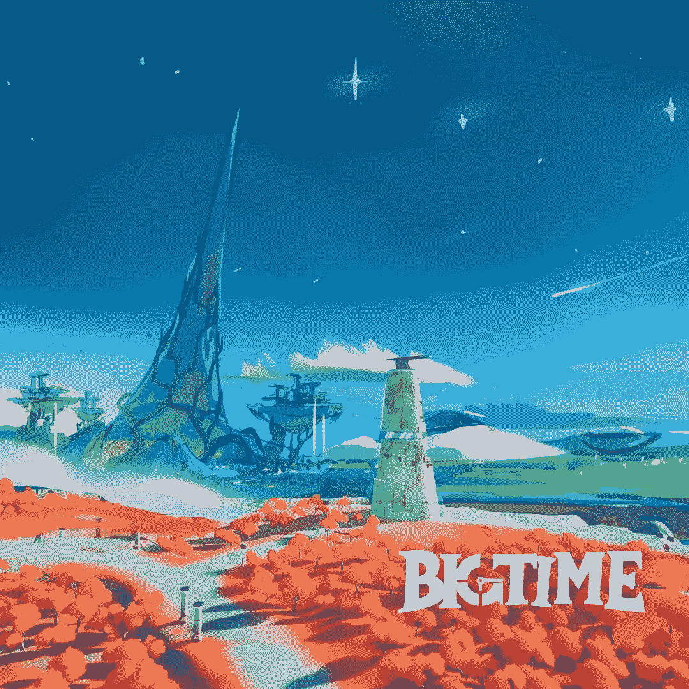

# 大时代工作室，它能有多大？

> 原文：<https://medium.com/coinmonks/big-time-studios-how-big-can-it-go-51351aba1ba9?source=collection_archive---------13----------------------->

# 介绍

想想有史以来最好的游戏；我以魔兽世界为例。现在想象组建一个团队，从你想到的最伟大的游戏中挑选一个人:

嗯… **你入选了大名单**。

> 《大时代》吸引了我们的眼球，因为它让我们感觉像是《魔兽世界》的第一天，但是加入了 NFTs 的**。**想象一下…

Taken from a recent TwitchTV Livestream of BigTime early access.

他们的图形有着**非真实感**，**复古风格的外观**，让游戏一眼就能认出来。

我们一直认为 NFT 对游戏有着巨大的影响，尤其是像 MMORPGs 这样的游戏。我们迫不及待地想看看这项技术如何影响游戏的动态。

大时代开发的一个巨大优势是让区块链隐形。所以有一个复杂的系统和游戏本身交互的感觉会尽可能的流畅。这是加密领域的一个关键点，技术壁垒非常高。

**获胜游戏由玩该游戏的活跃用户数定义**。这给我们带来了一个制胜点，产品越简单，愿意尝试的人数就越高。

# **什么是 BigTime？**

BigTime 是一个**动作** **RPG** ，它利用了*过程生成*(稍后将详细解释)并结合了:

*   真人格斗，比如 **PVE 地下城**。
*   游戏中的物品作为非功能物品掉落。
*   **开放世界**冒险风格。

BigTime 是一个游戏，围绕着那些正在摧毁时间之柱的人的威胁，作为一名时间旅行者，你的工作就是阻止它。

> 在《大时代》中，你扮演一名时间旅行者，被召唤到宇宙的尽头，参与人类历史上最伟大的冒险。你的旅程会把你送到时空最遥远的地方，遇到古老的奥秘，恐怖的危险，甚至几个熟悉的面孔。

**截至目前，大时代共有四个班。**

这个设置定义了任何 RPG 的**圣杯；它给你基础层来组成你的队伍和进入任何地牢。也就是说，它也为进一步的类开发提供了起点。**

**最大玩家组**设定为 6 名玩家，他们每个人都可以通过**“怀表”改变自己的职业**

怀表是游戏中的物品，可以让你在游戏中切换职业。像任何其他类，怀表有一个附加的水平；你玩得越多，你的级别就越高。

发现自己被爱因斯坦、梅林训练，或者打败像切·吉尔瓦拉这样的老板；到底有什么比旅行时光更美？

《大时代》和其他 MMORPG 作品一样；世界探索，派系，地下城和老板击败，和许多稀有物品战利品。

# 程序生成的

程序化生成是通过独特的算法创造大量内容的一种方式。著名的游戏如《无人区》和《《我的世界》》使用程序化生成的内容。

几乎不需要输入，你就可以为你的玩家编写无限的内容。PG 创造环境，敌对的怪物，掉落…你说得出的。

结合所有这些方面可以让你的游戏有无限的可玩性。

# 时间机器和空间

**时间机器**是玩家在游戏早期将获得的物品。你的那种“旅馆房间”将会给你足够的个性化(**入口，额外的房间，工艺区)。** )
还需要时光机解锁可玩特性，收集限量版 NFT。

**空间**，大时间版本的**虚拟土地**，被用作你的时间机器的扩展。

你可以用空间 NFT(额外空间，额外功能)升级你的时间机器。
空间可以通过游戏(非常罕见)或市场获得。总供应量中只有一定数量的将被出售，其余的将分布在大冒险中。

当前**空间总供应量**设定为 60 万单位。

# 大时代令牌经济学

如果有一件事是我们喜欢大时代的，那就是它在游戏结束前没有任何象征意义。

**为什么？**

因为只有那些愿意玩游戏(并拥有空间)的人才有资格赢得游戏。

另一方面显示了对球队的强烈信心，并奖励了球员。这也避免了任何可能以低价获得代币的投资者抛出代币的情况。

在这一点上，你猜对了，**没有任何象征性的经济政策**在大时代实施。但是对于那些对如何得到令牌感兴趣的人，该团队提供了一个有用的解释。

在这种情况下，**沙漏**的作用是作为你获得**代币**的“能量”。由于显而易见的原因，按照其他区块链游戏，你可以赚取的代币必须有一个限额。

记住平衡游戏中的经济不是一件容易的事情；没有一款区块链游戏达到了这个目标。**有耐心**。

我们之前就创建大众经济的困难发表了一篇有趣的帖子。

**空间**结合**沙漏**是你在游戏中赚取代币的唯一机会。

# 保险库技术和大时代市场

以太坊正在开发大时代，这不是秘密；你可能会想，那么汽油费呢？

剧情转折是，团队开发了他们的“第二层”概念，称为**金库**，允许你在游戏内交易，而没有以太网的影响。

BigTime 推出了保管系统，再次消除了区块链的麻烦。保险库技术使您的 NFT 安全，所以没有更多的密码，钱包，或资产丢失。

看，叙述:“你在游戏中花费的时间不会丢失”增加了金融/经济方面，这需要**更多的安全性**。

你现在不能失去你的资产。否则，这意味着失去真正的金钱，而不是时间本身。团队开发的保管系统减少了错误的数量，增加了游戏的安全性。

Big time 目前与 Circle ($USDC)建立了[合作关系，以实现更顺畅的存款和取款流程优化。](/playbigtime/big-time-x-circle-d907f00cee3d?source=user_profile---------13----------------------------)

# 游戏处于早期访问状态；怎么玩呢？

该团队在早期发布了三种不同的通行证，您可以按以下价格铸造:

***第一次销售:*
黄金** 499 美元
**白银** 299 美元
**翡翠** 179 美元

***第二次拍卖:*
黄金** 799 美元
25】白银 399 美元
28】玉石 199 美元

截至目前，只有**金卡**车主可以玩**早取**；该团队也将逐步开放白银和玉石所有者的访问权限。黄金通行证目前售价为 6500 美元(几乎是铸币价的 13 倍)。

我们没有提到 Ruby Pass，这是对那些为 Big Time 的发展做出最大贡献的人的社区奖励。

至于通行证，这里是 2021 年 12 月的更新:

# 组

这个团队不需要任何演示，从他们的创始人之一 Ari Meilich (@ arimeilich)开始，他是分散土地的联合创始人。

大时代工作室已经从像 **Epic Games、暴雪、EA、**和 **Riot 这样的公司招募了一个游戏行业资深人士的全明星团队。**

就个人而言，他们为游戏历史上一些最受欢迎的专营权做出了贡献，包括**堡垒之夜、战神、使命召唤、**和**守望者、**等等。

# 细分市场

**2021 年，全球视频游戏市场规模约为 1555 亿美元，占数字媒体市场的 52.9%。**视频游戏市场是数字媒体中最重要的细分市场，到 2026 年将以平均每年 9.0%的速度增长。我们看到所有地区都有类似的发展。

**中国**，**美国**。到 2021 年，欧洲的视频游戏总收入将达到 1036 亿美元，占全球视频游戏市场的 68.0%。

由于 WoW(魔兽世界)的衰落以及 MOBA、FPS 游戏和移动游戏的大量增加，MMORPG 失去了最多类型游戏的位置。

虽然目前仍有很多玩家在玩 MMO，但 WoW 仍然拥有最高的用户数(最多的玩家玩 MMO 2021)

MMORPGs 是 PC 上一些最大和最有野心的游戏。在数百个游戏中，MMO 一年的总收入为 100 亿美元，拥有比这多得多的观众。

不幸的是，由于硬件成本上升(芯片危机)和 GPU 过高的成本，PC 游戏类型受到了打击。每个人都会问的一个大问题是，“PC 硬件价格什么时候会再降下来？”

在这一点上，似乎没有简单的答案。制造延迟、芯片短缺、黄牛、加密开采、全球能源成本上涨、运输问题……消费者正在争论一系列迫使硬件价格上涨的问题。

> 不要惊慌，因为 Big Time 的最低硬件要求仍然是合理的，你不需要更新的 GPU 以最低设置运行游戏。
> 
> GeForce GTX 1060 或更好/镭龙 Rx 580 或更好
> 8GB RAM DirectX 11 或更高
> 英特尔酷睿 i5 4430/ AMD FX 6300
> 10GB 可用驱动器空间

# 辛 X 大时代 AMA

我们有幸与大时代团队一起举办了一个小型的 **Twitter AMA** 。这里有一些问题和直接来自大时代团队的答案。

# 结论

在我们对大时代生态系统的研究中，我们对许多方面表示赞赏:

*   **进入门槛低**，区块链理工有，但不常见到。
*   这个团队非常优秀、友好，并且在游戏行业有着丰富的经验。
*   没有来自 VCs 的**令牌转储**；该代币仅为游戏玩家设置。
*   伟大的故事写作；一个好的 MMORPG 也是一次好的冒险。
*   体面的主流媒体曝光。
*   他们已经有一个 MVP 了。

**有一些注意事项 tho:**

*   SPACE nft 的交易价格低于 mint，这在早期采用者中引起了一些不满。
*   打造一款区块链游戏绝非易事；它需要大量的经济平衡，几乎没有出错的余地。
*   让它成为区块链游戏吧，但是开发一个游戏是很难的；很多大制片厂都倒闭了。

空间价格的下降可能是由那些购买空间的人为了获利而疯狂抛售造成的。

永远把一场区块链的比赛看做是**的长期投资**。

我们愿意把我们的**耐心**给那些为建设明天的奥运会而表现出热情和奉献的人。

# 放弃

无论如何，这不是财务建议；我们研究的目标永远是深入项目，从不同的角度研究它们；我确实包含了基于我最近审查的类似项目的经验的个人意见。

我现在和将来都愿意接受讨论。

**在 Twitter 上关注我们:**

**@道辛**

**请在投资任何东西之前做好调查**。

# 链接

[https://twitter.com/daolectic](https://twitter.com/daolectic)
https://nft.bigtime.gg/
https://twitter.com/playbigtime