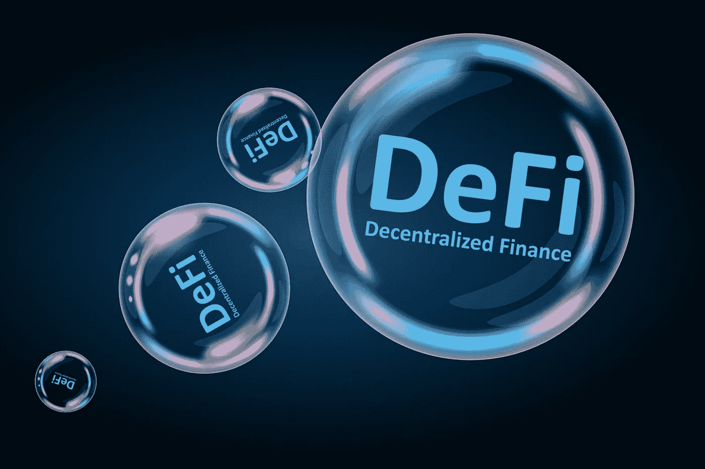

# 越来越大的 DeFi 未来

> 原文：<https://medium.com/coinmonks/bigger-and-bigger-defi-future-6d863890231d?source=collection_archive---------63----------------------->

虽然推出时间不长，但分散式交易所与现有的集中式交易所相比有着巨大的优势，与 DeFi 的发展同步，这些 DEX 交易所满足了用户的期望。点对点交易，自动做市商，不需要任何第三方，这些都是大量用户转向使用这些去中心化交易所进行交易或投资其资产的关键。

只要用这些 dex 创建并连接钱包，用户就可以进行交易了。这些 dex 不持有任何用户资产，所以谁的资产完全由那个人决定。分权制使得没有人能掌握绝对的权力，也不需要任何第三方来证明。一切都是横向交易，在想买的人和想卖的人之间，通过智能合约完成。

凭借这些优势，dex 发展非常迅速，交易量达到了任何交易所的要求。像 Uniswap、Sushiswap、Pancakeswap、Justswap 这样的大公司，以及即将推出的潜在 dex alium swap，forbitswap 将创造一个越来越大的 DeFi 未来。

> 加入 Coinmonks [电报频道](https://t.me/coincodecap)和 [Youtube 频道](https://www.youtube.com/c/coinmonks/videos)了解加密交易和投资

# 另外，阅读

*   [如何购买 Monero](https://coincodecap.com/buy-monero) | [IDEX 评论](https://coincodecap.com/idex-review) | [BitKan 交易机器人](https://coincodecap.com/bitkan-trading-bot)
*   [CoinDCX 评论](/coinmonks/coindcx-review-8444db3621a2) | [加密保证金交易交易所](https://coincodecap.com/crypto-margin-trading-exchanges)
*   [红狗赌场评论](https://coincodecap.com/red-dog-casino-review) | [Swyftx 评论](https://coincodecap.com/swyftx-review) | [CoinGate 评论](https://coincodecap.com/coingate-review)
*   [Bookmap 点评](https://coincodecap.com/bookmap-review-2021-best-trading-software) | [美国 5 大最佳加密交易所](https://coincodecap.com/crypto-exchange-usa)
*   [如何在 FTX 交易所交易期货](https://coincodecap.com/ftx-futures-trading) | [OKEx vs 币安](https://coincodecap.com/okex-vs-binance)