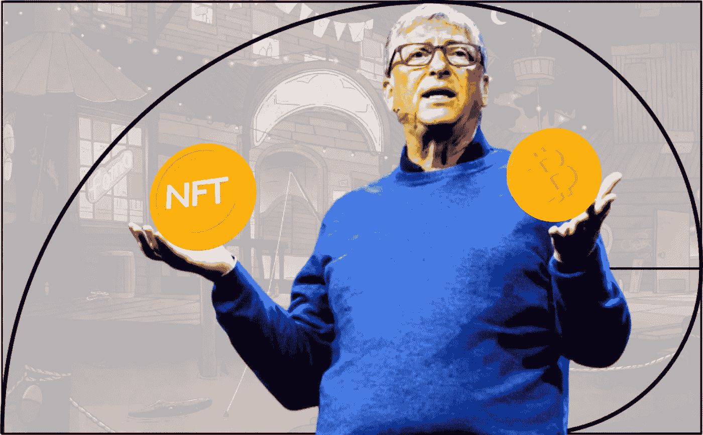
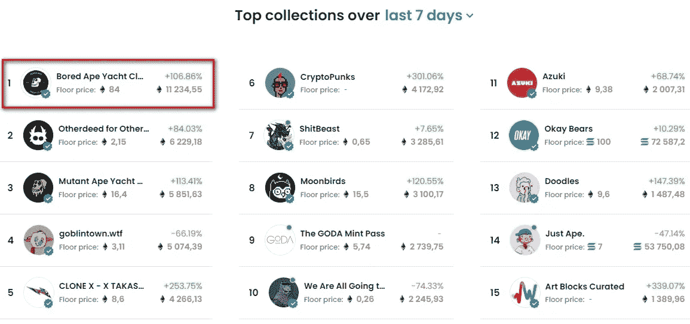

# 比尔·盖茨批评了 NFT

> 原文：<https://medium.com/coinmonks/bill-gates-criticized-the-nft-f619ce5aa49c?source=collection_archive---------13----------------------->

## 微软创始人比尔·盖茨称不可替代代币是“基于大傻瓜理论”的骗局

This preview will be included in the NFT collection called “[Uncle Fibonacci News](https://opensea.io/collection/uncle-fibonacci-news)”

在加州 TechCrunch 主办的一次会议上，这位亿万富翁调侃道:

> "显然，昂贵的猴子数字图像极大地改善了世界."

他补充说，他在这一资产类别中没有任何头寸。

据推测，在引用中，盖茨提到了来自宇迦实验室团队的流行的无聊猿游艇俱乐部 NFT 收藏。

Ranking of NFT collections by trading volume for seven days. Data: OpenSea.

此前，盖茨敦促潜在投资者不要效仿特斯拉，后者投资了 15 亿美元的比特币。他还指出了开采第一种加密货币对气候变化的负面影响。

盖茨作为气候基金突破能源风险投资公司的创始人参加了这次活动。他指出，很难从硅谷聘请专家到化工和钢铁等需要减少碳排放的行业工作。

这位亿万富翁还称，他通过慈善基金会支持的数字银行比加密货币“高效数百倍”。

盖茨在 5 月份表示，他没有投资数字资产，因为它们没有价值。

📰 ***订阅*** [***斐波那契***](/@unclefibonacci) ***我来保持最新***

> 加入 Coinmonks [电报频道](https://t.me/coincodecap)和 [Youtube 频道](https://www.youtube.com/c/coinmonks/videos)了解加密交易和投资

# 另外，阅读

*   [比特币基地评论](/coinmonks/coinbase-review-6ef4e0f56064) | [德里比特评论](/coinmonks/deribit-review-options-fees-apis-and-testnet-2ca16c4bbdb2) | [FTX 评论](/coinmonks/ftx-crypto-exchange-review-53664ac1198f)
*   [Coinmetro 评论](https://coincodecap.com/coinmetro-review) | [VirgoCX 评论](https://coincodecap.com/virgocx-review)
*   [法国 4 大最佳加密副本交易平台](https://coincodecap.com/copy-trading-platforms-france)
*   [从 WazirX 切换到 CoinDCX 的 5 个理由](https://coincodecap.com/reasons-to-switch-from-wazirx-to-coindcx)
*   [Unocoin 评论](https://coincodecap.com/unocoin-review) | [最佳加密赌注硬币](https://coincodecap.com/best-crypto-staking-coins)
*   [如何使用 MetaMask Wallet 获取 KCC 地址？](https://coincodecap.com/kcc-address-metamask)