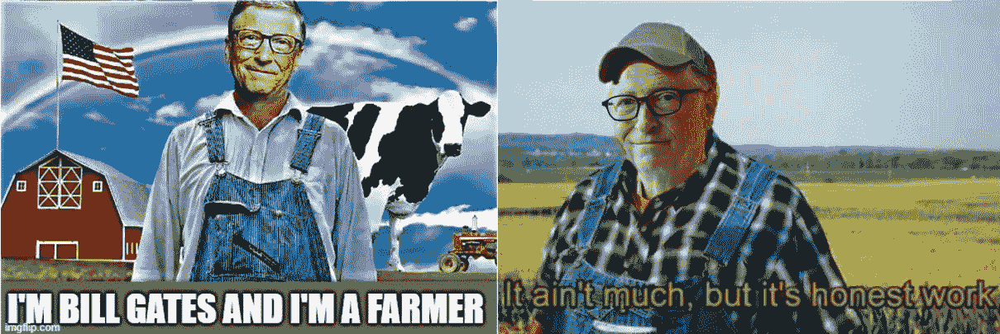
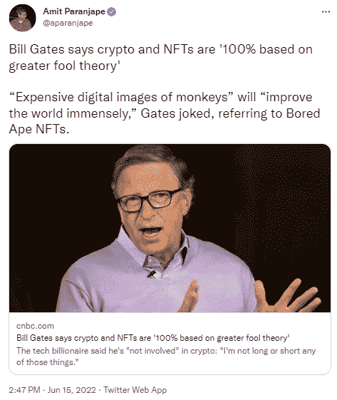
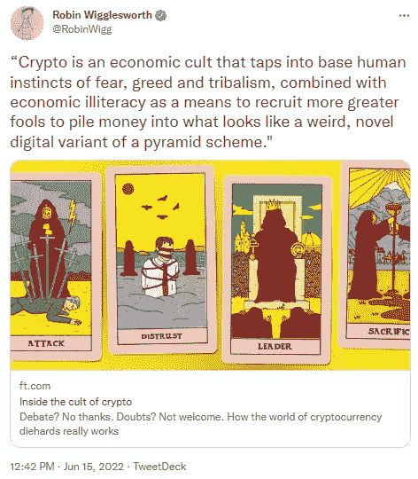
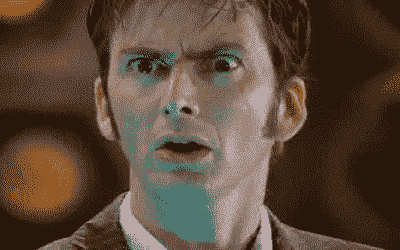
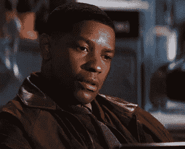
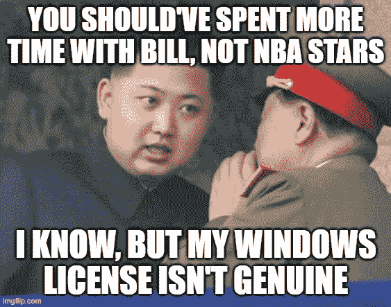
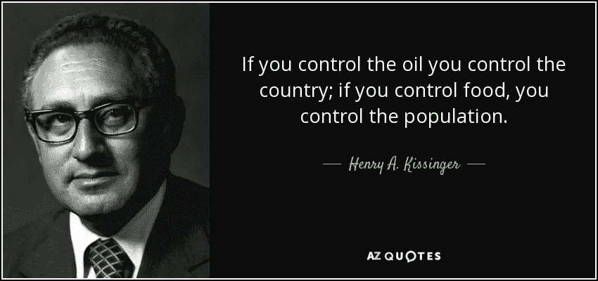
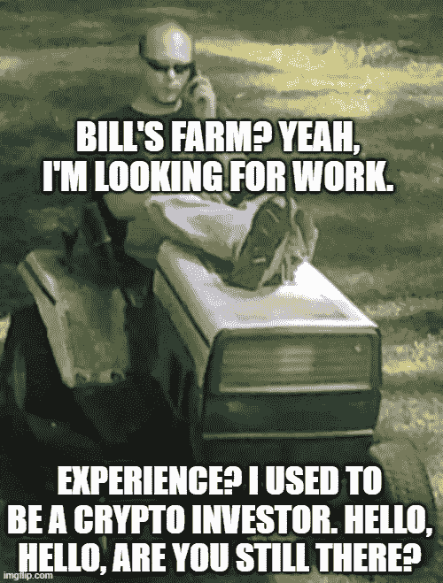

# 比尔“农夫”对“密码傻瓜”

> 原文：<https://medium.com/coinmonks/bill-the-farmer-vs-crypto-fools-322122f654e?source=collection_archive---------55----------------------->

与密码时代(世代)有关吗？

我不这么认为。我已经[写过了](https://hackernoon.com/the-multiverse-of-madness-warren-buffett-elon-musk-inflation-and-bitcoin?ref=hackernoon.com)。所以，我们有最好的“老派”代表，沃伦·巴菲特，他说“如果你……拥有世界上所有的比特币，你以 25 美元卖给我，我不会接受。”努夫说。然后，我们有了“年轻一代”企业家的“偶像”,他和 Dogecoin 玩得很开心。搞定了。埃隆·马斯克[警告我们所有人](https://hackernoon.com/elon-musk-from-the-kings-gambit-to-the-pawns-endgame?ref=hackernoon.com):“不要把农场押在加密上！”

谈到农场和农业，比尔·盖茨确信整个密码狂热是“ [100%基于大傻瓜理论](https://www.cnbc.com/2022/06/15/bill-gates-says-crypto-and-nfts-are-based-on-greater-fool-theory.html?ref=hackernoon.com)”现在，我知道什么是傻瓜的金子了。我妻子认为马修·麦康纳在那部电影中是纯金的。显然，她指的不是他的表演。老实说，我不得不谷歌一下比尔在 TechCrunch 关于气候变化的演讲中提到的理论。

> *在金融领域，* [*更大的傻瓜理论*](https://en.wikipedia.org/wiki/Greater_fool_theory?ref=hackernoon.com) *表明，有时可以通过购买高估的资产来赚钱，这些资产的购买价格远远超过其内在价值，如果这些资产后来可以以更高的价格出售的话。*

因此，简单地说，如果你买了“愚蠢”的东西，你就是一个傻瓜，但是如果你能找到一个“更大的傻瓜”以更高的价格出售你所买的东西，最终不可避免地将一文不值，你就是一个“聪明的傻瓜”。

比尔开了一个关于 NFTs 的“玩笑”。

# 《秘密崇拜的内幕》

你知道是怎么回事。一条推特引发另一条。

这句“名言”是从《金融时报》上摘抄下来的吗？我得检查一下。而且，文章的插图很有意义，不是吗？

> 大多数被认定为邪教的团体都有一个魅力非凡的领袖，这是秘密世界所缺乏的。但是，许多其他经典的邪教特征——启示录、对有价值的信徒的乌托邦承诺、回避外部批评和对异端内部人士的尖刻谴责——正日益占据主导地位。

因此，秘密组织是一个“非典型的邪教”，但仍然是一个邪教，因为“秘密邪教不同于传统邪教的另一个主要方面是缺乏物理聚会。除了比特币迈阿密和“加密巡航”(crypto cruises)等活动，或者像萨尔瓦多比特币海滩(bitcoin beach)这样的分散社区，加密货币的倡导者还在网上交流。

而且，让我们记住“与传统邪教最大的不同是缺少一个单一的领袖人物。”

所以，也没那么糟。我的加密伙伴和加密社区仍然有一个选择。他们要么是“秘密傻瓜”，要么是“秘密邪教成员”

# 你呢，秘密杀手比尔，你在忙什么？

据自豪的美国地主杂志《土地报告》称，比尔正式成为美国农田所有者的最高长官。

> *[*盖茨总共拥有约 24.2 万英亩农田*](https://www.theguardian.com/commentisfree/2021/apr/05/bill-gates-climate-crisis-farmland?ref=hackernoon.com) *，资产总额超过 6.9 亿美元。**

*但是，嘿，这都是视角的问题。"客观地说，这差不多相当于香港的面积."*

**

> ****老智者说过，密码作为金融的未来被打破了！****

**

*“这不是很讽刺吗……你不觉得吗？”是的，我亲爱的阿兰妮斯·莫利塞特。我们还没有想出如何分散互联网，更不用说财政，分散农田已经成为(下一个)问题。*

*因此，投资加密是愚蠢和狂热的，但是购买香港那么大的土地是…你至少可以为“全球绿色革命”做些什么。好吧，比尔，如果你这么说的话。*

**

**原载于 2022 年 6 月 16 日 https://hackernoon.com***。***

> **加入 Coinmonks [电报频道](https://t.me/coincodecap)和 [Youtube 频道](https://www.youtube.com/c/coinmonks/videos)了解加密交易和投资**

# **另外，阅读**

*   **[在美国如何使用 BitMEX？](https://coincodecap.com/use-bitmex-in-usa) | [BitMEX 评论](https://coincodecap.com/bitmex-review)**
*   **[最佳期货交易信号](https://coincodecap.com/futures-trading-signals) | [期交所评论](https://coincodecap.com/liquid-exchange-review)**
*   **[南非的加密交易所](https://coincodecap.com/crypto-exchanges-in-south-africa) | [BitMEX 加密信号](https://coincodecap.com/bitmex-crypto-signals)**
*   **[MoonXBT 副本交易](https://coincodecap.com/moonxbt-copy-trading) | [阿联酋的加密钱包](https://coincodecap.com/crypto-wallets-in-uae)**
*   **[Remitano 审查](https://coincodecap.com/remitano-review)|[1 英寸协议指南](https://coincodecap.com/1inch) | [购买 Floki](https://coincodecap.com/buy-floki-inu-token)**
*   **[MoonXBT vs Bybit vs 币安](https://coincodecap.com/bybit-binance-moonxbt) | [Arbitrum:第二层解决方案](https://coincodecap.com/arbitrum)**