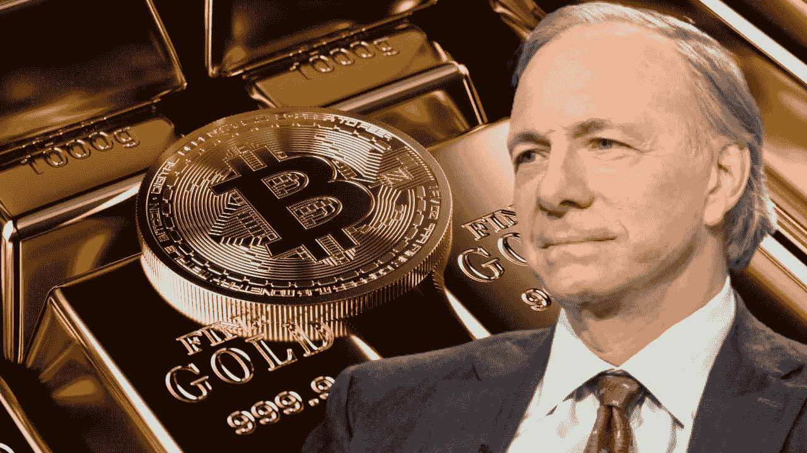

# 亿万富翁雷伊·达里奥承认，他的投资组合中只有“极小比例”的比特币

> 原文：<https://medium.com/coinmonks/billionaire-ray-dalio-acknowledges-his-portfolio-includes-a-tiny-percentage-of-bitcoin-79ad116d63bb?source=collection_archive---------76----------------------->

在对比特币保持强硬立场后，Bridgewater Associates 创始人兼亿万富翁雷伊·达里奥承认，比特币是他投资组合的一部分。

5 月 24 日，在美国消费者新闻与商业频道的 Squawk Box 节目中，达利奥表示，比特币“在过去十年里取得了巨大的成就”，因此人们对这种资产的看法发生了变化。他强调，比特币已经成为黄金和其他资产的替代品。

Dalio 之前对比特币的反对源于这种资产的高波动性，他认为这使其失去了作为价值储存手段的资格。

> “我是说比特币在过去 11 年里取得了巨大的成就；这只占我投资组合的很小一部分。我认为比特币的人太专注于它了。黄金虫太专注于此了。我认为你必须着眼于服务于这一目的的更广泛的资产组合，”达利奥说。

此外，Dalio 指出，比特币已经获得了牵引力，成为可能取代法定货币的新货币形式。他暗示说，比特币很适合作为一种交换媒介，起到价值储存的作用。

在改变对比特币的立场时，达利奥强调，这种旗舰加密货币在未来可以充当“黄金分散器”和财富储存库。

在某个时候，Dalio 表示他没有做出选择，承认他可能错过了比特币受欢迎的一些东西。

尽管由于波动性，Dalio 表达了对比特币的反对意见，但该资产在 2022 年经历了不稳定的 2022 年，录得了大规模的价格修正。该资产目前的交易价格为 29，200 美元，在过去 24 小时内下跌了 3%以上。

尽管波动性很大，但数据显示，随着资产试图维持其价值在 30，000 美元左右，投资者会留在原地。据 Finbold 报道，加密资产管理公司 gray 的首席执行官 Sonnenshein 表示，最近比特币的抛售并没有阻止投资者。

此外，“富爸爸，穷爸爸”罗伯特清崎呼吁投资者在动荡的全球经济中拯救比特币和贵金属。

> 加入 Coinmonks [电报频道](https://t.me/coincodecap)和 [Youtube 频道](https://www.youtube.com/c/coinmonks/videos)了解加密交易和投资

# 另外，阅读

*   [BigONE 交易所点评](/coinmonks/bigone-exchange-review-64705d85a1d4) | [电网交易 Bot](https://coincodecap.com/grid-trading)
*   [氹欞侊贸易评论](https://coincodecap.com/anny-trade-review) | [CoinSpot 评论](https://coincodecap.com/coinspot-review)
*   [新加坡十大最佳加密交易所](https://coincodecap.com/crypto-exchange-in-singapore) | [收购 AXS](https://coincodecap.com/buy-axs-token)
*   [投资印度的最佳加密软件](https://coincodecap.com/best-crypto-to-invest-in-india-in-2021) | [WazirX P2P](https://coincodecap.com/wazirx-p2p)
*   [7 个最佳零费用加密交换平台](https://coincodecap.com/zero-fee-crypto-exchanges)
*   [最佳网上赌场](https://coincodecap.com/best-online-casinos) | [期货交易机器人](/coinmonks/futures-trading-bots-5a282ccee3f5)