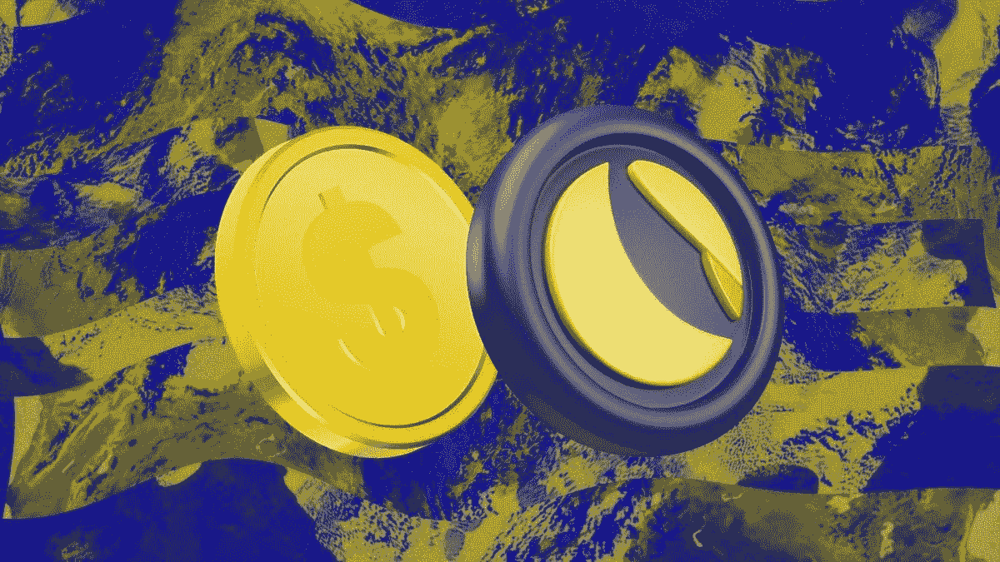
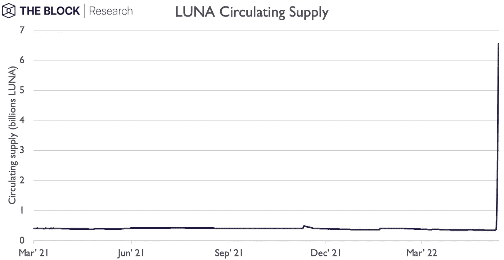
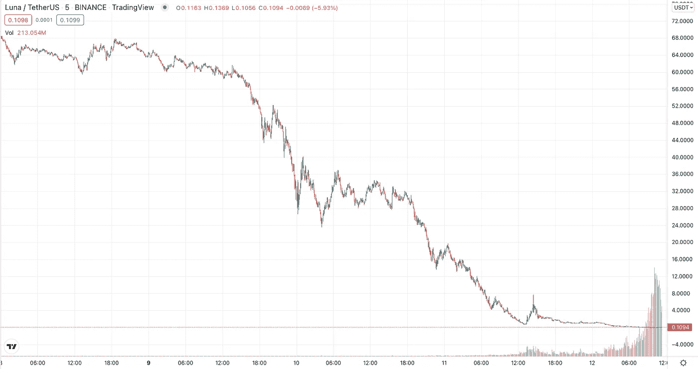

# 四天内供应量增长 20 倍，铸造了数十亿 Luna

> 原文：<https://medium.com/coinmonks/billions-of-luna-minted-as-supply-grows-20-fold-in-four-days-aca65b195dc0?source=collection_archive---------28----------------------->

**Luna**

**Luna 的供应量在短短四天内从 3.46 亿增长到 71 亿。**

**这大幅降低了代币的价值，从 63 美元跌至不到 0.10 美元。**

这种大规模的供应增加加速了 Luna 价格的下跌，在过去两天里下跌了 99%。而如果露娜的价格继续下跌，其供应量也会继续增加。

## 为什么会这样？

要了解是怎么回事，我们需要知道卢娜和 UST 之间的关系。

卢娜是用来帮助 UST 实现与美元挂钩的象征。如果 UST 的价格超过 1 美元，1 美元的 Luna 可以被烧毁，并兑换成 1 UST，这是今年早些时候 Lunas 价格上涨的一个因素。然而，还有一个平衡因素:如果 UST 价格下跌，交易者可以用 1 UST 兑换 1 美元的卢纳。

目前，UST 的价值远低于其挂钩汇率，截至美国东部时间 8:05，交易价仅为 0.57 美元

周四。因此，UST 持有者没有在市场上出售，而是试图通过 Luna 套现，利用旨在保持联系汇率的机制。当这发生时，更多的月神被铸造以回应 UST 被燃烧的数量。

当月神的价格高得多时，比如说 100 美元，如果你用 1 UST 兑换 1 美元的月神，你只能得到 0.01 美元的月神。因此，这样的互换不会让 Luna 的供应量增加太多。

然而，现在 Luna 的价格低得多，大股东正在套现，这导致 Luna 的供应量大幅增加。按照月神当前 0.10 美元的价格，兑换 1 UST 可以得到 10 月神。**因此，如果有人想交换一大笔钱，比如 10 万 UST，这将导致铸造 100 万卢纳。**

这导致了恶性循环。随着持有者用 UST 兑换月神，他们增加了月神的供应量，并可能在市场上出售这些代币。这进一步降低了露娜的价格，意味着下一个重新设计 UST 的人会创造出更多的露娜。

这也导致了露娜供应量的指数级增长。周三，Luna 的供应量从 3.86 亿增加到 15 亿，增加了 12 亿。到今天为止，供应量已经增加到 71 亿——再增加 55 亿。

在这种巨大的供应增加的同时，价格不断走低。

 [## Bartu Bozkurt -区块链开发者-私人 IT 公司| LinkedIn

### 查看巴图·博兹库尔特在全球最大的职业社区 LinkedIn 上的个人资料。巴图有 4 个工作列在他们的…

www.linkedin.com](https://www.linkedin.com/in/bartu-bozkurt/) 

> 加入 Coinmonks [电报频道](https://t.me/coincodecap)和 [Youtube 频道](https://www.youtube.com/c/coinmonks/videos)了解加密交易和投资

# 另外，阅读

*   [Bookmap 点评](https://coincodecap.com/bookmap-review-2021-best-trading-software) | [美国 5 大最佳加密交易所](https://coincodecap.com/crypto-exchange-usa)
*   最佳加密[硬件钱包](/coinmonks/hardware-wallets-dfa1211730c6) | [Bitbns 评论](/coinmonks/bitbns-review-38256a07e161)
*   [新加坡十大最佳加密交易所](https://coincodecap.com/crypto-exchange-in-singapore) | [购买 AXS](https://coincodecap.com/buy-axs-token)
*   [红狗赌场评论](https://coincodecap.com/red-dog-casino-review) | [Swyftx 评论](https://coincodecap.com/swyftx-review) | [CoinGate 评论](https://coincodecap.com/coingate-review)
*   [投资印度的最佳密码](https://coincodecap.com/best-crypto-to-invest-in-india-in-2021)|[WazirX P2P](https://coincodecap.com/wazirx-p2p)|[Hi Dollar Review](https://coincodecap.com/hi-dollar-review)
*   [加拿大最佳加密交易机器人](https://coincodecap.com/5-best-crypto-trading-bots-in-canada) | [库币评论](https://coincodecap.com/kucoin-review)