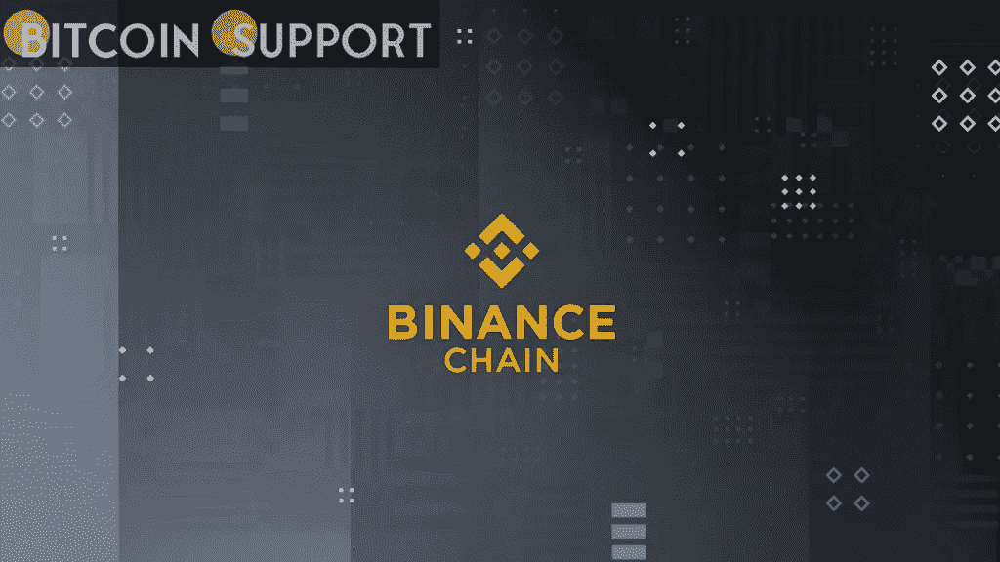

# 币安宣布推出币安桥 2.0，它将整合 CeFi 和 DeFi

> 原文：<https://medium.com/coinmonks/binance-announces-the-launch-of-binance-bridge-2-0-which-will-incorporate-cefi-and-defi-20cede0d829?source=collection_archive---------35----------------------->

**Visit our website:-** [**https://bitcoinsupports.com/**](https://bitcoinsupports.com/)

用户将能够使用该服务连接任何区块链到 BNB 连锁店的资产。3 月 29 日，中央加密货币交易所币安宣布推出币安桥 2.0。用户现在可以通过这一功能将任何区块链的资产，包括那些没有在币安应用程序中列出的资产，连接到 BNB 链。未列出的桥接令牌将被发送到资金或现货钱包，而列出的桥接令牌将被专门转移到资金钱包。

用户可以使用标准的存款和取款功能在他们的家乡区块链和 BNB 连锁店之间传递代币。币安还希望在未来改进其移动应用程序，使用户只需点击一下鼠标就能进行类似的转换。币安的产品负责人 Mayur Kamat 对这一开发发表了评论:

“通过币安桥 2.0，我们可以扩大分散资金的全球访问，同时保持与中央银行相关的无缝用户体验。”这已经在 PancakeSwap 迷你应用的大量使用中看到了。

币安桥 2.0 还拥有全新的自动代币流通控制系统。除了热门钱包中的缓冲规模之外，交易所不会持有过剩的挂钩令牌，即通常所说的包装资产。相反，它将打印额外的令牌，以响应用户从 BNB 智能链中提取的固定令牌。

据该公司称，所有后续的流通都将由用户在原区块链上存放的原生代币来支持。当用户希望恢复到原始代币时，他们可以在币安存放挂钩代币并提取原始代币。同时，额外的代币将立即被扫入冷钱包并烧毁。

**访问我们的网站:-**[**https://bitcoinsupports.com/**](https://bitcoinsupports.com/)

**免责声明:以上为作者观点，不应视为投资建议。读者应该自己做研究。**

> 加入 Coinmonks [电报频道](https://t.me/coincodecap)和 [Youtube 频道](https://www.youtube.com/c/coinmonks/videos)了解加密交易和投资

# 另外，阅读

*   [Botsfolio vs nap bots vs Mudrex](/coinmonks/botsfolio-vs-napbots-vs-mudrex-c81344970c02)|[gate . io 交流回顾](/coinmonks/gate-io-exchange-review-61bf87b7078f)
*   [CoinFLEX 评论](https://coincodecap.com/coinflex-review) | [AEX 交易所评论](https://coincodecap.com/aex-exchange-review) | [UPbit 评论](https://coincodecap.com/upbit-review)
*   [AscendEx 保证金交易](https://coincodecap.com/ascendex-margin-trading) | [Bitfinex 赌注](https://coincodecap.com/bitfinex-staking) | [bitFlyer 评论](https://coincodecap.com/bitflyer-review)
*   [Bitget 回顾](https://coincodecap.com/bitget-review)|[Gemini vs block fi](https://coincodecap.com/gemini-vs-blockfi)cmd |[OKEx 期货交易](https://coincodecap.com/okex-futures-trading)
*   [AscendEx Staking](https://coincodecap.com/ascendex-staking)|[Bot Ocean Review](https://coincodecap.com/bot-ocean-review)|[最佳比特币钱包](https://coincodecap.com/bitcoin-wallets-india)