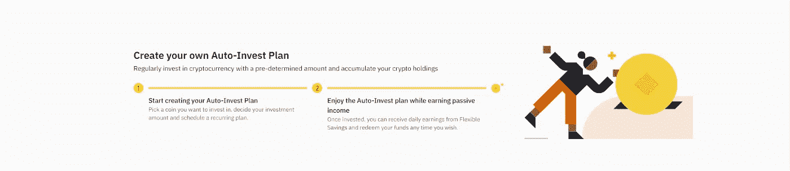
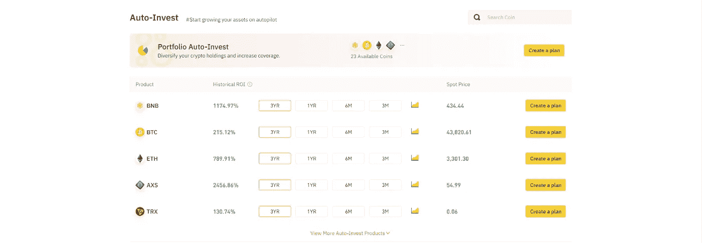
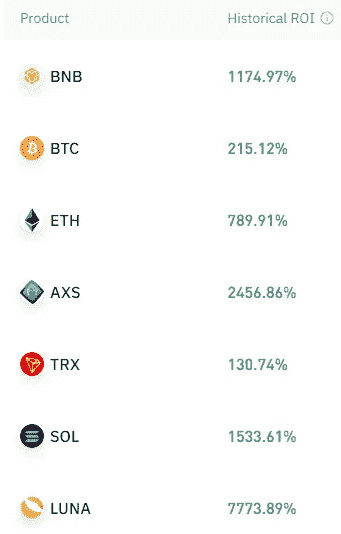
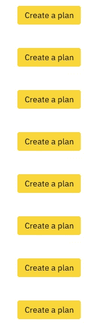
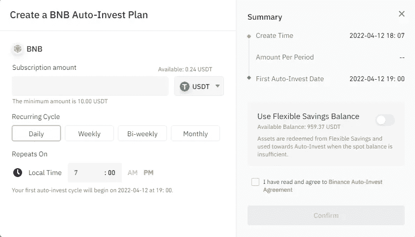
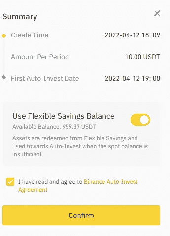

# 币安汽车投资:在密码市场超级有效的投资工具

> 原文：<https://medium.com/coinmonks/binance-auto-investment-an-investment-tool-super-effective-in-the-crypto-market-d2e59fcadc22?source=collection_archive---------7----------------------->

投资任何金融市场的最佳策略之一是 DCA ( [美元成本平均化](https://en.wikipedia.org/wiki/Dollar_cost_averaging))策略。DCA 策略几乎适合所有投资者，也许从长期来看，我还没有见过有人因为这个策略而亏损。假设你是一个懒惰的投资者，或者想有一个工具，可以为你在加密市场进行自动投资。下面来看看这个帖子吧！

Illustration

# 什么是币安汽车投资？

[币安汽车投资](https://www.binance.com/en/savings/auto-invest)是根据 DCA 策略进行自动投资的投资工具。[币安](https://www.binance.com/en)汽车投资最适合两类用户:

*   长期投资
*   没有时间进行深入研究的用户

优势

*   投资组合:主要是顶级硬币或具有显著市值的硬币= >安全
*   您的稳定硬币正在等待购买，仍然收到利息。

# 访问教程

第一步:访问[https://www.binance.com/en/savings/auto-invest](https://www.binance.com/en/savings/auto-invest)

Step 1

第二步:选择合适的产品

Step 2

第 3 步:点击创建计划

Step 3

第四步:从你的钱包里取出 USDT，选择你的循环周期

Step 4.1

或者选择使用灵活的储蓄余额进行投资

Step 4.1.1

# 投资策略

*   为了在投资时感到舒适，你必须使用你的闲置资本，这意味着你可能失去的钱仍然不会影响你的生活。
*   下一步，你应该决定这项投资的时间(1 年、2 年或 3 年)。这种策略只适合长期投资，所以你要考虑清楚再做决定。
*   在列表中选择您想要投资的硬币。如果希望安全，就投资比特币或者以太坊。
*   为币安汽车投资公司设立。

# 结论

事实上，DCA 仍然是每项投资的最佳策略。想象一下，如果你从 2009 年到 2020 年兑换比特币，每年 10.000 美元，到今天你会有多少钱？币安的汽车投资是这一战略的最佳工具。但是，记住这个工具只适合长期使用。如果你是一个真正的投资者，这个工具将是理想的。如果你是交易者，请不要使用这个工具。

以上就是**币安汽车投资:在密码市场超级有效的投资工具**。如果你对我有任何问题，请在本帖下方评论；我会为你写下他们。别忘了跟随我的媒介。祝你投资之旅成功。

> 加入 Coinmonks [电报频道](https://t.me/coincodecap)和 [Youtube 频道](https://www.youtube.com/c/coinmonks/videos)了解加密交易和投资

# 另外，阅读

*   [8 大加密联盟项目](https://coincodecap.com/crypto-affiliate-programs) | [eToro vs 比特币基地](https://coincodecap.com/etoro-vs-coinbase)
*   [最佳以太坊钱包](https://coincodecap.com/best-ethereum-wallets) | [电报上的加密货币机器人](https://coincodecap.com/telegram-crypto-bots)
*   [交易杠杆代币的最佳交易所](https://coincodecap.com/leveraged-token-exchanges) | [购买 Floki](https://coincodecap.com/buy-floki-inu-token)
*   [3Commas 诉 Pionex 诉 crypto hopper](https://coincodecap.com/3commas-vs-pionex-vs-cryptohopper)|[Bingbon Review](https://coincodecap.com/bingbon-review)
*   [加密复制交易平台](/coinmonks/top-10-crypto-copy-trading-platforms-for-beginners-d0c37c7d698c) | [如何在 WazirX 上购买比特币](/coinmonks/buy-bitcoin-on-wazirx-2d12b7989af1)