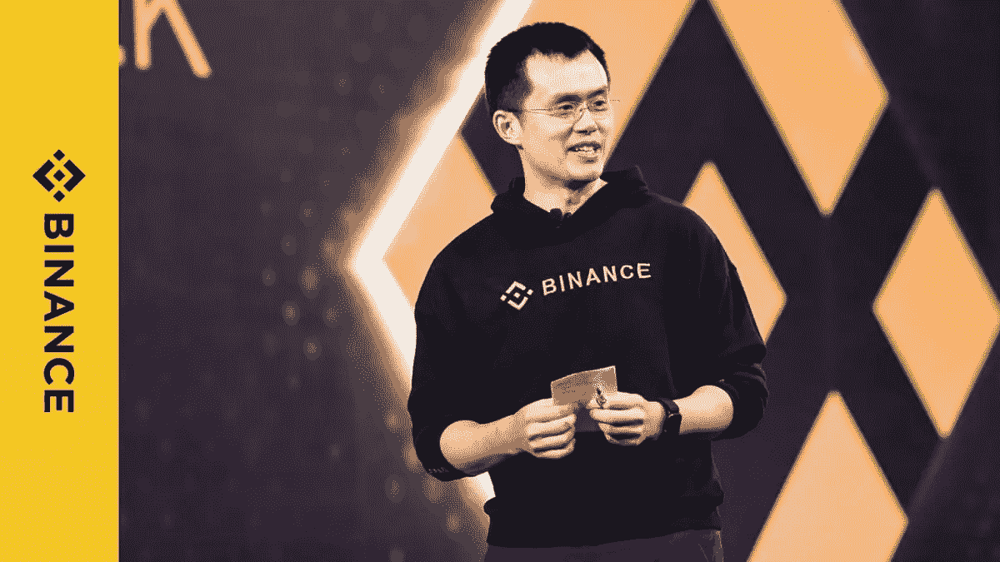

# 币安封锁了与俄罗斯政府有关联的亲戚的加密账户

> 原文：<https://medium.com/coinmonks/binance-blocks-crypto-accounts-of-relatives-tied-to-the-russian-government-e5a0c6685a09?source=collection_archive---------64----------------------->

在对俄实施经济制裁后，克里姆林宫发言人的女儿试图使用外汇时，币安封锁了她的账户。

币安加密货币交易所正在采取更多措施，以防止俄罗斯政府通过使用加密来减轻制裁的影响。

彭博周四报道，自俄开始在乌采取军事行动以来，币安已在过去两个月关闭了几个与克里姆林宫高官亲属有关的账户。

报道称，受影响的人员包括俄罗斯总统弗拉基米尔·普京发言人佩斯科夫的女儿佩斯科娃(Elizaveta Peskova)和外交部长拉夫罗夫的继女科瓦列夫(Polina Kovaleva)。币安表示，它还封锁了俄罗斯寡头康斯坦丁·马洛费耶夫(Konstantin Malofeyev)的儿子基里尔·马洛费耶夫(Kirill Malofeyev)，后者此前被指控违反美国的制裁。

币安新任命的全球制裁负责人查格里·波亚兹(Chagri Poyraz)在他的 LinkedIn 页面上就币安的最新措施写道:“很荣幸成为这个团队中的一员，这个团队带来了真正的变化。”。

Poyraz 表示，币安在 3 月 3 日屏蔽了 Peskova，当时她试图通过第三方经纪公司使用该交易所。随后，她于 3 月 11 日受到美国财政部的制裁，作为对“克里姆林宫精英、领导人、寡头和家族支持普京对乌战争”的制裁的一部分

佩斯科娃随后对西方的制裁表示愤慨，称这种行为“完全不公平，毫无根据”。“我真的很惊讶，因为对一个 24 岁的人实施制裁是很奇怪的，而且与这种情况毫无关系，”她说。佩斯科娃在 3 月 12 日发布的最后一条 Instagram 帖子上写着一个词:“和平。”

根据 Poyraz 的说法，币安一直在监测其平台，以寻找更多与可能使用其服务的受制裁个人有关的人。

“不同的是，我们的合规筛查行动是‘主动的’，旨在对这些个人或实体采取任何监管或法律行动之前，发现并阻止金融犯罪风险，”他说。

4 月 21 日，币安对俄罗斯国民或俄罗斯居民采取了一系列限制措施，限制持有超过 1 万欧元(合 1.08 万美元)账户的交易。币安首席执行官赵昌鹏此前表示，币安将遵守制裁，但不会因西方对俄制裁而“单方面冻结数百万无辜用户的账户”。

> 加入 Coinmonks [电报频道](https://t.me/coincodecap)和 [Youtube 频道](https://www.youtube.com/c/coinmonks/videos)了解加密交易和投资

# 另外，阅读

*   [加拿大最佳加密交易机器人](https://coincodecap.com/5-best-crypto-trading-bots-in-canada) | [Bybit vs 币安](https://coincodecap.com/bybit-binance-moonxbt)
*   [阿联酋 5 大最佳加密交易所](https://coincodecap.com/best-crypto-exchanges-in-uae) | [SimpleSwap 点评](https://coincodecap.com/simpleswap-review)
*   购买 Dogecoin 的 7 种最佳方式
*   [最佳期货交易信号](https://coincodecap.com/futures-trading-signals) | [流动性交易所评论](https://coincodecap.com/liquid-exchange-review)
*   [火币加密交易信号](https://coincodecap.com/huobi-crypto-trading-signals) | [Swapzone 审查](/coinmonks/swapzone-review-crypto-exchange-data-aggregator-e0ad78e55ed7)