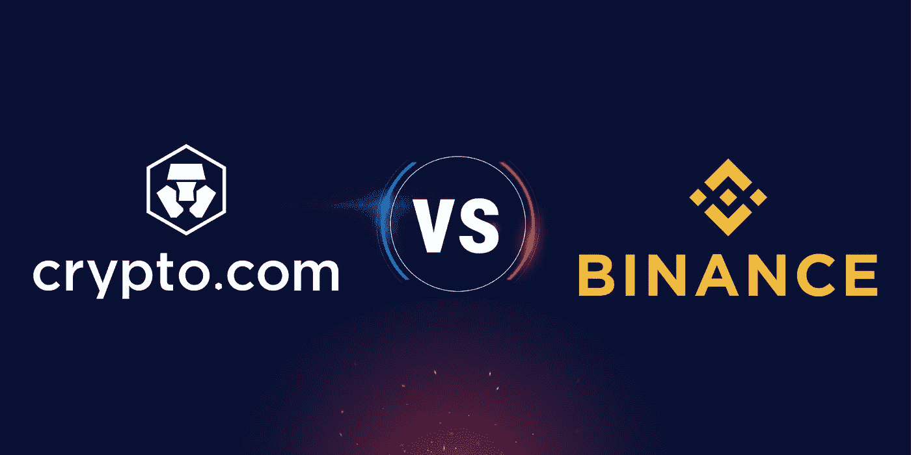

# Crypto.com 卡对币安卡

> 原文：<https://medium.com/coinmonks/binance-card-vs-crypto-com-card-f4c033d61672?source=collection_archive---------1----------------------->

让我们从币安开始。我们有 7 个级别，根据你有多少 BNB 来分类。屏幕上有详细的表格。我们将详细介绍如下:

**第一级**你不必拥有 BNB，也可以获得 0.1%的返现。

**对于卡**的 2 级**你已经需要至少 1 个 BNB，返现增加到 2%。**

**对于卡的第 3 级**，您必须拥有 10 个 BNB 并获得 3%的返现。

对于第 4 级你需要 40 BNB，并获得 4%的购买折扣。

**在第 5 关**，币安要求我们购买 100 个 BNB，我们得到了 5%的折扣。

对于第 6 关，我们需要 250 台 BNB，币安为我们提供 6%的折扣。

最后一关的要求是持有 600 BNB，相反，我们用这张卡购物可以享受 8%的折扣。

还应该提到的是，您将在购买后的第二天结束时在 BNB 收到现金返还。比如 3 月 22 日去购物，3 月 23 日结束就能收到返现。

此外，BNB 的数量使你有资格获得一定级别的卡，你可以把它放在金库里，在那里你可以获得很低的利息(每年不到 1%)，但你也有资格获得免费的新硬币，当它们在 lauchpad 上推出时。

币安卡也可以添加到 Google pay，你可以在商店用它购物，而不必亲自带着它或等到它被送到你手中。您可以在订购后立即将其添加到 google pay。币安卡是由塑料制成的。

另一方面，我们有来自 Crypto.com 的卡片，在那里我们将很快检查他们的资格标准。

在这里，我们发现该卡只有 5 个级别，具有类似的返现百分比。

**对于等级 1** 的卡，你根本不需要拥有他们的货币，你可以从他们的申请中免费订购，并获得使用 1%的返现。

对于该卡的 2 级，你必须拥有他们名为 CRO 的硬币，价值 400 美元，但你也必须封锁这笔钱 180 天。您不会收到这笔钱的利息，您收到的是 2%的返现和 Spotify 订阅。

对于等级 3 的卡，你必须购买 4000 美元的 CRO，下注 180 天，获得 10%的下注年利率，获得 Spotify 订阅，获得网飞订阅，获得 3%的返现和进入机场休息室。

**对于该卡的第 4 级**，您必须存入 40，000 美元的赌注，也是 180 天，订阅 Spotifiy、网飞、亚马逊 Prime，在 Expedia 上享受 10%的折扣，您和另一位朋友可以使用机场休息室，40，000 美元赌注每年 10%的利息和 5%的返现。

**在卡的最后一关**，你需要购买价值 40 万美元的 CRO，并持有 180 天。使用这张卡，你可以享受 Spotifiy、网飞、全额支付的亚马逊 prime、通过 airbnb 购买的 Expedia 和度假产品的 10%折扣、你和另一位朋友使用机场休息室的权利、staking 的 40 万美元的 10%年息以及 8%的返现。

您会收到 CRO 货币的返现，并且每次购买都会立即收到。Crypto.com 卡从第二级开始，由金属制成。

Crypto.com 卡不能加入 google pay，购物时你必须随身携带。

现在我们来比较一下每张卡的优缺点。

我们在进行这一比较时，会考虑到 BNB 的现值 650 美元。两张卡之间的每一次比较，获胜者将各获得 1 分。

考虑到这是一张 visa 卡，任何找到它的人都可以用它在网上购物，而不需要你的 pin，我会把第一点给币安，因为它让你可以在 google pay 中添加卡，当你和他在城里购物时，你可以把它放在家里的抽屉里。

第二件重要的事情是你的钱的流动性。Crypto.com 强迫你冻结资金 6 个月，而在币安，你可以随时动用资金，我将为币安提供另一个点。

在 Crypto.com，当你提交你的 CRO 赌注，你就自动有资格获得你申请的卡。相反，在币安，你上个月持有的平均 BNB 会被考虑在内。因此，如果您现在存入 1 BNB 以获得该卡的 2 级资格，您将只能在一个月后获得资格。这里的重点是 Crypto.com 的速度。

您将立即在 Crypto.com 收到现金返还，一天后在币安收到。在这里，Crypto.com 又获得了一分。

如果我们排除卡的最后一级，crypto.com 需要存入 40 万美元，币安需要存入 39 万美元。我不认为很多人能理解。对于所有其他级别，入门价格对 Crypto.com 来说要实惠得多。对于同样水平的币安返现，你平均需要多 50%的资金。

我想给 crypto.com 另外一点，因为你可以通过 SEPA 转账存钱。如果您不愿意阻止资金受益于返现，那么我们将比较免费卡的第一级。在 crypto.com，我们有 1%的返现，在币安是 0.1%，少了 10 倍。这一点再次指向 Crypto.com。

在卡的下一个级别，除了两家公司提供的返现，crypto.com 还提供了如上所述的许多优势。网飞、Spotify 等。

此外，Crypto.com 通过保持金钱赌注和接受奖励为我们提供了卡的资格，这是币安不允许的。如果你把钱押在币安身上，钱不算在牌里。如果你把你 BNB 放在金库里，新硬币发行时，你得到的利息不到 1%。所有这些好处都远远优于 Crypto.com 卡相比币安卡。这一点又指向了 Crypto.com。

如果你对从自动取款机中提取现金感兴趣，那么你应该知道币安为你提供了更高的取款限额。因此，我们为币安提供了另一个要点。

如果这对你很重要，从卡片的第二级开始，Crypto.com 的卡片是金属的，币安的是塑料的。如果你也认为塑料卡的时代已经结束，那么让我们看看 Crypto.com。

与 10 个不同的标准相比，来自 crypto.com 和币安的卡片虽然看起来很相似，但似乎差别很大。Crypto.com 是超然的赢家，其 10 项需求中有 7 项比币安得到了更好的满足。

> 加入 Coinmonks [电报频道](https://t.me/coincodecap)和 [Youtube 频道](https://www.youtube.com/c/coinmonks/videos)了解加密交易和投资

# 另外，阅读

*   [印度最佳 P2P 加密交易所](https://coincodecap.com/p2p-crypto-exchanges-in-india) | [柴犬钱包](https://coincodecap.com/baby-shiba-inu-wallets)
*   [八大加密附属计划](https://coincodecap.com/crypto-affiliate-programs) | [eToro vs 比特币基地](https://coincodecap.com/etoro-vs-coinbase)
*   [最佳以太坊钱包](https://coincodecap.com/best-ethereum-wallets) | [电报上的加密货币机器人](https://coincodecap.com/telegram-crypto-bots)
*   [交易杠杆代币的最佳交易所](https://coincodecap.com/leveraged-token-exchanges) | [购买弗洛基](https://coincodecap.com/buy-floki-inu-token)
*   [3Commas 对 Pionex 对 Cryptohopper](https://coincodecap.com/3commas-vs-pionex-vs-cryptohopper) | [Bingbon 评论](https://coincodecap.com/bingbon-review)
*   [加密复制交易平台](/coinmonks/top-10-crypto-copy-trading-platforms-for-beginners-d0c37c7d698c) | [如何在 WazirX 上购买比特币](/coinmonks/buy-bitcoin-on-wazirx-2d12b7989af1)
*   【Crypto.com 评论】|[【T4 评论】](/coinmonks/crypto-com-review-f143dca1f74c)
*   [如何在加拿大购买加密货币？](https://coincodecap.com/how-to-buy-cryptocurrency-in-canada)